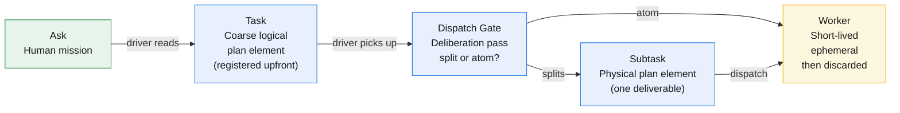
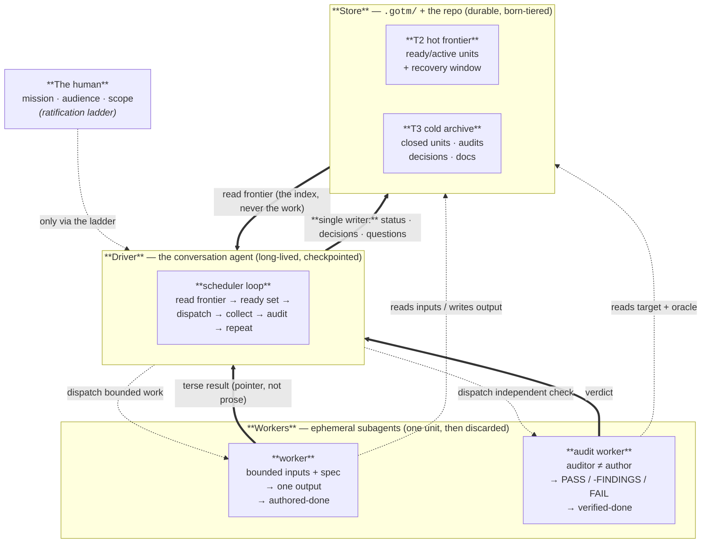

# GOTM

A **graph-engineering + learning-engineering** framework for surviving bounded-context agentic execution — when serious work spans hundreds of LLM sessions and many subagents and fits in none of them.

## Why care — in 60 seconds

GOTM moves memory out of chat into a durable **project store** — agents become disposable **workers**, the **project** becomes the source of truth. It avoids two traps: (1) **Driver inline execution** — small tasks accumulate until the driver stalls; (2) **Monolithic dispatch** — large unbounded workers stall watchdogs. GOTM solves both via **deliberate DAG decomposition at the dispatch gate** and **aggressive delegation** (every task, however small, is a worker dispatch). The driver plans; execution is always ephemeral.

**Use it** for multi-session work. **Skip it** for one-offs. Start at [`docs/01`](docs/01-the-problem-and-thesis.md).

---

**Your agent's context is scarce, lossy, and gone at the session boundary. GOTM makes the *project* the system of record — so any context can be thrown away and rebuilt from disk.**

GOTM reframes the whole problem as a **context economy**. Context is the binding resource: every token is paid for on every turn it survives, quality degrades long before the window overflows, and nothing crosses the session boundary unless it was written down. On a long project, getting this wrong does not fail loudly — it grinds to a halt under its own accumulated weight. That failure has a name: **monotonicity** — cost that grows without bound because work, recovery logs, and the plan all pile up in a long-lived context and get re-read forever.

GOTM fixes monotonicity with one law: **nothing on the hot path is long-lived.** The durable store is the system of record; every working context is disposable and reconstructable from it. That law produces a three-role architecture.

## The thesis

> **GOTM is a context-economy discipline. The durable store is the system of record; every working context is disposable and reconstructable from it. Nothing on the hot path is long-lived.**

Everything else is a consequence of that sentence.

## At a glance — the Spark model: Ask → Task → Subtask → Worker

GOTM models orchestration on Apache Spark: the driver is the Spark driver (plans, schedules, executes nothing); workers are executors (short-lived, one unit each). A human mission spawns coarse Tasks (the logical plan, registered upfront); when the driver picks a task up, it takes a deliberation pass and either commits it as atomic or splits it into Subtasks (the physical plan). Every subtask goes to its own fresh worker.



<sub>The driver plans (the cheap part) but executes nothing. Every task — however small — becomes a worker dispatch, keeping driver context clean and enabling parallel execution. Deliberate decomposition at the dispatch gate (before execution) prevents monolithic long-running workers and their un-auditable outputs.</sub>

---

## Three roles: driver / worker / store



<sub>The **driver** plans and talks; it holds the plan (the ledger DAG), the discipline, and the human interface — never the work. All work, however small, is a **worker** dispatch: a fresh context with bounded inputs that produces one output and is discarded. The **store** is durable and born-tiered. The driver is the single writer; workers report terse results (a pointer, never the N bodies). A worker marks only **authored-done**; an independent **audit worker** (auditor &ne; author) confers **verified-done**.</sub>

## When to use it

Use GOTM when the work is multi-session, when the cost of drift is high, and when an agent (or several) does meaningful chunks of execution: multi-week deliverables, multi-author research, systems that span hundreds of sessions and dispatched subagents.

Do not use GOTM for one-shot tasks. A one-off email or a five-line script does not need a ledger; the ceremony exceeds the work.

## The concept arc — `docs/01–09`

The framework from first principles, each chapter a consequence of the one before:

- [`docs/01-the-problem-and-thesis.md`](docs/01-the-problem-and-thesis.md) — context as the scarce, lossy, bounded resource; the monotonicity failure; the thesis and the one law
- [`docs/02-driver-worker-store.md`](docs/02-driver-worker-store.md) — the three roles, their lifetimes, the Spark analogy; the non-monotonicity guarantee and its honest limit
- [`docs/03-work-as-a-dag.md`](docs/03-work-as-a-dag.md) — the unit as a self-contained worker dispatch spec; the ledger as DAG + scheduler state, born tiered; foundation as topology; dependencies as first-class `depends_on` edges (distinct from the read-set)
- [`docs/04-the-loop.md`](docs/04-the-loop.md) — the driver's deterministic scheduler: read frontier, compute ready set, dispatch, collect, retry by lineage recompute; the living DAG the driver reshapes — CAN-run vs SHOULD-run
- [`docs/05-scaling-and-economy.md`](docs/05-scaling-and-economy.md) — fan-out/fan-in (fan-in = a worker reading the store, never the driver holding N results), worker-context minimalism, amortized batching, risk-tiered audits, model tiering
- [`docs/06-keeping-it-honest.md`](docs/06-keeping-it-honest.md) — structural audit independence (a worker cannot grade itself); authored-done vs verified-done; the freeze
- [`docs/07-resilience-and-memory.md`](docs/07-resilience-and-memory.md) — the two-level crash model (worker retry, driver re-hydrate) and the three-tier memory economy
- [`docs/08-in-practice.md`](docs/08-in-practice.md) — adopting GOTM across three tiers, interactive vs SDK driver, bootstrapping, and the worked example (this rewrite)
- [`docs/09-learning-across-projects.md`](docs/09-learning-across-projects.md) — how finished projects compound: the **two** cross-project cold tiers — the learning pool (experience) and the context pool (facts) — that seed future drivers

## Operational prompts and templates

Paste-ready bodies a practitioner runs in any LLM:

- [`prompts/driver-loop.md`](prompts/driver-loop.md) — the scheduler the driver runs: ready-set, fan-out, collect, audit, checkpoint, repeat — with the destructive-op pre-execution gate and the proof-stamped DISPATCHED
- [`prompts/worker-dispatch.md`](prompts/worker-dispatch.md) — the central worker contract: a bounded, self-contained dispatch with forced detail-to-disk (≤ ~8-line return) and the concrete-path Output micro-schema (supersedes v2's `subagent-dispatch`)
- [`prompts/audit.md`](prompts/audit.md) — the fresh-worker audit: the 7-point checklist, three-way verdict (`PASS` / `PASS-FINDINGS` / `FAIL`), and the typed `verified-done` runtime check (per-`Kind` dimensions: ui / eval / deploy-infra / data / diagnosis)
- [`prompts/session-start.md`](prompts/session-start.md) — the driver boot: re-hydrate from the store + reconcile against disk (no compaction hook)
- [`prompts/consult.md`](prompts/consult.md) — start-of-project: query the cross-project learning pool by tag, surface the few that apply (confidence weighted by the promotion gate)
- [`prompts/outcome-analysis.md`](prompts/outcome-analysis.md) — end-of-project: distill the record into transferable learnings and merge them into the shared pool (candidate → validated via an independent project)
- [`prompts/consult-facts.md`](prompts/consult-facts.md) — start-of-project: query the cross-project **context pool** for authoritative *facts* by subject/tag (declarative sibling of `consult`; facts are obeyed, not weighted — prefers current records, trust as caveat)
- [`prompts/context-analysis.md`](prompts/context-analysis.md) — pin facts on discovery (the `FACT:` return convention) and, at end, merge the shareable ones into the context pool (declarative sibling of `outcome-analysis`; supersede-on-change, the `shareable` privacy gate, decompose/relink)

Copy-and-fill scaffolds for a new project:

- [`templates/`](templates/) — `PROTOCOL.md` (driver/worker/store, the loop, the Output micro-schema + ledger-parse lint, typed verified-done, the destructive-op gate), `LEDGER.md` (born-tiered: frontier + archive, with the `Kind` column and Output-contract conventions), `DECISIONS.md`, `QUESTIONS.md`, `README.md`, `LEARNINGS.md`, `CONSULTED.md`, `CONTEXT.md` (declarative facts — the `subject`-keyed sibling of `LEARNINGS.md`)

## Two repos: the idea and the runtime

This repo is the platform-neutral **idea** — the concept chapters, the prompts, and the templates, all plain markdown. Paste any prompt body into ChatGPT, Cursor, Cline, the Claude API, or raw chat and it works; nothing here is tied to a runtime. The companion **`gotm` plugin** is the **runtime** — it ships the executable layer the templates only *describe*: the scheduler command, the born-tiered ledger machinery, the compaction script, the immutability hook (with the follow-on-ownership fix), and the **two cross-project pools** — the learning pool (`~/.gotm/learnings/` + `pool.py`, for experience) and the context pool (`~/.gotm/context/` + `context.py`, for facts), each enforcing its own promotion gate — `docs/09`'s L2 stores, made real. The split is deliberate: the discipline lives here and survives any tool; the automation lives in the plugin.

## What's in this repo

```
docs/         9 concept chapters — the framework from first principles
prompts/      8 operational prompts a practitioner pastes into their LLM
templates/    8 copy-and-fill scaffolds for a new project (root, or a .gotm/ subfolder)
.gotm/        this repo's own GOTM machinery — a working meta-example:
                PROTOCOL.md · LEDGER.md (born-tiered) · DECISIONS.md · QUESTIONS.md · audits/
CLAUDE.md     thin root bridge → .gotm/PROTOCOL.md (auto-loads the discipline each session)
```

This project is itself driven as a GOTM project: the conversation agent is the driver, every chapter / prompt / template was produced by a stateless worker and gated by an independent audit worker. The repo's own `.gotm/` is the live demonstration of the layout described in [`docs/08-in-practice.md`](docs/08-in-practice.md).

## How to start

1. **Read [`docs/01-the-problem-and-thesis.md`](docs/01-the-problem-and-thesis.md).** It is short and it grounds everything else.
2. **Pick work that fits.** Multi-session, drift-cost high. See [When to use it](#when-to-use-it).
3. **Copy the templates into your project.** From `templates/`, scaffold `PROTOCOL.md`, `LEDGER.md`, `DECISIONS.md`, `QUESTIONS.md`. Put them at the repo root for a writing/research project, or in a `.gotm/` subfolder for a software/multi-asset project (keep a thin root pointer so your tool's session file still auto-loads — see the Layout note in `PROTOCOL.md.template`). Fill the mission line; sketch your first few units (foundation first, as upstream DAG nodes).
4. **Boot the driver with [`prompts/session-start.md`](prompts/session-start.md).** It re-hydrates from the store, reconciles against disk, and reports the active frontier.
5. **Run the loop with [`prompts/driver-loop.md`](prompts/driver-loop.md).** Dispatch a worker per ready unit via [`prompts/worker-dispatch.md`](prompts/worker-dispatch.md); gate every claimed-done output with an independent [`prompts/audit.md`](prompts/audit.md) worker before downstream consumes it.

From there the loop repeats until the DAG drains.

## License

Apache 2.0 — see [`LICENSE`](LICENSE). Contains an explicit patent grant.

## Contributing

See [`CONTRIBUTING.md`](CONTRIBUTING.md).
