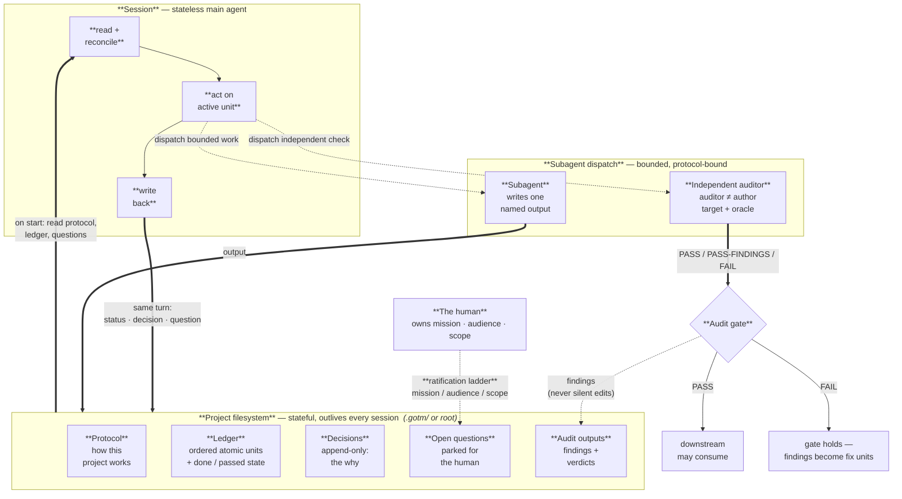

# GOTM

A discipline for surviving bounded-context agentic execution — when complex work spans hundreds of LLM sessions and many subagents and can't fit in any one of them.

---

**Your agent forgets everything when the session ends. GOTM makes the project remember.**

Ever wished an agent session just *never lost the thread* — that you could lose it mid-task to a crash, a dead laptop, a closed terminal, reopen it tomorrow, and pick up exactly where you left off, with every decision and every reason still intact?

What if the agent could audit its own work — but handed the check to a **fresh subagent with no memory of writing it**, so the review was honest instead of the author nodding along to itself?

What if drafts never ran ahead of the evidence, "done" always meant *independently checked*, and the project's memory lived in plain files that outlast any single session — so session #300 starts as sharp as session #1?

That is what GOTM is for. It doesn't try to make the agent smarter; it makes the **project** disciplined — the working memory moves out of the agent and into the project, and context stops leaking out the session boundary.

---

## The problem GOTM solves

Complex work with AI agents falls apart in predictable ways. State that an agent built up in one session evaporates at the session boundary. The next session starts cold and re-derives — usually slightly differently — and the project's working understanding drifts. Drafts run ahead of the evidence the agent never wrote down. Subagents inherit the task but not the project's discipline. "Done" markers accumulate without independent audit. Mission-level decisions get made unilaterally by the agent; trivial choices get escalated to the human. Session-level tooling — slash commands, custom instructions, system prompts — dies when the session does.

None of these are fixable inside the agent. The agent is, by construction, a bounded-context worker. The thing that gives the worker continuity has to live outside.

## What GOTM is

GOTM is the discipline of moving continuity outside the agent and into the **project filesystem**. The project carries five primitives — a mission, a ledger, atomic units of work, a foundation-before-drafts gate, and an audit cycle — plus a ratification ladder that says which decisions are the human's, anti-drift safeguards that make the rules catchable instead of remembered, and resilience rules that keep the on-disk state recoverable after any session end. Every agent that opens a session in the project reads the protocol, reads the ledger, and operates under the discipline. Subagents inherit the discipline through the dispatch. The agent stays stateless; the project stays stateful.

GOTM is not a hierarchy. It is not project management. It is not a methodology. It tells you how to carry context across many sessions of whatever methodology you use to plan the work.

**At a glance:**



<sub>The agent is stateless; the project is stateful. Each session reads the project on start, acts, and writes back in the same turn. Bounded work and an independent auditor (auditor &ne; author) are dispatched as subagents; the auditor's verdict drives the gate that downstream units wait on. The human enters only through the ratification ladder — mission, audience, scope — while execution decisions stay in the loop.</sub>

## When to use it

Use GOTM when the work is multi-session, when the cost of drift is high, and when an agent (or several) will be doing meaningful chunks of the execution. Multi-week deliverables. Multi-author research projects. Systems that span hundreds of LLM sessions and dispatched subagents.

Do not use GOTM for one-shot tasks. A one-off email or a five-line script does not need a ledger. The ceremony is more than the work.

## What's in this repo

```
docs/         6 concept chapters — the framework from first principles, incl. learning across projects
prompts/      5 operational prompts a practitioner pastes into their LLM
templates/    scaffold files to copy into a new project (root, or a .gotm/ subfolder)
.gotm/        this repo's own GOTM machinery — a working meta-example:
                PROTOCOL.md · LEDGER.md · DECISIONS.md · QUESTIONS.md · audits/
CLAUDE.md     thin root bridge → .gotm/PROTOCOL.md (auto-loads the discipline each session)
```

Everything is platform-neutral markdown. Paste any prompt body into ChatGPT, Cursor, Cline, Claude API, or raw chat — it works. The repo's own machinery lives in [`.gotm/`](.gotm/) (`PROTOCOL.md`, `LEDGER.md`, `DECISIONS.md`, `QUESTIONS.md`, `audits/`) as a working meta-example: this project is itself GOTM-orchestrated, and it uses the `.gotm/` subfolder layout — with a thin root `CLAUDE.md` bridge — as a live demonstration of the layout described in `docs/05-in-practice.md`.

## Quickstart — your first GOTM project in five steps

1. **Pick work that fits.** Multi-session, drift-cost high. See [When to use it](#when-to-use-it).
2. **Copy the templates into your project.** From `templates/`: `PROTOCOL.md.template` → `PROTOCOL.md`; `LEDGER.md.template` → `LEDGER.md`; `DECISIONS.md.template` → `DECISIONS.md`; `QUESTIONS.md.template` → `QUESTIONS.md`. Put them at the repo root for a writing/research project, or in a `.gotm/` subfolder for a software/multi-asset project (keep a thin pointer at the root so your tool's session-context file still auto-loads — see the Layout note in `PROTOCOL.md.template`). Fill in the mission line in `PROTOCOL.md` and `LEDGER.md`. Sketch your first two or three units in `LEDGER.md` (foundation first).
3. **Open `prompts/session-start.md` in your LLM.** Paste the body. The LLM reads `PROTOCOL.md`, `LEDGER.md`, and `QUESTIONS.md`, identifies the active unit, and reports back.
4. **Direct the LLM to act on the active unit.** When it finishes, it updates `LEDGER.md` and either appends a decision to `DECISIONS.md` or surfaces a question to `QUESTIONS.md`.
5. **When work exceeds a session or needs independent context, dispatch.** Use `prompts/subagent-dispatch.md` to construct a worker prompt that points back at `PROTOCOL.md`. Use `prompts/audit.md` to run a mechanical check before downstream work consumes any claimed-done output.

From there, the loop repeats. Pick the next active unit. Act. Write back. Audit when called for.

## Concept chapters

- [`docs/01-what-is-gotm.md`](docs/01-what-is-gotm.md) — what GOTM is, from first principles: the five primitives and the ratification ladder
- [`docs/02-why-agents-need-it.md`](docs/02-why-agents-need-it.md) — the specific gaps in agentic work, including the ones real use surfaced
- [`docs/03-how-the-project-carries-it.md`](docs/03-how-the-project-carries-it.md) — the mechanism: the file-set, the session loop, subagent inheritance, ratification
- [`docs/04-keeping-it-honest.md`](docs/04-keeping-it-honest.md) — the battle-tested operational layer: anti-drift safeguards, resilience, audit gates
- [`docs/05-in-practice.md`](docs/05-in-practice.md) — layouts, the loop end to end, and a worked software example
- [`docs/06-learning-across-projects.md`](docs/06-learning-across-projects.md) — how finished projects compound: the bottom-up, three-level learning layer (project → user → enterprise)

## Operational prompts and templates

- [`prompts/session-start.md`](prompts/session-start.md) — kickoff + crash-recovery reconcile; the first move of every session
- [`prompts/subagent-dispatch.md`](prompts/subagent-dispatch.md) — how the orchestrator builds a bounded worker prompt (and why audit dispatches must be independent)
- [`prompts/audit.md`](prompts/audit.md) — the independent audit: a 7-point checklist and a three-way verdict (`PASS` / `PASS-FINDINGS` / `FAIL`)
- [`prompts/outcome-analysis.md`](prompts/outcome-analysis.md) — the end-of-project retrospective: distill the project's record into transferable, mergeable learnings (the *produce* half of the learning loop)
- [`prompts/consult.md`](prompts/consult.md) — the start-of-project step: scan a pool of prior `LEARNINGS.md`, tag-filter, and surface the few that apply (the *consume* half — closes the loop)
- [`templates/`](templates/) — copy-and-fill scaffolds for the four working files, a project README, and a `LEARNINGS.md` scaffold for the end-of-project retrospective

## License

Apache 2.0 — see [`LICENSE`](LICENSE). Contains an explicit patent grant.

## Contributing

See [`CONTRIBUTING.md`](CONTRIBUTING.md).
