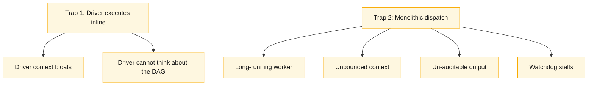
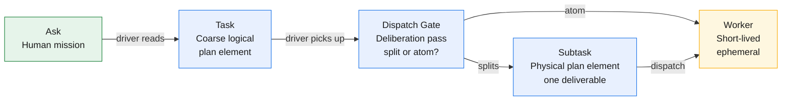

# The problem & the thesis

## The constraint: context as a scarce, lossy resource

Serious agentic work does not fit in a single LLM session. A real project — a research report, a migration, a multi-part deliverable, a deployed system — spans hundreds of model invocations and many dispatched subagents. It runs longer than any one context window, longer than any one session, longer than any one model's patience.

This exposes the binding constraint of the medium: **context is the scarce, lossy, expensive resource.** Every token in a context is paid for, on every turn it survives. Context is lossy — quality degrades as a window fills, long before it overflows. And context is bounded — when the window ends, *nothing survives the session boundary unless it is on disk.* An agent's working memory is not durable. The transcript is not a system of record. The only thing that crosses a session boundary is what was written down.

We call this regime **bounded-context agentic execution**: real work, much larger than one context, where the binding question is not "can the model do the task?" but "how do we move work across context boundaries without losing it, and without paying for it forever?" Get the economy of context wrong and a long project does not fail loudly — it slowly grinds to a halt under its own weight.

## The failure mode: monotonicity and the two traps

Earlier GOTM designs were monotonic — costs that only ever grew. On a long project, monotonicity is fatal. The analysis of six recent projects (epsilon-lakebase, influential-agentic-workshop, knowledge-graph, identity-federation, nielsen/genie/dsa, reyden/ontology) exposed two concrete failure modes, both rooted in the same architectural mistake.

**Trap 1: The driver picked up execution inline.** Small tasks were justified as "too small to warrant a worker," so the driver did them itself. A one-line fix here, a quick read there, a small script. These accumulated. A driver that had done 15 small things had 15 decision-trees in its context. Combined with the ledger, the conversation, the watchdog, and the next 10 tasks it must schedule, the frontier context grew unbounded. More importantly, the driver could no longer think clearly about the DAG because it was *doing* the work.

**Trap 2: Monolithic subagent dispatch.** A task that *was* dispatched but was large got one worker, one long-lived context, one unbounded task definition. The worker ran for hours (watchdog stalls in every project). It was un-auditable (a 400KB transcript is not a findable unit output). A failure mid-task meant retry the whole thing. A worker that discovered it should split mid-run had no mechanism to do so — it had to soldier on or fail, and if it failed the driver had to decompose the task *post-mortem*.

## The Spark reframe: the driver plans, never executes

Both traps share one root: **the driver was doing the work**. The cure comes from how Spark solved the parallel execution problem one layer down: separate the planner from the doer.

In Spark, the driver builds a *logical* plan (a DAG of jobs → stages → tasks) without touching data. It reads configurations and closed upstream results — all metadata — and yields a *physical* schedule: which executor runs what, in what order. Each executor is a short-lived process that runs one task and returns a result pointer (not the data itself). The driver never executes; it plans, schedules, and monitors.

The 4.5 reframe imports that model: **the driver plans the DAG but executes nothing. Every concrete task goes to a short-lived worker.** And when the driver picks up a coarse task for execution, it takes a deliberation pass — now, with upstream closed and more information than it had at plan time — and decides: does this split into subtasks, or commit it as an atom? This decision is made *before* dispatch, so the worker knows its exact scope and cannot surprise downstream.

## The four-level object model: Ask → Task → Subtask → Milestone

GOTM 4.5 introduces an explicit four-level nesting, each with a Spark analogue.

| GOTM | Definition | Spark | Scope |
|---|---|---|---|
| **Ask** | Human mission / question | (user question) | Driver reads once per project start (implicit, not a unit) |
| **Task** | Coarse ledger entry; a logical plan element | Job | A work area / phase (days to weeks); registered upfront |
| **Subtask** | Physical plan element; born when a Task decomposes | Stage/partition-task | One deliverable / boundary (hours to days); registered at dispatch gate |
| **Milestone** | Verification boundary for runtime/eval tasks | Shuffle / barrier | Explicit gate that forces live-verified checks (implicit for pure authoring) |

A **Task** is registered upfront as a coarse spec. When the driver reaches it in the ready set, it takes a **deliberation pass** and either:
- **Commits it as an atom** (no split) and dispatches a single worker, OR
- **Splits it into Task.1, Task.2, … Task.N** (decimal children), registers them all, and the original becomes a **pure container** with no Output of its own.

A **Milestone** is an explicit ledger row for runtime/eval tasks that marks a forced **live-verification boundary**. For example, a task to deploy to three regions splits into three subtasks (one per region, each live-verified individually), plus an explicit milestone that re-aggregates and verifies the system as a whole.

## The thesis: deliberate decomposition + aggressive delegation

The founding GOTM invariant still holds: **the durable store is the system of record; every working context is disposable and reconstructable from it.** GOTM 4.5 builds on that and makes it operational:

> **The driver executes nothing; every task, however small, goes to a short-lived worker. The decomposition happens at the dispatch gate, not mid-run. The milestone is where live verification is forced.**

Three things follow from this. *The driver is a scheduler* — it plans, it holds metadata, it dispatches, it audits. It never reads bulk work or edits artifacts. *Every worker is atomic* — born for one deliverable, then discarded; if it discovers the work should have been smaller, it reports that observation (a typed signal); the driver decides whether to act on it. *Nothing grows unbounded* — the driver carries only the plan (metadata + ledger), never the work; workers are ephemeral; the store is tiered so the recurring read stays cheap.

The net result: small tasks no longer bloat the driver (they are worker dispatches, costing nothing but one turn + a ledger row); large tasks no longer stall watchdogs (they are split *before* dispatch, so each worker gets bounded scope and the driver can reason about the split before it happens).

## The law: aggressive delegation is absolute

The discipline behind this thesis is one statement:

> **The driver plans and talks; all work — however small — is a worker dispatch. Nothing happens on the hot path except scheduling, auditing, and ratification.**

This is not a performance heuristic; it is the structural property that keeps monotonicity out. The moment the driver edits a chapter, reads a 50MB file into its own context, or fixes a bug directly, it starts accumulating work-state. The accumulation is exactly the monotonicity we forbid. Aggressive delegation is absolute: there is no threshold below which the driver "just quickly does it." A one-line fix is still a worker dispatch. This costs the driver nothing — one turn, one worker, one terse result — and buys everything: clean driver context, auditability, parallelism, recovery from disk.

## Everything that follows is a consequence

This chapter argues a thesis. The rest of this framework is the derivation: Chapter 2 builds the **driver, worker, and store** architecture. Chapter 3 makes the driver's plan concrete: **work as a DAG**. Chapter 4 describes the **scheduler loop**. And the remaining chapters show how that machinery achieves the goals: audit independence, resilience, and learning across projects.
