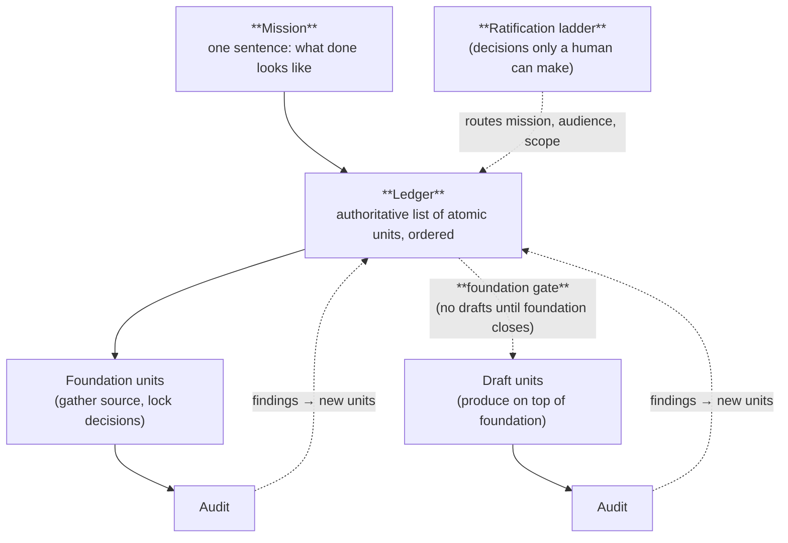
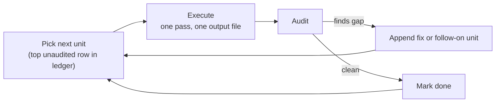

# What GOTM is

GOTM is a discipline for executing complex work that exceeds one working session.

A working session — one writing session, one coding session, one design session — has a fixed bandwidth. The mind can hold so much. The page can show so much. When the work is small enough to fit, you don't need GOTM; you do the work and you're done. When the work exceeds one session, something has to carry context across sessions, or each session starts cold and the work drifts.

GOTM is the discipline of carrying that context — explicitly, externally, and in a form that survives whoever picks up the work next.

## The five primitives

GOTM rests on five working primitives. None is theoretical; each is a file or a rule you can point at.

**Mission.** A single sentence that names what done looks like. It sits at the top of the project's working notes. It exists so that a stranger to the project — or yourself in three weeks — can answer "why are we doing this" in one read.

**Ledger.** A single file that holds every unit of work the project is committed to, in the order they should be done. The ledger is authoritative. State that isn't in the ledger isn't really state. If two documents disagree, the ledger wins. Because the ledger *is* the project's state, it is also its recovery point: the files on disk — not the chat history — must be enough to resume, whether the last session ended cleanly or crashed mid-step.

**Atomic unit.** Each row in the ledger is one execution pass — one working session that produces one named output file. Not two outputs. Not "and also a small revision." Not "while we're at it." One. If a planned unit hides more than one output, it gets split before work starts.

**Foundation gate.** Some work is foundation — gathering source material, mapping the terrain, locking decisions. Some work is drafting on top of that foundation. Foundation precedes drafting. The gate is the line between them. Drafts that begin before the foundation closes don't fail noisily; they fail by producing fluent prose grounded in nothing. The gate makes the failure mode legible.

**Audit cycle.** Every claimed-done unit is checked before downstream work depends on it. The check is mechanical — does the named output exist; does its content match what was promised; do its citations trace. An audit either passes the unit through or surfaces a finding that becomes its own follow-on unit.

Around those five sits a sixth idea — a **ratification ladder** — for the small set of decisions that aren't yours to make alone. The mission, who the audience is, what counts as done — these may need a stakeholder, a customer, a co-author. The ladder names which decisions get ratified and which don't.

That is the whole framework. There is no hierarchy underneath. There are no goals, objectives, or targets. There is a mission, a ledger, and a working cycle.

### How the primitives relate

The diagram surfaces two things the prose can underplay. First, audits feed *back into the ledger* — findings become new units, not edits to closed ones. Second, ratification is an *external input* to the ledger, not an inline ceremony; it routes the questions a human owns and leaves everything else inside the working loop.

## How it works

The cycle is short. You write the mission. You decompose the work into atomic units and list them in the ledger. You order them so foundation precedes drafting. You pick the first unit, do exactly that unit, write its output, mark it done, audit it. You move to the next.

When something surprises you — a unit was secretly two units; a foundation gap appears; a decision turns out to need someone else's input — the ledger absorbs the change. New units are appended. Old units that are now wrong get superseded, not edited. The ledger grows; it doesn't drift.

The discipline isn't in following a plan. The discipline is in keeping the ledger honest as the plan changes.

## What GOTM isn't

GOTM isn't a hierarchy. Earlier versions of this framework called the working unit a "Milestone" and grouped milestones into "Targets" and "Objectives" and "Goals." That hierarchy turned out to be filing labels — present in the spec, absent from the actual decisions. It is dropped here. If grouping helps you scan a long ledger, group however you like; the grouping is not load-bearing.

GOTM isn't a methodology. It does not tell you how to write, how to design, how to test, how to code. It tells you how to carry context across many sessions of writing, designing, testing, or coding.

GOTM isn't project management. There are no sprints, no estimates, no burndowns, no roles. There is one ledger and one rule for what counts as a unit.

GOTM isn't agile, lean, or waterfall. It is orthogonal to all three. You can do agile inside GOTM; you can do waterfall inside GOTM. The discipline operates underneath whichever methodology you use to plan the work itself.

## When you need it

You need GOTM when the work is too large for one session and the cost of losing context is high — when the deliverable is multi-week, multi-author, or multi-session under the same person; when "where were we" at session start is its own task; when drafts run ahead of evidence; when you have ever ended a project unsure whether a particular claim came from a source or a vibe.

You don't need GOTM for one-shot work. You don't need it for tasks that fit in a single sitting. You don't need it when the cost of drift is low — for a one-off email or a five-line script, the ceremony is more than the work.

The next chapter looks at one specific case where the cost of drift is enormous and the working-session bandwidth is severely bounded: complex work done with AI agents.

→ Next: [What agents are missing today](02-what-agents-are-missing.md)
