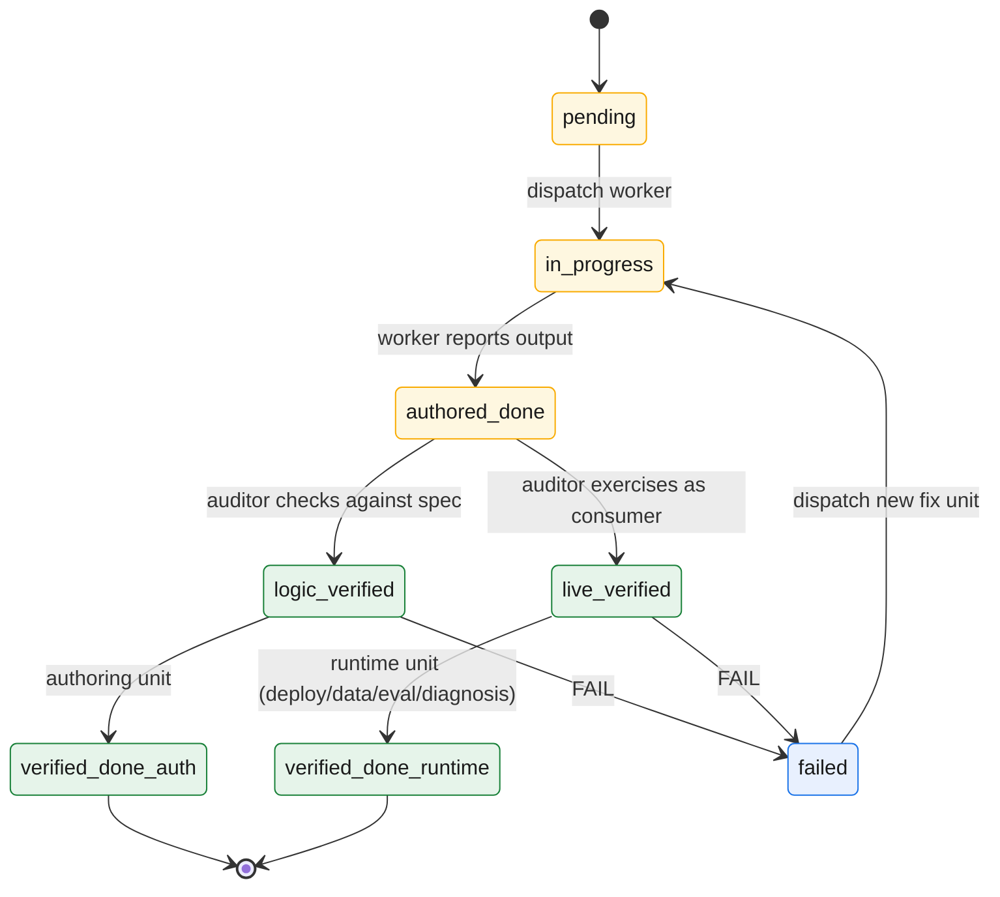
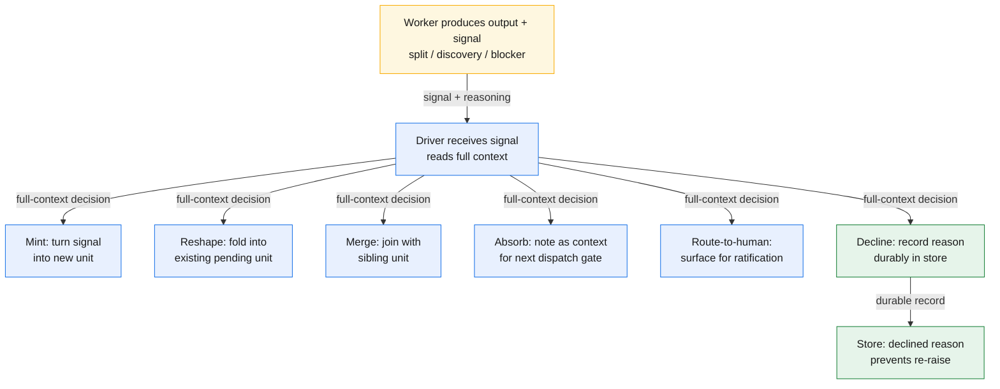

# The architecture: driver / worker / store

The previous chapter ended with a single law — *the driver executes nothing; every task, however small, goes to a short-lived worker* — and a promise that everything else is a consequence of it. This chapter cashes out the first and most important consequence: a three-role architecture. Separate the planner from the doer, route everything they share through disk, and you have **driver**, **worker**, and **store**. The split is not an arrangement of convenience. It is the structure that makes non-monotonicity a property of the system rather than a habit someone has to remember.

## The three roles

| Role | Maps to (Spark) | Lifetime | Holds | Never holds |
|---|---|---|---|---|
| **Driver** — the conversation agent | the driver | long-lived, **checkpointed** (re-hydratable from the store) | the plan (the ledger DAG), the discipline (the protocol), the human interface (the ratification ladder), the scheduler loop | work artifacts, raw inputs, execution logs, build/deploy state |
| **Worker** — a dispatched subagent | an executor | **ephemeral** — one unit, then discarded | only its bounded inputs and its spec; produces exactly one output; returns a terse structured result | any cross-unit state; any context from a prior unit |
| **Store** — `.gotm/` plus the repo | HDFS / shuffle | durable, **tiered** | hot frontier (active units plus the recovery window) and cold archive (closed detail) | — |

**The driver is the conversation agent.** It is the one context that talks to the human and persists across the project. It plans, it sequences, it ratifies, it runs the scheduler loop. What it holds is deliberately thin: the plan, the discipline, the human interface, and the loop. What it does *not* hold is the work — no draft chapters, no raw inputs, no build output, no execution logs. The driver knows that a unit exists, what it depends on, and where its output lives. It does not know what is *in* that output. It carries the index, not the work.

**A worker is an ephemeral subagent dispatched to do exactly one unit.** It is born with a payload — its bounded inputs and its spec — does its one job, writes its one output, returns a terse structured result, and is discarded. It never sees a sibling's work, never carries state from a prior unit, never holds the conversation. Like a Spark executor running a single task, it is a function of its inputs: same inputs, same spec, same result. That is precisely what lets it be thrown away and, if needed, recomputed.

**The store is `.gotm/` plus the repo — the durable store, the system of record.** It is HDFS and the shuffle file: the only thing that crosses a context boundary, the only place work durably lives. It is **tiered** by design — a hot frontier (the active units and the recent recovery window, read on every turn) and a cold archive (closed-out detail, never on the hot path). Workers read their inputs from it and write their outputs to it. The driver reads the frontier from it. The store is where the parts that must not be lost are kept, and where any discarded context is rebuilt from.

*The three roles and the four flows: the driver dispatches workers and is the single writer of the store; workers read their inputs from the store and return only a terse result. The bulk never crosses into the long-lived context.*

## The load-bearing rule

> **The driver plans and talks; all work — however small — is a worker dispatch.**

Three consequences: (1) The driver never edits artifacts (a one-line fix is still a dispatch; inline execution is how monotonicity creeps in). (2) The driver never reads bulk input (dispatches a summarize worker instead; bulk stays off the hot path). (3) The driver is the single writer of the store (workers report, driver records; one writer means no race).

## The dispatch gate: deliberate decomposition before dispatch

When a Task enters the driver's ready set, the driver does not immediately dispatch it. Instead, it takes a **deliberation pass** — a cheap, metadata-only scan — and decides: does this task split into subtasks, or is it an atomic unit? This decision, made *before* dispatch with more information than was available at plan time, is the engine of deliberate DAG decomposition.

**The deliberation pass** reads the task spec, the summaries of its upstream inputs, and the stopping rule (split down to one deliverable, never below). It costs nothing but one model invocation and a cursor through the ledger. The driver then either:
- **Commits it as an atom** and dispatches a single worker to execute it, OR  
- **Splits it into subtasks** (e.g., U3 becomes U3.1, U3.2, U3.3 — decimal children), registers them all with their internal dependencies, and the original becomes a **pure container** (no Output of its own; closes verified-done only when all children verify).

Because the decomposition happens *before* dispatch, the worker never gets surprised mid-run. It knows its exact scope when it is born; it knows what to produce and where to write it. No mid-task discovery that the work should have been smaller. No watchdog stalls from a worker realizing halfway through that it should split.

## Workers are atomic, self-contained, and disposable

Atomic means: a worker is born for exactly one deliverable and dies after producing it. Self-contained means: all its required inputs are passed at dispatch; it needs nothing more from the driver once running. Disposable means: it is discarded immediately after reporting its result; it carries no state forward.

The contract is: *given the inputs and the spec, produce the output, report a result (structured: status, output reference, optional typed signal), and vanish.* Because this contract is so narrow, a worker that crashes can be recomputed by simply re-running it — the inputs are on disk, the spec is the same, the result will be identical. And because the worker never holds state across invocations, the driver never has to reason about partial work or recovery loops.

## The verify-grain split: logic-verified vs live-verified

Chapter 1 established that "auditor ≠ author" is structural — the author is discarded before any audit happens. GOTM 4.5 deepens this: the *kind* of verification depends on the *kind* of unit.

**Logic-verified** means: an independent auditor checked the output against the spec and source. Did the chapter exist? Is it on-spec? Is the code syntactically correct and does it compile? Are the configs well-formed? This is terminal verification for pure authoring work (writing, research, documentation).

**Live-verified** means: an auditor exercised the artifact *as a real consumer would*. Did the deployment actually run? Does the data query return results? Does the UI render and respond? Did the eval harness run without flaw? This is required terminal verification for runtime kinds — deploy-infra, data, eval, diagnosis — where logic-only checking misses the point.

A logic-only audit of a runtime unit is a **FAIL-as-UNVERIFIED**, not a pass. The two verify-grains are not interchangeable. Chapter 6 (Keeping it honest) binds each Kind to its required verify-grain and describes how the **Milestone** forces the live-verified gate for runtime tasks.

*Unit lifecycle: born pending, dispatched, worker produces output (authored-done), independent audit (logic-verified or live-verified per Kind), terminal verified-done or FAIL. FAIL becomes a new unit.*

## The upward-signal protocol: workers suggest, drivers decide

A worker may encounter an observation that the driver should know: the task would benefit from being split differently, a downstream dependency is at risk, a block was discovered that the driver should re-route around. The worker has bounded context — it is not the place to decide whether to act on these observations. Instead, the worker returns a **typed signal** — `split` (the work should split here), `discovery` (something unexpected was found), or `blocker` (work cannot proceed) — along with its terse reasoning.

The driver receives the signal and, holding full context, decides whether to act. The options are:
- **Mint**: turn the signal into a new unit and dispatch it  
- **Reshape**: fold the signal into an existing pending unit  
- **Merge**: join the flagged work with a sibling unit  
- **Absorb**: note the signal as context for the next dispatch-gate pass, but take no immediate action  
- **Route-to-human**: surface it for human ratification  
- **Decline with reason**: do nothing, and record the reason durably (so the signal is not re-raised forever)

The last option is crucial: if a signal is declined, the decision must be recorded in the store, *not* discarded from the driver's context. Otherwise, the same signal comes back again later, creating infinite churn. This is the discipline that fixes the knowledge-graph failure: a worker discovered an adjacent problem, self-resolved it, and took the live app down. Now: workers report what they find; drivers decide whether to fix it; declined decisions are durable.

*Upward signals: workers report observations (split / discovery / blocker); the driver (sole full-context) decides whether to mint, reshape, merge, absorb, route, or decline with a durable reason.*

## The net principle

The architecture: thin checkpointed driver (plans, talks, decides), disposable workers (one atomic unit each), durable tiered store (only thing crossing context boundaries). Everything downstream — scheduler loop, fan-out, audit independence, resilience — rides on this split. The principle: **no context on the hot path is long-lived; the one long-lived context carries the index, not the work.**

The next chapter makes the driver's plan concrete: work as a DAG.
