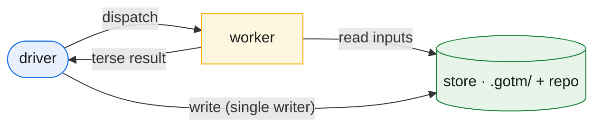

# The architecture: driver / worker / store

The previous chapter ended with a single law — *nothing on the hot path is long-lived* — and a promise that everything else is a consequence of it. This chapter cashes out the first and most important consequence: a three-role architecture. Separate the planner from the doer, route everything they share through disk, and you have **driver**, **worker**, and **store**. The split is not an arrangement of convenience. It is the structure that makes non-monotonicity a property of the system rather than a habit someone has to remember.

The cleanest way to see it is by analogy to Spark, which solved the same problem one layer down: how to run work far larger than any single machine without any single machine accumulating all the state.

## The three roles

| Role | Maps to (Spark) | Lifetime | Holds | Never holds |
|---|---|---|---|---|
| **Driver** — the conversation agent | the driver | long-lived, **checkpointed** (re-hydratable from the store) | the plan (the ledger DAG), the discipline (the protocol), the human interface (the ratification ladder), the scheduler loop | work artifacts, raw inputs, execution logs, build/deploy state |
| **Worker** — a dispatched subagent | an executor | **ephemeral** — one unit, then discarded | only its bounded inputs and its spec; produces exactly one output; returns a terse structured result | any cross-unit state; any context from a prior unit |
| **Store** — `.gotm/` plus the repo | HDFS / shuffle | durable, **tiered** | hot frontier (active units plus the recovery window) and cold archive (closed detail) | — |

**The driver is the conversation agent.** It is the one context that talks to the human and persists across the project. It plans, it sequences, it ratifies, it runs the scheduler loop. What it holds is deliberately thin: the plan, the discipline, the human interface, and the loop. What it does *not* hold is the work — no draft chapters, no raw inputs, no build output, no execution logs. The driver knows that a unit exists, what it depends on, and where its output lives. It does not know what is *in* that output. It carries the index, not the work.

**A worker is an ephemeral subagent dispatched to do exactly one unit.** It is born with a payload — its bounded inputs and its spec — does its one job, writes its one output, returns a terse structured result, and is discarded. It never sees a sibling's work, never carries state from a prior unit, never holds the conversation. Like a Spark executor running a single task, it is a function of its inputs: same inputs, same spec, same result. That is precisely what lets it be thrown away and, if needed, recomputed.

**The store is `.gotm/` plus the repo — the durable store, the system of record.** It is HDFS and the shuffle file: the only thing that crosses a context boundary, the only place work durably lives. It is **tiered** by design — a hot frontier (the active units and the recent recovery window, read on every turn) and a cold archive (closed-out detail, never on the hot path). Workers read their inputs from it and write their outputs to it. The driver reads the frontier from it. The store is where the parts that must not be lost are kept, and where any discarded context is rebuilt from.

## The load-bearing rule

One rule holds the architecture together:

> **The driver plans and talks; all work — however small — is a worker dispatch.**

Three things fall out of it, and they are the whole discipline.

**The driver never edits a work artifact.** Not a chapter, not a config file, not a line of code. If something needs producing or changing, that is a unit, and a unit is a worker dispatch. There is no threshold below which the driver "just quickly does it itself" — a one-line fix is still a worker, because the moment the driver edits artifacts it starts accumulating work-state, and the accumulation is exactly the monotonicity we are trying to forbid.

**The driver never reads bulk input.** When it must inspect something large — a long file, a directory, a data dump — it does not pull that into its own context. It dispatches a read-and-summarize worker and receives back a terse digest. The bulk stays off the hot path; only the summary reaches the long-lived context.

**The driver is the single writer of the store.** Workers report results; the driver records them. There is exactly one hand that writes the ledger and the durable state, which removes a whole class of races and contention by construction. Many contexts read the store; one writes it.

Put together: the driver is a coordinator that holds an index and a discipline, dispatches all real work to disposable contexts, and is the sole author of the record. It is generous with itself — it is the one context that is orchestrating — and frugal everywhere there are many contexts.

*The three roles and the four flows: the driver dispatches workers and is the single writer of the store; workers read their inputs from the store and return only a terse result. The bulk never crosses into the long-lived context.*

## The non-monotonicity guarantee, per role

The architecture buys non-monotonicity role by role. Two of the three roles get it structurally. The third has an honest limit, and the framework states it plainly rather than papering over it.

**Workers are structurally non-monotonic.** A worker is born fresh for one unit and gone after. Its context is bounded by *one unit's* work — forever, regardless of how large the project grows. There is no "rotate the worker" rule to remember and no discipline to slip on, because rotation is not a policy laid over the worker; it *is* the worker's shape. A thousand units cost a thousand bounded contexts, never one growing one.

**The store's hot path is non-monotonic.** The cold archive grows without bound — that is fine, because it is never on the hot path. The ledger is **born tiered**: a small hot frontier the driver and workers actually read, and a cold archive that accumulates but is pulled only on demand. The recurring read stays cheap no matter how much history piles up behind it. Growth is real but quarantined to the part nobody reads on a recurring basis.

**The driver is checkpointed, not stateless — and this is the honest limit.** In interactive Claude Code the driver *is* the session. It cannot be made stateless, and it cannot self-trigger `/compact`: compaction is human-only, no hook or model directive fires it, and the auto-compact threshold is not tunable. We do not pretend otherwise. The driver still grows — but *slowly*, because it carries only the plan, the discipline, and a terse frontier, never the work.

What makes the limit honest rather than fatal is that the driver is **checkpointed**. Its durable state lives in the store, so any fresh start rebuilds it. On a cold restart, after a `/clear`, or after an auto- or manual compaction, the driver reconstructs its working set from the store through the **session-start reconcile** — the same transcript-independence guarantee GOTM has always made. Crucially, **re-hydration is runtime-agnostic and depends on no compaction hook.** An optional hook could auto-inject the manifest on a compaction event, but it is at most an accelerator; the framework deliberately does not build on it, because the store-plus-reconcile path works on every runtime without it.

In SDK or headless mode the driver gains one extra capability — it *can* compact itself programmatically. That is a bonus where the runtime allows it, not a requirement the architecture leans on. Either way the rule is the same: **never sell a stateless interactive driver.** The driver is a long-lived, slowly-growing, re-hydratable context — and that is enough, because re-hydration, not statelessness, is what makes it survivable.

## The net principle

That is the architecture: a thin, checkpointed driver that plans and talks; disposable workers that each do one unit and vanish; a durable, tiered store that is the only thing crossing context boundaries. Every consequence in the rest of this framework — the scheduler loop, parallel fan-out, structural audit independence, resilience — rides on this split. And the split exists to honor one sentence:

> *No context on the hot path is long-lived; the one long-lived context carries the index, not the work.*

The next chapter makes the driver's plan concrete: work as a DAG — units as self-contained dispatch specs, the ledger as the DAG and scheduler state, and foundation as topology.
