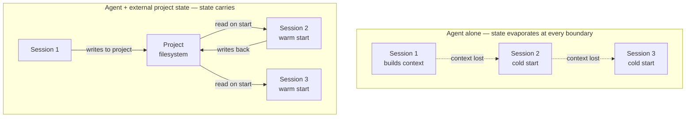
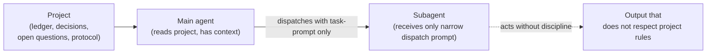

# What agents are missing today

The previous chapter described GOTM as a discipline for work that exceeds one working session. This chapter narrows to one case where the working session is radically bounded and radically opaque: a session with an AI agent.

The premise is simple. An agent — a large language model wrapped in a chat or coding interface — operates within a single context window. Everything the agent can attend to in one turn fits in that window. The window is finite. The work, often, is not.

This chapter walks through what specifically falls apart when complex work is attempted inside agent sessions today, without external scaffolding. The chapter does not yet propose a fix; the next one does.

## 1. The agent as a working session

An LLM agent session has the same shape as a human working session, with one tightening: the bandwidth is the context window, and the window resets at session boundaries with no internal memory of what came before.

Inside one session the agent can hold a great deal — the open files, the conversation so far, what has been decided. That state is real, but it is *in the window*. When the session ends, the window closes. When the next session opens, the window is empty.

This is not a flaw to be fixed by a smarter model. The session boundary is structural. Larger windows raise the ceiling on what one session can do; they do not change the fact that complex work needs more than one session.

## 2. What evaporates between sessions

When a session ends, whatever the agent figured out — which sources matter, which decisions were locked, which questions are open — is gone unless it was written down outside the agent.

Most of the time, it was not written down. The agent's working notes lived in the conversation. The conversation is in the window. The window is closed.

The next session opens with no idea where the last one ended. You re-explain. The agent re-derives — usually slightly differently than last time. Small drift compounds. By session ten, the project's working understanding has been re-invented eight times.

## 3. Drafts run ahead of evidence

When an agent is asked to produce a deliverable without an explicit foundation already laid out for it, the agent will produce one anyway. The output will be fluent. It will read as if grounded. It often is not.

What the agent draws on, in the absence of project-specific evidence, is its training priors — patterns from the public corpus. Those priors are usually plausible and sometimes accidentally correct. They are not the project. They are a confident average of similar-shaped projects the model has seen before.

The failure mode is not that the agent refuses; it is that the agent never signals the gap. Confidence is constant whether the output is grounded or extrapolated.

## 4. Subagents inherit context narrowly

When a main agent decides a piece of work is too large for its own pass, it dispatches a subagent. The subagent receives a prompt. That prompt names the task and the inputs to read. It does not, in current practice, carry the project's working discipline — the ledger, the decisions log, the foundation gate, the audit checklist. Those live in the project, but the dispatch did not reference them.

The subagent produces fluent output that obeys the prompt and ignores the project. The main agent receives the output and folds it back in. The project absorbs work that was not done under the project's discipline. The discipline gap is invisible at the moment it opens.

## 5. Self-marking, not self-auditing

An agent that completes a unit marks it done. There is no independent check on the claim. The agent that did the work is the same agent that judges whether the work matches what was promised — same context, same blind spots.

In human terms, this is the author of a paragraph self-grading whether they cited sources accurately. The author has a particular reason to believe the citations are fine. The point of an audit is that someone other than the author looks.

Without something external doing the check, the project accumulates "done" markers that do not all hold up. The first time anyone notices is when a downstream unit reads a supposedly-done output and finds it is not what was claimed.

## 6. The blurred human/agent decision boundary

Some decisions in a project are the human's — the mission, the audience, what counts as done, the deliverable format, the license, the scope. Some are properly the agent's — the order to read inputs, the word count for a single section, whether to split a unit into two.

There is no convention today that says which is which. The boundary is improvised per project, per turn. The result is two failure modes running concurrently. Agents make decisions that should have been ratified — they pick an audience, they pick a scope, they pick a tone, and the human is presented with the consequence after the fact. Or humans get pulled into decisions that do not need them — every formatting choice surfaces a question — and the project bogs down in micro-ratification.

What is missing is a stated ladder: this layer is yours, this layer is mine, this layer is mine but I will surface it if it looks material. Without one, every project re-negotiates the boundary, badly.

## 7. Tooling lives one turn; projects live many

The tooling around agents — slash commands, system prompts, configured skills, custom instructions — operates at the session level. A slash command fires once. A system prompt configures one session. A skill loads when invoked.

Complex work spans hundreds of sessions. The persistence horizon of the tooling and the persistence horizon of the work do not match.

The mismatch is not addressed by remembering to re-invoke the tooling every session, because remembering is itself a form of state that has to live somewhere — and the somewhere it has to live is outside the agent. The same problem, recursively.

## 8. The agent cannot fix this alone

Every gap above has the same shape. Something needs to persist past a session boundary. Something needs to carry from main agent to subagent. Something needs to judge work from outside the work. Something needs to know which decisions are yours.

That something is not inside the agent. The agent is, by construction, a bounded-context worker. The thing that gives the worker continuity has to live outside.

The next chapter describes what that something is when GOTM is the answer: the discipline materialized in the project's filesystem, where every agent that touches the project encounters it automatically, and the project carries the discipline across whatever sequence of sessions and subagents the work requires.

→ Next: [GOTM with agents](03-gotm-with-agents.md)
