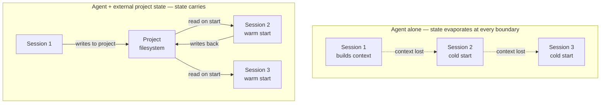
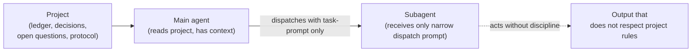

# Why agents need it

The previous chapter described GOTM as a discipline for work that exceeds one working session. This chapter narrows to the case where the working session is the most bounded and the most opaque: a session with an AI agent. It is also the case where the framework has been tested hardest, and the last two gaps below were found by running it for real.

The premise is simple. An agent — a large language model wrapped in a chat or coding interface — operates within a single context window. Everything it can attend to in one turn fits in that window. The window is finite. The work, often, is not. And when the session ends, the window closes with no memory of what it held.

This chapter walks through what specifically falls apart when complex work is attempted inside agent sessions with no external scaffolding. It does not yet propose a fix; the next chapter does. Every gap below has the same shape, and naming that shape is the point.

## 1. State evaporates between sessions

Whatever the agent figured out in a session — which sources matter, which decisions were locked, which questions are still open — is gone when the session ends, unless it was written down somewhere outside the agent. Usually it wasn't: the working notes lived in the conversation, the conversation lived in the window, and the window is closed.

The next session opens with no idea where the last one ended. You re-explain. The agent re-derives — usually a little differently than last time. Small drift compounds. By session ten, the project's working understanding has been re-invented eight times.

## 2. Drafts run ahead of evidence

Asked to produce a deliverable without an explicit foundation laid out for it, an agent will produce one anyway. The output will be fluent. It will read as if grounded. It often is not.

What the agent draws on, absent project-specific evidence, is its training priors — patterns from the public corpus. Those priors are usually plausible and sometimes accidentally correct. They are not the project; they are a confident average of similar-shaped projects the model has seen. The failure mode is not refusal — it is that the agent never signals the gap. Confidence reads the same whether the output is grounded or extrapolated.

## 3. Subagents inherit context narrowly

When a main agent decides a piece of work is too large for its own pass, it dispatches a subagent with a prompt. That prompt names the task and the inputs to read. It does not, in current practice, carry the project's working discipline — the ledger, the decisions log, the foundation gate, the audit checklist. Those live in the project, but the dispatch never referenced them.

The subagent produces fluent output that obeys the prompt and ignores the project. The main agent folds it back in. The project absorbs work that was not done under the project's discipline, and the gap is invisible at the moment it opens.

## 4. Self-marking, not self-auditing

An agent that completes a unit marks it done. There is no independent check on the claim: the agent that did the work is the agent that judges whether the work matches what was promised — same context, same blind spots. In human terms, this is the author of a paragraph grading whether they cited their sources accurately. The point of an audit is that someone *other than the author* looks. Without that, the project accumulates "done" markers that do not all hold up, and the first time anyone notices is when a downstream unit reads a supposedly-finished output and finds it isn't what was claimed.

## 5. The human/agent decision boundary is improvised

Some decisions are the human's — the mission, the audience, what counts as done, the format, the scope. Some are properly the agent's — the order to read inputs, the word count of a section, whether to split a unit in two. No convention says which is which, so the boundary is renegotiated per project and per turn. The result is two failure modes running at once: agents make decisions that should have been ratified (an audience, a scope, a tone — presented to the human only after the fact), and humans get pulled into decisions that don't need them (every formatting choice surfaced as a question) until the project bogs down in micro-ratification.

## 6. Tooling lives one turn; projects live many

The tooling around agents — slash commands, system prompts, configured skills, custom instructions — operates at the session level. A slash command fires once. A system prompt configures one session. A skill loads when invoked. Complex work spans hundreds of sessions. The persistence horizon of the tooling and the persistence horizon of the work do not match, and "remember to re-invoke the tooling every session" is itself a piece of state that has to live somewhere outside the agent — the same problem, one level up.

## 7. Written-down rules still rely on memory

Suppose a project does write things down — a protocol that says *never edit a finished output*, a habit of recording each decision as it is made. Two failure modes still slip through, and both are invisible at the moment they happen.

The first is **silent work**: the agent does a unit, produces the output, and moves on without recording it. The work exists on disk; the project's bookkeeping doesn't know. The second is the **quiet edit**: the agent reopens a finished output and changes it in place rather than appending a correction, erasing the trail of what changed and why.

Nothing catches either in the moment. The only thing between the discipline and its erosion is the agent *remembering* to follow it — and remembering is a property of the same bounded context that closes at the session boundary. A discipline that depends on the worker's memory has quietly reintroduced the exact dependency it was meant to remove.

## 8. Session ends are not always graceful

The picture so far assumes sessions end cleanly — the agent finishes a turn, writes its notes, yields. Real sessions also end the other way: a crash, a killed process, a closed terminal, a resume prompt that never gets answered. The session ends mid-turn, and there may be no resume at all.

When that happens the project can be left in a state no one chose. An output file written, but the bookkeeping never updated to say so. A unit marked started, with nothing to show for it. On the next cold start there is no procedure to notice: the new session reads the bookkeeping, trusts it, and either redoes work that was silently finished or builds on work that was silently abandoned. The promise that a project's state survives session boundaries is only as strong as that state staying *consistent* with what is actually on disk — and graceful ends preserve that consistency while hard ends do not.

## The shape of every gap

Every gap above is the same shape. Something needs to persist past a session boundary. Something needs to carry from main agent to subagent. Something needs to judge the work from outside the work. Something needs to know which decisions are the human's. Something needs to catch the rule the agent forgot, and reconcile the state a crash left behind.

That something is not inside the agent. The agent is, by construction, a bounded-context worker. The thing that gives the worker continuity has to live outside it. The next chapter describes where.

→ Next: [How the project carries the discipline](03-how-the-project-carries-it.md)
