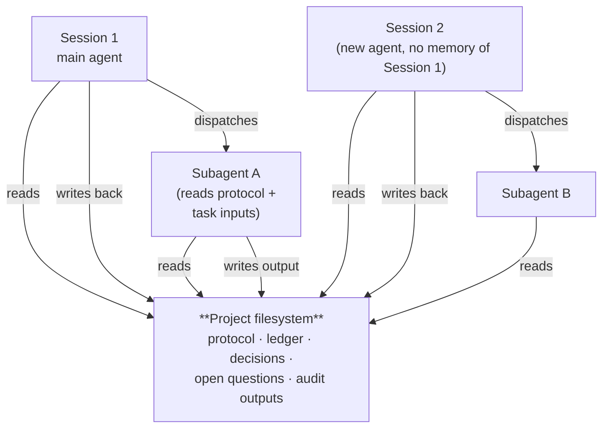
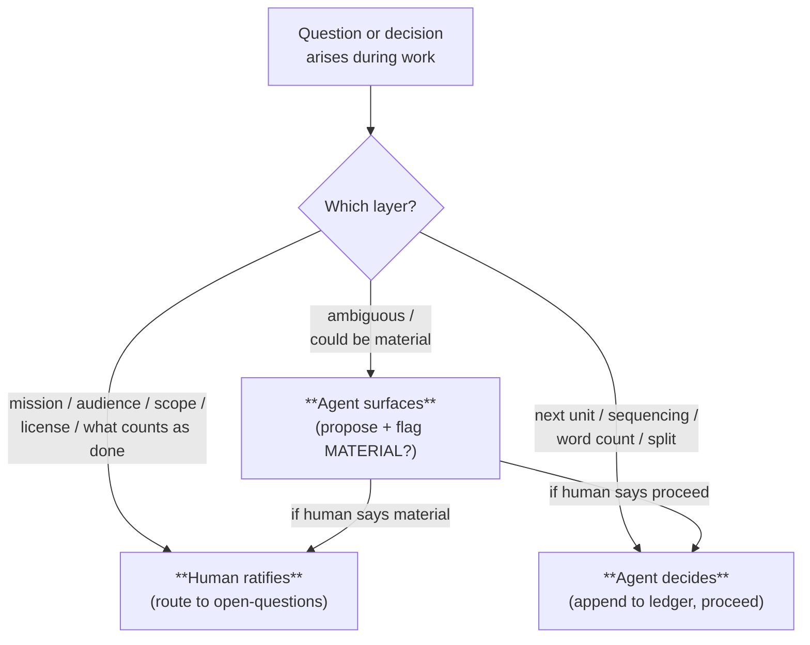

# GOTM with agents

The previous chapter listed what falls apart when complex work is attempted inside agent sessions without external scaffolding. State evaporates between sessions. Drafts run ahead of evidence. Subagents inherit only the task. Self-marking replaces audit. The human/agent decision boundary is improvised. Session-level tooling cannot persist across hundreds of sessions. Written-down rules still lean on the agent remembering them. Hard session ends leave the project's state inconsistent with what is on disk. Every gap had the same shape: something needed to live outside the agent.

This chapter names what that something is.

## 1. The shift

The move is to stop trying to make the agent more disciplined and instead make the project more disciplined.

The agent does not change. It remains a bounded-context worker. What changes is what surrounds the agent. The discipline materializes in the project's filesystem — as files the agent reads when it opens a session, files it writes when it makes a decision, files it points its subagents at when it dispatches work. The agent is stateless; the project is stateful. The project carries the discipline forward across whatever sequence of sessions and subagents the work requires.

This is the only place where the discipline could live and still survive the gaps from Chapter 2. Tooling lives one turn. Custom instructions configure one session. Memory features bind to one tool. The project's working directory outlives all of them.

## 2. What the project carries

The project holds a small fixed set of working files. These are described here generically — concept first, filenames later — because the names are an implementation choice. The concepts are what matter.

**The protocol.** A file that names how this project works: that there is a ledger and the ledger is authoritative; that units are atomic; that foundation precedes drafts; that audits run; that the ratification ladder routes some decisions to a human. Any agent that opens a session in this project reads the protocol before acting.

**The ledger.** The single authoritative list of units the project is committed to, in execution order, with the status of each. The ledger is the project's working memory across sessions. Every unit references the inputs it reads and the named output file it produces. The active unit is identifiable at the top.

**The decisions log.** Append-only. Each entry records a decision that has been ratified — by the human, by the agent, or by both — with the context that justified it. Decisions are never edited. A reversed decision is recorded as a new entry that names the supersession.

**The open questions.** Questions whose resolution requires the human. The file routes ratification: a question lives here until the human answers it; after the answer, it moves into the decisions log and any blocked units become unblocked.

**The audit outputs.** When an audit unit runs, its findings are written to a file the rest of the project can read. Findings that surface gaps become new ledger units. Findings that pass leave a trace that downstream work can rely on.

That is the file-set. Five concepts, each one file, all in the project root or a known subdirectory.

What the diagram shows: the project is the only thing that persists. Sessions come and go. Subagents come and go. The agent that opens Session 2 has no memory of Session 1, and does not need one — the ledger holds the relevant state, and reading the ledger is the first thing the protocol requires.

## 3. The session-start protocol

Every session in this project begins the same way. The agent reads the protocol. The agent reads the ledger. The agent reads the open questions. The agent reconciles the ledger against what is actually on disk — healing any drift a previous hard end may have left. The agent identifies the active unit. The agent acts.

The reading is not optional and not perfunctory. The agent does not skim. The protocol exists so that the agent's first move is to align with whatever state the project is in — including any state put there by an entirely different agent in an earlier session.

After the action, the agent writes back. The ledger gets updated with the unit's new status. The decisions log gets a new entry if a decision was made. The open questions file gets updated if a new question surfaced or an old one was answered.

This is the loop. It works the same way whether the project is on session three or session three hundred.

## 4. Subagent inheritance

When the main agent dispatches a subagent, the dispatch prompt carries two things. It carries the task — the inputs, the expected output, the constraints. It also carries a pointer back to the project's protocol and ledger. The subagent reads the protocol first, then the task. The subagent operates under the project's discipline because the dispatch made the discipline available.

The subagent does not need to know the broader project context. It needs to know the project's rules and its own bounded task. Those two together are enough for the subagent to produce output that respects the project's conventions: writing only to the named output path, citing only the inputs it was given, surfacing rather than guessing when something is missing.

When the subagent returns, the main agent folds the output back into the project — into the ledger, into the audit outputs if it was an audit, into whatever file the dispatch named. The discipline never broke; the work was done under it.

## 5. The ratification ladder, concretely

Some decisions are the human's. Some are the agent's. The ratification ladder makes the boundary explicit.

The agent applies this classifier at every decision point. Mission-level questions go to the open-questions file and the agent waits. Execution-level questions get decided and recorded in the decisions log. Anything ambiguous gets surfaced with a flag.

The ladder solves both failure modes from Chapter 2. The human is no longer surprised by an agent decision they should have ratified, because mission-level questions never get decided by the agent. The human is no longer pulled into trivial choices, because execution-level decisions never reach them. The boundary is stated once, in the protocol, and applied automatically by every agent that touches the project.

## 6. The audit cycle, concretely

The audits are themselves files in the project. Each audit is a prompt that names what to check, what counts as a finding, and how to rank severity. When the main agent decides a unit needs auditing — typically when it is marked done, or when downstream work is about to read it — the agent dispatches an audit subagent. The subagent reads the target output, reads the relevant oracle (sources, spec, the ledger), runs the audit, and writes findings to the audit-outputs file.

Two properties make the audit count as a check rather than a rubber stamp. The first is **independence**: the audit is run by a context that did *not* author the unit. This is exactly why it is dispatched — a fresh subagent that receives only the target, the oracle, and the audit prompt, never the authoring session's reasoning. An agent auditing its own output in the same context reproduces its own blind spots; that is self-marking again, the §5 failure wearing an audit's clothes. The second is the **gate**: the ledger records each unit's audit state in its own column, and a downstream unit consumes an input only once that input has passed (or has a recorded, tracked deferral). "Done" — the output exists — and "passed" — an independent context checked it — are kept as distinct states, so claimed-done work cannot be silently built upon.

The findings are not consumed inside the audit. They are written down. The main agent reads them and, for findings above the trivial bar, appends new units to the ledger — fix units that name the gap and the file to change. A failing audit blocks downstream until those fixes land and a re-audit passes. The audit-and-fix cycle becomes part of the project's normal forward motion. Drift is not avoided by being careful; drift is caught by being checked — by someone other than the author.

## 7. Keeping the discipline honest

Chapter 2 ended on two gaps that the file-set alone does not close. A protocol can *say* "never edit a finished output" and "write back every turn," but saying is not catching — the rules still lean on the agent remembering them (§8 there). And a project's state only survives a session boundary if it stays consistent with what is on disk, which graceful ends preserve and hard ends do not (§9 there). The framework answers both with operational rules, not exhortation.

**Safeguards against the two erosion modes.** The protocol carries a small set of checks that make *silent work* and *quiet edits* catchable in the moment rather than in hindsight. A **pre-edit check** runs before any write: if the target is the output of a unit already marked done, it is frozen — the change becomes a new appended unit, not an in-place edit. (Living governance docs — the protocol itself, the README — are explicitly exempt; the freeze is for unit outputs and closed log entries.) A **write-back gate** ties a unit's work and its ledger update into the same turn: output produced but not recorded means the unit is not done. A **turn-end self-check** asks, before yielding, whether the ledger, decisions, and questions reflect what just happened.

These are paste-able discipline — prose the agent reads and applies. Where the surrounding tooling allows it, the pre-edit check can also be *enforced* rather than remembered: a pre-tool hook in the agent's harness can refuse an edit whose target is a frozen output, moving the guarantee from "the agent follows the doc" to "the harness will not let it." The framework describes that enforcement path; it does not ship a runtime. Such bindings are platform-specific and live in adopter tooling, not in the platform-neutral framework.

**Resilience against hard ends.** Three rules make the on-disk state self-sufficient and self-healing. *Transcript independence:* at every yield point the project files alone must be enough to resume, with no reliance on the chat history — the recent-updates log is written as a recovery log, not a changelog. *Crash-safe write ordering:* a unit is marked in-progress before its output is produced and marked done only after, so a crash mid-unit leaves a recoverable trail instead of a silent gap. *Session-start reconciliation:* before acting, a session compares the ledger against disk and heals what it finds — a done row with no file is reopened, an orphaned file from an interrupted unit is finalized or superseded, an in-progress unit is resumed — recording the recovery as new ledger entries. This does not shrink the crash window to zero; it makes every outcome recoverable, which is the achievable bar. The promise is not "nothing ever interrupts" but "no interruption loses context that the project cannot reconstruct."

## 8. What still requires the agent

The project carries the structure. The agent does the work.

The agent generates the prose, writes the code, designs the schema. The agent reads the inputs and produces the output. The agent decides which unit is small enough to handle in-loop and which is large enough to dispatch. The agent judges, in the moment, whether a question is mission-level or execution-level. The agent is the worker. The framework does not replace the worker; it gives the worker continuity.

What the framework removes from the agent is the burden of remembering the project across session boundaries, of inferring the discipline from scratch each session, of deciding alone what only the human can decide. What the framework leaves with the agent is the work itself.

## 9. What's next

This chapter is the concept. The rest of this repository is the implementation.

The `prompts/` directory holds the operational moves — what to write at session start, how to dispatch a subagent, how to run each kind of audit. The `templates/` directory holds the starting file-set — the empty ledger, the empty decisions log, the empty open-questions file, the protocol. The README explains how to bootstrap a new project.

The discipline is small. The mission is one sentence. The ledger is one file. The protocol is one read at session start. Whatever the work is — a months-long deliverable, a multi-author research project, a system that spans hundreds of agent sessions — the same five primitives carry it.
