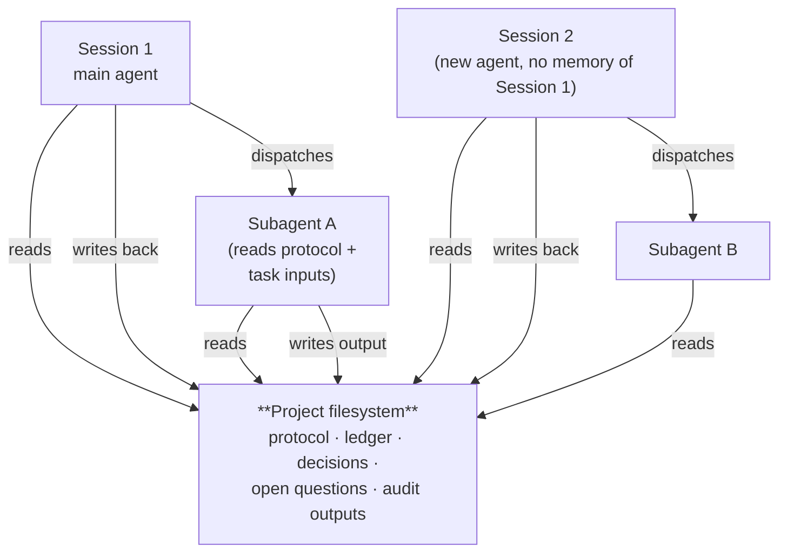
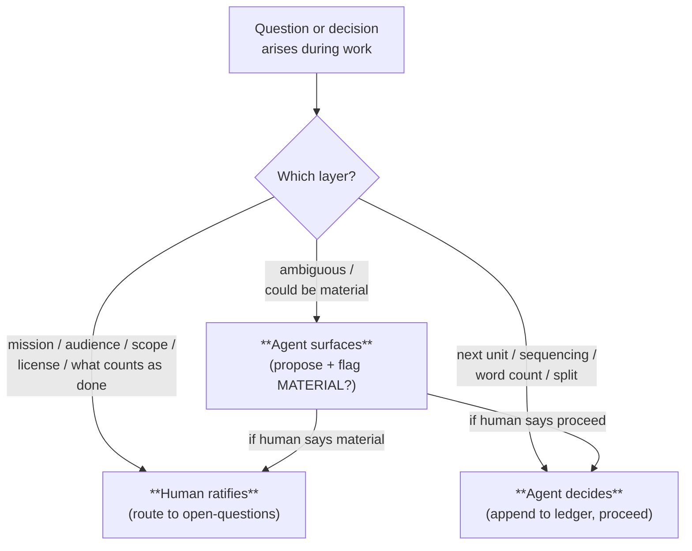

# How the project carries the discipline

The previous chapter ended on a single observation: every way complex agent work falls apart has the same shape. Something needs to live outside the agent. This chapter names what that something is.

## 1. The shift

The move is to stop trying to make the agent more disciplined and instead make the *project* more disciplined.

The agent does not change. It remains a bounded-context worker. What changes is what surrounds it. The discipline materializes in the project's filesystem — as files the agent reads when it opens a session, files it writes when it makes a decision, files it points its subagents at when it dispatches work. The agent stays stateless; the project stays stateful, and the project carries the discipline forward across whatever sequence of sessions and subagents the work requires.

This is the only place the discipline could live and still survive the gaps from the last chapter. Tooling lives one turn. Custom instructions configure one session. Memory features bind to one tool. The project's working directory outlives all of them.

## 2. What the project carries

The project holds a small, fixed set of working files. They are described here concept-first — the names are an implementation choice; the concepts are what matter.

**The protocol.** A file that states how this project works: that there is a ledger and the ledger is authoritative; that units are atomic; that foundation precedes drafts; that audits run, independently; that a ratification ladder routes some decisions to a human. Any agent that opens a session reads the protocol before acting.

**The ledger.** The single authoritative list of units the project is committed to, in execution order, each with its status, the inputs it reads, and the one named output it produces. The active unit is identifiable at the top. The ledger is the project's working memory across sessions — and its recovery point if a session ends badly.

**The decisions log.** Append-only. Each entry records a ratified decision and the context that justified it. Decisions are never edited; a reversed decision is a new entry that names the supersession. This is where the *why* lives — the reasoning that is otherwise lost when a session closes.

**The open questions.** Questions whose resolution requires the human. A question lives here until it is answered; then it moves into the decisions log and any units it blocked become unblocked. Crucially, a non-blocking question can sit here while unrelated work proceeds — it parks the human's decisions without stalling the agent's.

**The audit outputs.** When an audit runs, its findings are written to a file the rest of the project can read. Findings that surface gaps become new ledger units; findings that pass leave a trace downstream work can rely on.

The project is the only thing that persists. Sessions come and go; subagents come and go. The agent that opens Session 2 has no memory of Session 1 and does not need one — the ledger holds the relevant state, and reading the ledger is the first thing the protocol requires.

## 3. The session-start protocol

Every session in this project begins the same way. The agent reads the protocol, reads the ledger, reads the open questions, reconciles the ledger against what is actually on disk, identifies the active unit, and acts. After it acts, it writes back.

The reading is not optional and not perfunctory. The agent does not skim. The protocol exists so that the agent's first move is to align with whatever state the project is in — including state put there by an entirely different agent in an earlier session. The reconcile step catches the case where the last session ended badly and the on-disk reality and the ledger disagree; both it and the write-back are load-bearing enough that the next chapter is largely about them.

After the action, the write-back closes the loop in the same turn: the ledger gets the unit's new status, the decisions log gets a new entry if a decision was made, the open questions file gets updated if a question opened or closed. This is the loop, and it works the same way whether the project is on session three or session three hundred.

## 4. Subagent inheritance

When the main agent dispatches a subagent, the dispatch prompt carries two things: the task — the inputs, the expected output, the constraints — and a pointer back to the project's protocol. The subagent reads the protocol first, then the task. It operates under the project's discipline because the dispatch made the discipline available.

The subagent does not need the broader project context. It needs the project's rules and its own bounded task, and those two together are enough for it to produce output that respects the project's conventions: writing only to the named output path, citing only the inputs it was given, surfacing rather than guessing when something is missing. When it returns, the main agent folds the output back into the project. The discipline never broke; the work was done under it. (This same mechanism — a fresh, bounded context that did not author the work — is what makes an *independent* audit possible. The next chapter leans on it.)

## 5. The ratification ladder, concretely

Some decisions are the human's. Some are the agent's. The ratification ladder makes the boundary explicit and removes the per-turn "should I ask or just decide?" stall.

The agent applies this classifier at every decision point. Mission-level questions go to the open-questions file and the agent waits. Execution-level questions get decided and recorded in the decisions log. Anything genuinely ambiguous gets surfaced with a flag, and the human routes it. The boundary is stated once, in the protocol, and applied automatically by every agent that touches the project — so the human is neither surprised by a decision they should have made nor dragged into one they shouldn't have to.

## What the project still leaves to the agent

The project carries the structure. The agent does the work — it writes the prose, the code, the schema; it reads the inputs and produces the output; it judges, in the moment, whether a question is mission-level or execution-level. The framework does not replace the worker. It removes from the worker the burden of remembering the project across session boundaries, of inferring the discipline from scratch each time, of deciding alone what only the human can decide — and leaves the worker the work itself.

That is the framework. The next chapter is what happens when you run it for real, and the loop above turns out to be necessary but not quite sufficient.

→ Next: [Keeping it honest under real conditions](04-keeping-it-honest.md)
