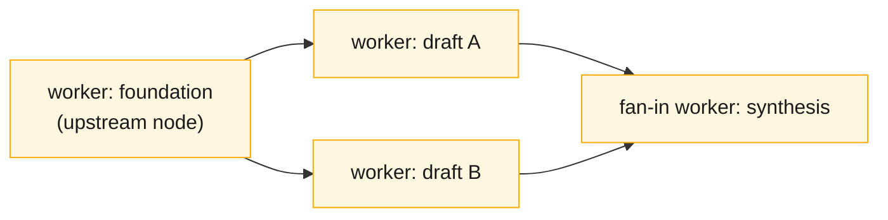
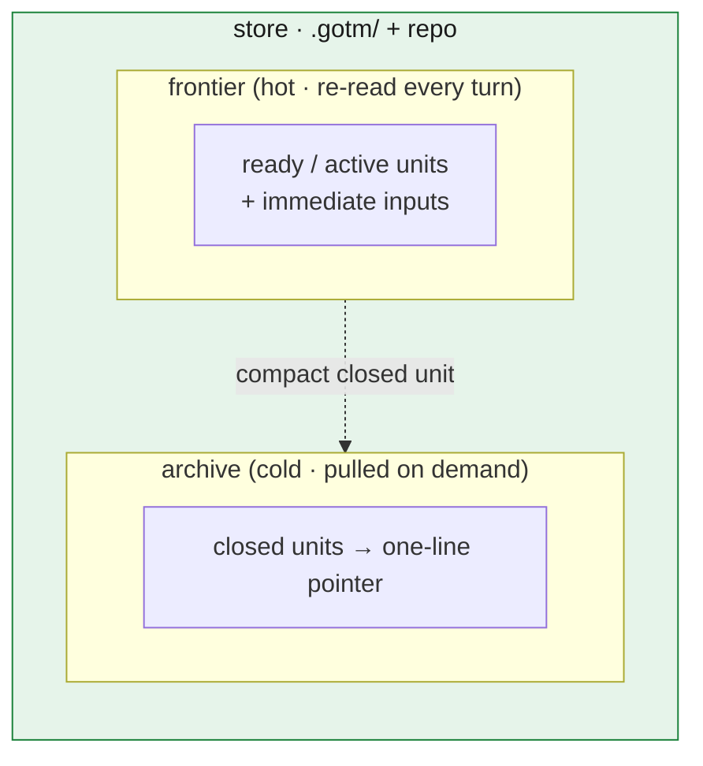

# Work as a DAG: units, the ledger, foundation

The previous chapter named the three roles — **driver**, **worker**, **store** — and the law they enforce: nothing on the hot path is long-lived. That law describes the runtime. This chapter describes the *shape of the work itself*: how a project decomposes into pieces, how those pieces relate, and how the plan that tracks them stays cheap forever. The structure is a **DAG** — a directed acyclic graph of **units**, recorded in a **ledger** that is the graph plus the scheduler's state. We define the static structure here; the dynamics — how the driver walks the graph — are the next chapter.

## The unit is a self-contained worker dispatch spec

A **unit** is the atom of work. In v2 a unit was "one pass, one output." That was right but underspecified: it described the *size* of the work without pinning down the thing that actually makes the architecture run. In GOTM a unit is a **self-contained worker dispatch spec** — and that phrase is the load-bearing one.

A worker is born stateless. It has never seen the conversation, the mission, the other units, or any prior worker's context. Everything it needs to do its job must be *in the dispatch*. So a unit is exactly that payload:

- **Bounded inputs** — the specific files, pointers, or values the worker reads, and nothing more. Not the whole ledger, not sibling outputs it won't touch, not the conversation.
- **Exactly one output** — one artifact the worker produces. One unit, one deliverable.
- **A spec** — what to produce, in what form, to what standard.
- **Constraints** — voice, length, canonical terms, things to avoid.

The test of a well-formed unit is simple: *a fresh, stateless worker could execute it from the dispatch alone, with no access to the conversation that created it.* If the worker would have to ask "what did we decide earlier?" the unit is underspecified — the missing context belongs in the dispatch (as a bounded input or a constraint), not in the worker's imagination. **The dispatch contract is the center of gravity** of the whole framework: get it right and everything downstream — parallelism, audit independence, recovery — follows; get it wrong and work leaks back into the long-lived context.

This has a corollary for trivia. The discipline is *always dispatch* — the driver never edits a work artifact, however small the change. But dispatching has overhead, so a litter of one-line fixes is not N tiny workers; it is **amortized batching**: group the trivia into one **partition-worker** whose dispatch overhead is paid once and spread across the batch. Size each worker's payload to a sensible band — minimal sufficient, not padded, not starved. A unit that would blow past its band fans out instead (chapter 5). The rule never bends: the driver plans and talks; all work is a worker dispatch.

## The ledger is the DAG plus the scheduler's state

Units do not float free; they depend on each other. A draft depends on the research it draws from; a synthesis depends on every chapter it merges; an audit depends on the output it checks. Those dependencies form a **DAG** — directed (inputs flow one way), acyclic (no unit waits on itself, transitively).



*A small unit DAG: a foundation unit upstream of the dependents it feeds; the synthesis is a fan-in node that waits on all of its upstreams. Edges are dependencies, and a unit is dispatchable only once its upstreams are done.* The **ledger** is where that graph lives, and it carries two things at once: the *topology* (which units exist, what each depends on) and the *scheduler state* (the status of each unit — ready, active, done, blocked). The ledger is the plan and the runtime state in one structure.

This is a sharp break from v2, where the ledger was a flat, append-only log, re-read whole on every turn. As chapter 1 recounted, that design was **monotonic**: a unit closed weeks ago still paid its full cell on every re-read, forever, until the record of the work outweighed the work. The GOTM ledger is **born tiered** — split into two tables from the first unit, not compacted as an afterthought:

| Tier | Holds | Read | Cost shape |
|---|---|---|---|
| **frontier** (hot) | ready + active units and their immediate inputs/pointers | re-read every turn | small, roughly constant |
| **archive** (cold) | closed units — terse pointer only; detail lives in `audits/`, `DECISIONS.md`, `docs/` | pulled on demand, never on the hot path | grows, but off the hot path |



*The born-tiered ledger: a small hot frontier the driver re-reads every turn, and a cold archive that accumulates closed units as one-line pointers. Closed units compact downward; only the frontier is ever on the hot path.*

The frontier is the only part on the **hot path**. The driver reads the frontier each turn, not the history. The archive grows without bound as the project runs, but because nothing recurring reads it, that growth costs nothing per turn — the cold detail already lives in the audit, decision, and doc files, so the archive cell is a one-line pointer, not a duplicate. This is how a thousand-unit project keeps the same per-turn read cost as a ten-unit one.

A frontier row is terse by design — an index entry, not a record of the work:

```
| id    | unit                     | deps      | status        | audit | output                  |
|-------|--------------------------|-----------|---------------|-------|-------------------------|
| ch3   | Write ch3 — work as DAG  | design,ch2| authored-done | —     | docs/03-work-as-a-dag.md|
| ch4   | Write ch4 — the loop     | design,ch3| ready         | —     | docs/04-the-loop.md     |
```

One more rule makes the ledger safe: **only the driver writes it.** Workers do not touch the ledger; they execute and **return a terse structured result**, and the driver — the single writer — records status and output pointer. In v2, multiple contexts wrote back, and the same unit could land twice as duplicate rows. Single-writer discipline kills that race by construction.


## The Output cell is a machine-authoritative key

The ledger is two things at once — a **human narrative** of the project and a **machine index** something parses. Most cells lean toward the narrative side; the driver reads them, and nothing else needs to. But a few are load-bearing for the machine, and the **Output cell is the sharpest of them**: it is the unit's **ownership key**. Whatever enforces the freeze — the driver's own pre-write check, or an optional file-write hook where the runtime offers one — decides whether a given write is legitimate by matching the write's path against the Output cell of an active unit. So the cell is not a human's convenient shorthand for "roughly where the work lands"; it is the exact identity the freeze keys on.

That double duty is a trap when the two readings diverge. A cell that reads well to a human — "the pipelines dir", a `{server,client}/src` brace-glob, a path with a stray `|` in an adjacent prose cell — parses to something the machine cannot match to a concrete file, so a sanctioned follow-on edit gets false-blocked while the human sees a perfectly sensible row. The fix is to type the field: the **Output cell holds concrete backticked path(s) — no globs, no bare directories, no raw `|`** (a directory would over-claim ownership of every file beneath it, including ones not yet written). A unit that legitimately produces several files lists them as comma-separated backticked paths; the enforcer parses *all* of them, not just the first.

Keeping the field honest is itself mechanical: a **ledger-parse lint** runs when the driver writes the ledger and at the session-start reconcile, rejecting any row that mis-splits its columns, carries an unparseable Output, or holds a status the scheduler doesn't recognize — *before* that row can mislead the freeze. (An adopter with a runtime that supports it can wire this as an automated hook; with nothing installed, it is a check the driver runs on itself. The lint is the discipline; the hook is one way to enforce it.) The principle generalizes past this one cell: the ledger's load-bearing fields are **typed and validated**, so the machine index stays clean while the human narrative stays readable.

## Foundation is just DAG topology

v2 carried a rule: *foundation before drafts* — do the groundwork (the research, the shared decisions, the reference material) before the work that builds on it. It was a sequencing reminder, and reminders erode.

In GOTM it stops being a reminder and becomes a **property of the graph**. **Foundation** units are simply the *upstream nodes* of the DAG — the ones with no unmet dependencies that many other units list as inputs. The scheduler respects dependencies natively (next chapter): a draft unit declaring the research unit as a dependency *cannot* be dispatched until that dependency is done. "Foundation before drafts" is no longer something to remember and enforce; it is what a correct topological walk of the DAG *does*. The discipline is encoded in the edges, not in the operator's vigilance.

## Two done states — a preview

You may have noticed the `authored-done` status in the ledger sketch above. The ledger actually distinguishes two terminal states, and the difference matters enough to flag here. **authored-done** means a worker produced the output — the artifact exists. **verified-done** means an *independent* worker confirmed it — the output was checked (and for deploy, infra, or data units, exercised live as its real consumer). A producing worker can only ever reach authored-done; it never self-certifies, because by the time the check runs the executor is already gone. Only a separate, driver-launched worker confers verified-done. These are distinct ledger states, not decoration — and the full treatment of structural audit independence is the subject of chapter 6.

---

We now have the static picture: work is a DAG of self-contained unit dispatch specs, recorded in a born-tiered ledger that the driver alone writes, with foundation encoded as graph topology. The next chapter sets it in motion — **the loop: the driver's scheduler**, walking the DAG to compute the ready set, dispatch workers, and collect results.
