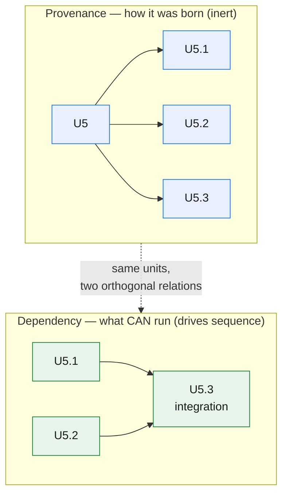
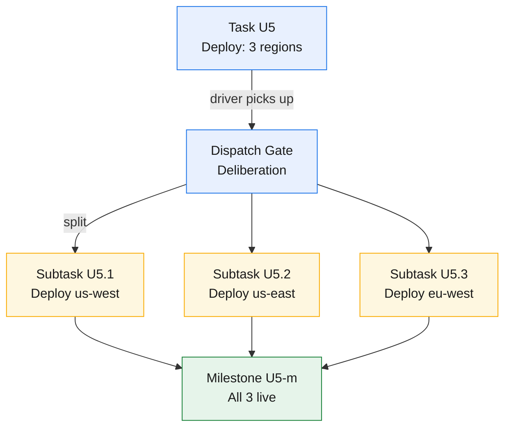

# Work as a DAG: units, decomposition, and the ledger

The previous chapter introduced the Spark reframe: the driver plans and schedules, never executes. That means the driver must be deliberate about how a coarse task becomes a set of concrete, executable pieces. This chapter describes how work decomposes: how a **Task** becomes **Subtasks** (via a deliberate dispatch gate), how those pieces relate through dependencies, and how the ledger records both the provenance (decimal IDs) and the dependencies (`depends_on`). We start with the unit — the atomic dispatch spec — and then build the mechanisms of deliberate decomposition and tiered storage that keep the driver's context cheap.

## The unit is a self-contained worker dispatch spec

A **unit** is the atom of work — one dispatch payload that a fresh, stateless worker receives, executes, and returns a result from. In earlier GOTM versions, a unit was loosely "one pass, one output." That was correct but vague. In GOTM 4.5, we are precise: a unit is a **self-contained worker dispatch spec**.

A worker begins with no context: it has never seen the conversation, the mission, other units, or prior workers' outputs. Every scrap of information it needs must be *in the dispatch itself*. A well-formed unit contains:

- **Bounded inputs** — the exact files, pointers, or values the worker reads (and nothing else; not the entire ledger, not unrelated sibling outputs).
- **One output** — one artifact the worker produces (one document, one query result, one report; one deliverable with one owner).
- **A spec** — what to produce, in what form, to what standard.
- **Constraints** — tone, length, canonical terms, things to avoid, output format.

The test is stark: *a fresh worker could execute the dispatch from its text alone, needing no unspoken context*. If the worker would have to ask "what did we decide earlier?", the unit is underspecified — the missing information belongs in the dispatch (in the Inputs or Constraints cell), not left to imagination.

This dispatch contract is the center of gravity of GOTM 4.5. Get it right and parallelism, audit independence, and recovery all flow from it. Get it wrong and work leaks back into the driver's context, re-creating the monotonicity we forbid.

The corollary is that the driver never edits a work artifact directly, no matter how small. A one-line typo fix is still a worker dispatch (costing one turn + one ledger row, nothing more). Small fixes batch together in a **partition-worker** whose dispatch overhead is amortized across the batch. The rule is absolute: all work is a worker dispatch.

## The dispatch gate: deliberate decomposition before execution

See Chapter 4 (§The loop, step 2) and Chapter 2 (§The dispatch gate) for full mechanics. Briefly: when a Task enters the ready set, the driver takes a **deliberation pass** using closed information (closed upstream outputs, frontier state) and decides: atomic or split? The **stopping rule**: split down to one-deliverable grain (one artifact, one owner), never below. Registration is **lazy**: the parent Task is upfront in the coarse plan; children are minted only when the parent is picked up, eliminating provisional row churn.

## Decimal IDs, `depends_on`, and the parallelism trap

When Task U5 splits into three subtasks, it mints `U5.1`, `U5.2`, `U5.3` — **decimal IDs** that form an append-only tree. The parent becomes a **pure container**: it has no Output cell of its own; it closes verified-done only when all its children pass. Any integration or convergence step is itself the final delegated subtask (the "reduce"), never done by the driver.

Here is where a critical distinction emerges, and it is load-bearing: **decimal position is inert; `depends_on` is everything.**

These are two orthogonal first-class relations over the same units. **Provenance** (decimal IDs — `U3.1`, `U3.2`, `U3.3`) records *how* a unit was born — "these subtasks came from the split of U3." It is an append-only tree, and it **carries no execution meaning**: it says nothing about *when* or *in what order* the pieces run.

**Dependency** (`depends_on`) records *what must be satisfied* before a unit can start. It is the graph edge and the **sole** carrier of ordering: **`depends_on` is the only mechanism for expressing sequence.** All gating lives here — data dependencies, ordering barriers, blockers, human-waits.

A unit's **read-set** — the data the worker actually consumes — is a **subset** of its `depends_on` (a unit may depend on an upstream for ordering without reading it); unstated, it defaults to the full set.

Anything that gates can-run is a **node and an edge**, never a status flag: a blocker, wait, or barrier is a **conditional unit** — a real unit whose spec is "await X," satisfied when X arrives — so can-run stays purely graph-derived and "a unit is a dispatch spec → output" still holds.

**Critical rule: sibling decimals do not imply sequence.** Reading `U3.1, U3.2, U3.3` and concluding they run sequentially is a silent misread that destroys parallelism. Sibling parallelism comes *only* from empty inter-sibling `depends_on`: if `U5.1`, `U5.2`, and `U5.3` list no dependencies on each other (only on their common upstream `U4`), they are **data-independent** and **run in parallel**. If `U5.2` lists `depends_on: U5.1` — declaring a dependency on U5.1's output — then U5.2 must wait for U5.1; but U5.3 may still run in parallel with U5.1 if it has no dependency on U5.1.

This is the *only* mechanism for expressing parallelism. Decimal position means nothing.



## Milestones: forced live-verification boundaries

For runtime tasks (Kind ∈ {deploy-infra, data, eval, diagnosis}), the driver often needs to force a **re-aggregation point** where the system as a whole is verified live, not just individual pieces in isolation.



A **Milestone** is an explicit ledger row (for runtime tasks) or implicit (for pure-authoring tasks) that marks a forced **live-verification boundary**. When U5 splits into three regional deployments, each can be verified individually (each region's deploy tested in isolation). But the milestone is where the *system as a whole* is verified: all three must be running; a cross-region query must succeed; the end-to-end path works.

**Explicit milestones** (registered as a ledger row) are required for runtime tasks — they mark the re-aggregation gate and force the verified-done verdict to include a live-consumer check. **Implicit milestones** (for pure-authoring tasks) happen when the parent closes: once all children pass logic audit, the parent is automatically verified-done, no separate row needed.

Here is the key rule: **a milestone is where the verify-grain shifts from logic-only (the individual subtasks) to live-verified (the system as a whole).** Chapter 6 covers this in detail; the point here is that milestones are explicit objects in the ledger that force verification boundaries.

## The ledger: born-tiered, one graph plus scheduler state

Units do not float free. They depend on each other: a draft depends on research; a synthesis depends on chapters; an audit depends on what it checks. Those dependencies form a **DAG** — directed, acyclic, no loops.

The **ledger** records both the graph topology (which units exist, what each depends on) and the scheduler state (ready, active, done, blocked). It is the plan and the runtime state in one structure. Its canonical form is a **machine-native flat file** — one line per unit; the human-readable table is a **derived, read-only view** of it (never hand-edited), and the mission/recovery narrative is a **separate prose surface**.

GOTM's ledger is **born tiered**, split from the first unit into two storage tiers, not compacted retroactively:

| Tier | Holds | Read pattern | Cost |
|---|---|---|---|
| **Frontier** (hot) | Ready + active units; their immediate inputs and pointers | Re-read every turn | Small, roughly constant (independent of total project size) |
| **Archive** (cold) | Closed units — terse pointer only; detail in `audits/`, `DECISIONS.md`, docs | Pulled on demand, never on the hot path | Grows unbounded, but off the hot path |

The frontier is the only part on the **hot path**. The driver reads the frontier each turn, not the history. The archive accumulates closed units as one-line pointers; the detail already lives in audit and decision files, so the archive row costs nothing per turn.

A frontier row is terse by design:

```
| id     | unit                            | depends_on  | status        | Output                  |
|--------|----------------------------------|-------------|---------------|-------------------------|
| U5     | Deploy: 3-region replication    | U4          | authored-done | (pure-container)        |
| U5.1   | Deploy to us-west (Oregon)      | U4          | verified-done | `deploy/us-west.log`    |
| U5.2   | Deploy to us-east (Virginia)    | U4          | verified-done | `deploy/us-east.log`    |
| U5.3   | Deploy to eu-west (Ireland)     | U4          | verified-done | `deploy/eu-west.log`    |
| U5-m   | Replication: all 3 live         | U5.1,U5.2,U5.3 | verified-done | `milestones/u5-live.md` |
| U6     | Analyze replication metrics     | U5-m        | ready         | `reports/repl-metrics.md` |
```

Notice the structure: U5 has no Output (it is a pure container); U5.1–U5.3 are the actual work units with concrete artifacts; U5-m is the milestone that re-aggregates. All five rows are in the ledger. The driver records status and pointers; workers do not touch the ledger.

One more rule makes the ledger safe: **only the driver writes it.** Workers execute and return a terse result; the driver — the single writer — records status and output pointers. This eliminates the duplicate-row race: a unit cannot land twice because only one context writes.

This graph is not fixed — the driver reshapes it as reality changes (Chapter 4).

## Foundation is just graph topology

Earlier GOTM versions had a reminder: *foundation before drafts* — do the research before the synthesis. It was a useful discipline that required constant enforcement.

In GOTM 4.5, it becomes a **property of the graph itself.** **Foundation** is simply the set of *upstream nodes* — units with no unmet dependencies that many other units list as inputs. A unit that declares the research as a dependency *cannot* be dispatched until that research is done. The scheduler respects the graph natively. "Foundation before drafts" is no longer something to remember; it is what a correct topological walk *does*.

## Two done states: authored-done vs verified-done

The ledger distinguishes two terminal states, and the distinction is structural:

**`authored-done`** means a worker produced the output. The artifact exists. The worker is already gone (it was short-lived).

**`verified-done`** means an independent auditor confirmed it. The output was checked against spec, and for runtime tasks (deploy-infra, data, eval, diagnosis), the artifact was exercised live as the real consumer would use it. A producing worker can only reach authored-done; it never self-certifies. Only a separate, driver-launched auditor confers verified-done.

These are distinct ledger states, not decoration. The full treatment of audit independence and verify-grain (logic-only vs live-verified) is Chapter 6's subject. The point here is that the terminal states are typed: a unit does not become verified-done until a fresh context has reviewed it.

---

Work is a DAG of self-contained unit specs; the ledger records provenance (decimal IDs) and dependencies (`depends_on`). Deliberate decomposition at the dispatch gate keeps the driver reasoning about scope, not drowning in execution state. The next chapter (**the loop**) sets this in motion.
