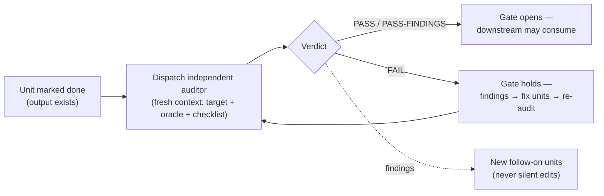

# Keeping it honest under real conditions

The file-set and the session loop from the last chapter are the skeleton of the discipline. They are necessary. Running the framework on real multi-session work showed they are not, by themselves, sufficient — because all three lean, in the end, on the agent *remembering* to follow them, and the bounded worker's memory is exactly what GOTM set out not to trust.

This chapter is the hardening that real use produced. It has three parts — anti-drift safeguards, resilience, and audit gates — and they share one move: each takes a rule the worker was supposed to remember and turns it into a mechanism that gets *checked*. A discipline that depends on the worker remembering has reintroduced the dependency it was meant to remove; these are how you take the dependency back out.

## Anti-drift safeguards

Chapter 2 named two failure modes that survive even a written-down protocol: **silent work** (acting without writing back) and **quiet edits** (changing a finished artifact in place instead of appending a correction). Both are invisible at the moment they happen. The safeguards make them catchable in the moment rather than in hindsight.

**A pre-edit check** runs before any write. If the target is the output of a unit already marked done, it is frozen — the change becomes a new appended unit, not an in-place edit. This is the rule that keeps the ledger's history honest. It needs one carve-out, learned the hard way: the freeze is for *unit outputs and closed log entries*, not for the living governance docs — the protocol itself, the project's README — which must keep evolving. A literal reading without that carve-out either freezes the protocol forever or licenses editing finished work; naming it explicitly avoids both.

**A write-back gate** ties a unit's work and its ledger update into the same turn. You may not end a turn in which you produced or changed a unit's output without, in that turn, updating the ledger and appending any decision or question that arose. Output produced but not written back means the unit is *not* done. This is silent work's antidote: there is no window in which the work exists and the bookkeeping doesn't.

**Done-means-written** is the smallest of the rules and the easiest to skip: never mark a unit done unless its named output actually exists at the stated path with the promised content. Verify; don't assume.

**A turn-end self-check** is the backstop — before yielding any turn that touched the project, three questions: did I change a unit output, and is its ledger row updated to match; did I make a decision, and is it recorded; did a question open or close, and is it logged. Any "no, but I should have" gets fixed before the turn ends.

These are paste-able prose — discipline the agent reads and applies. Where the surrounding tooling allows it, the pre-edit check can also be *enforced* rather than remembered: a pre-tool hook that simply refuses an edit whose target is a frozen output, moving the guarantee from "the agent follows the doc" to "the harness won't let it." This framework describes that enforcement path; it does not ship a runtime. Such a hook is a platform binding and lives in adopter tooling — for example, a Claude Code plugin — not in the platform-neutral framework.

## Resilience — no context loss across any session end

The write-back gate covers sessions that end cleanly. Real sessions also end the other way — a crash, a killed process, a closed terminal, a resume prompt no one answers — and the framework's headline promise, that on-disk state survives session boundaries, is only true if it survives *those* too. Three rules make the state self-sufficient and self-healing.

**Transcript independence** is the invariant the other two serve: at every yield point, the project's files alone must be enough to resume, with no reliance on the chat history. The recent-updates log is written as a recovery log, not a changelog — rich enough that a cold session understands not just what is done but where the work is and why.

**Crash-safe write ordering** sequences a unit's bookkeeping so an interruption is always recoverable. Mark the unit in-progress *before* producing its output; produce the single output file; then mark it done and append any decisions. A crash between those steps leaves a recoverable trail — an in-progress unit with a partial or complete output to inspect — never a silent gap. For heavy or iterative work, the same logic says: don't wrap a long loop in one un-checkpointed pass; split it into per-iteration units or checkpoint each iteration, so a crash costs one iteration, not the whole unit.

**Session-start reconciliation** is the heal step, run before acting. It compares the ledger against disk and resolves the disagreements a hard end can leave: a done row whose output file is missing is reopened; an output file that exists for a not-done unit is an interrupted unit, to be finalized or superseded; an in-progress unit is resumed. Whatever reconciliation finds and does is recorded — recovery is itself auditable, and it produces new ledger entries rather than silent edits to closed ones.

One honest qualification: this does not make the crash window literally zero — a crash *during* the ledger write itself still exists. It makes every outcome *recoverable*. The bar is not "nothing is ever interrupted" but "no interruption loses context the project cannot reconstruct," and that bar is reachable.

## Audit gates

Chapter 2's fourth gap was self-marking: the agent that did the work is the one that blesses it. The audit cycle from chapter 1 answers it only if the audit is real, and "real" turns out to mean two specific things — independence and a gate.

**Independence is non-negotiable.** An audit counts only if it is run by a context that did *not* author the unit. The author re-checking its own output reproduces its own blind spots; that is self-marking wearing an audit's clothes. In practice this is why the audit is *dispatched*: a fresh subagent that receives only the target output, the oracle it is checked against (the unit's inputs, its spec, the ledger), and the audit prompt — never the authoring session's transcript or reasoning. You do not audit, in the same session, the unit you just wrote.

**A default checklist** keeps the auditor from improvising what "checked" means. Five points cover most units: existence (the output is at the stated path), spec match (it contains what the unit promised), cross-reference integrity (every decision, unit, or question it cites exists and says what's claimed), internal consistency (no contradictions across the audited set), and decision fidelity (the output honors the relevant logged decisions). Specialized checks — does it render, do quoted spans match the source — are added where a unit warrants.

**The verdict is one of three.** *Pass*: nothing above the trivial bar. *Pass-with-findings*: consumable, but carrying non-blocking issues that become tracked follow-on units. *Fail*: one or more blocking issues. The auditor never fixes anything — it writes findings, ranked by severity, to the audit outputs; the orchestrator turns blocking findings into new fix units and stamps the result.

**The gate** is what makes the verdict bite. The ledger records each unit's audit state, so "done" (the output exists) and "passed" (an independent context checked it) are distinct, visible states. A downstream unit consumes an input only once that input has passed — drafts and code do not get built on unchecked or failed foundation. A fail blocks downstream until the fixes land and an independent re-audit passes.

Audit can be *deferred* — during interactive design, a human reviewing each output as it lands is a legitimate interim gate — but deferral is recorded as a follow-up audit unit, and it cannot outlast the point where code consumes the design. Deferral that is written down and tracked is honest; deferral that is forgotten is just skipping.

## The thread through all three

Anti-drift safeguards, resilience, and audit gates look like three separate concerns, but they are the same concern seen three times. In each, the original rule — *write back, don't edit finished work, audit before consuming* — was sound, and in each the rule failed the same way: it was left to the worker to remember, and the worker is a bounded context that forgets. The fix, each time, was not a sterner rule. It was a mechanism that does not depend on memory: a check before the edit, an ordering that survives a crash, an auditor that isn't the author. That is what running GOTM for real taught, and it is the difference between a discipline that sounds right and one that holds.

→ Next: [In practice](05-in-practice.md)
