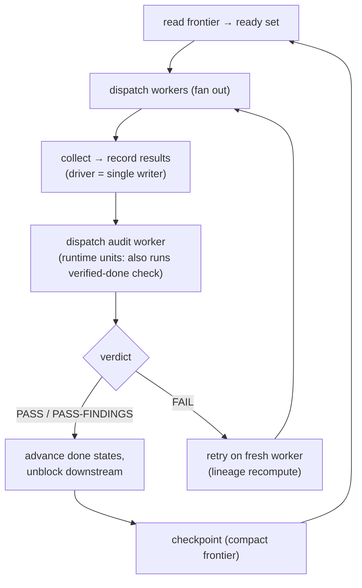

# The loop: the driver's scheduler

The previous chapter laid out the static picture: work is a DAG of self-contained unit dispatch specs, recorded in a born-tiered ledger that the driver alone writes, with foundation encoded as graph topology. That is the plan at rest. This chapter sets it in motion. The driver runs a **deterministic scheduler loop** over the DAG — and that loop *is* the driver's job. Everything else the driver holds (the plan, the discipline, the human interface) exists to serve it.

The loop is small on purpose. There is no forecasting in it, no budget governor, no clever adaptive policy. It walks the graph, dispatches the work that is ready, records what comes back, and repeats until the graph drains. The leverage in v3 is not a sophisticated scheduler; it is that the scheduler is simple *and* every step honors the one law — nothing on the hot path is long-lived.

## The loop, step by step

The driver repeats one cycle until the DAG is empty:

1. **Read the frontier; compute the ready set.** The driver reads the frontier — the hot tier of the ledger, never the history — and computes the **ready set**: every unit whose dependencies are all satisfied *and* whose audit gate is open (a downstream unit may not start until the upstream it depends on has cleared its audit). This is a topological scan, and it is the entire reason "foundation before drafts" needs no enforcement: a unit with an unmet dependency is simply not in the ready set, so it cannot be dispatched.

2. **Dispatch workers for the ready set.** For each ready unit, the driver dispatches a fresh worker with that unit's dispatch payload — its bounded inputs and its spec, nothing more. Independent ready units are dispatched together rather than one at a time: the driver **fans them out** in parallel, the way a Spark stage runs its independent tasks at once. Fan-out is the parallelism spine of v3 and the place it earns most of its speed; its mechanics — the concurrency cap, the fan-in barrier, the token economy of merging — are chapter 5. Here it is enough to say: ready units do not queue behind each other for no reason.

3. **Collect results; the driver records them.** Workers run, write their one output to the store, and return a terse structured result — a pointer plus a few index facts, never the work itself. The driver, as the **single writer**, records each unit's new status and output pointer to the ledger. This is the only point in the loop where the ledger is written, and exactly one hand writes it. Workers never touch the ledger; the dup-row race from v2 cannot occur by construction.

4. **Dispatch audit workers; advance the done states.** A worker that finishes can only ever reach **authored-done** — the artifact exists, but the context that made it is gone and never graded itself. So for each authored-done unit the driver dispatches a separate **audit worker**: a fresh context that reads the output and its spec from the store and renders a verdict. Independence here is not a rule to maintain; it is structural and therefore free, because the author is already discarded by the time the audit runs. For runtime units — anything deployed, infrastructural, or data-bearing — that **same audit worker additionally exercises the live artifact** as its real consumer to confer **verified-done**: one worker, one verdict, one report, not a second dispatch. A passing audit advances the unit's state and opens the gate for its downstream; a failure becomes new work (step 5). The depth of audit independence, the verified-done check, and the freeze that protects a passed unit are chapter 6.

5. **On worker failure, retry on a fresh worker.** A worker can crash, time out, or return a failing result. The response is a **retry**: dispatch the same unit again to a *new* worker. This is safe — in fact trivially safe — precisely because of the unit's shape. A unit is a function of its bounded inputs, and those inputs live on disk in the store. Re-running it is a **lineage** recompute, identical to how Spark recovers a lost task by recomputing it from its inputs rather than from any in-memory state. No partial worker state has to be salvaged, because there was never any worker state worth keeping; the inputs are the truth, and they are durable. A unit that keeps failing escalates to the human through the ratification ladder rather than retrying forever — but the default response to a single failure is simply: try again, fresh.

6. **Checkpoint.** Across cycles the frontier accumulates and the driver itself grows. Periodically the driver checkpoints: it compacts the frontier (rolling closed units down to their one-line archive pointers) and, on any fresh start, re-hydrates its own working set from the store. This is the mechanism that keeps the hot path cheap as the project runs long, and it is treated in full — compaction, the three-tier memory, and re-hydration — in chapter 7. In the loop it is one recurring housekeeping step, not a special mode.

7. **Repeat until the DAG drains.** The cycle runs again: recompute the ready set against the newly-recorded statuses, dispatch what is now ready, collect, audit, retry, checkpoint. As audits pass, downstream units enter the ready set; as the ready set empties and no unit is left blocked, the DAG has drained and the project is done.

A compact view of one cycle:

*The driver's scheduler loop: read the frontier, dispatch the ready set, collect and record as the single writer, audit, then advance (PASS) or retry from lineage (FAIL) — checkpoint and repeat until the DAG drains.*

## Why the loop stays cheap

Notice what the driver does *not* do in any step. It never reads a worker's output into its own context — it records a pointer and moves on. It never holds two workers' results side by side to compare or merge them — that is a fan-in worker's job, not the driver's (chapter 5). It never re-reads the project's history — it reads the frontier. Every step touches the hot path, and every step is bounded: the frontier is small, the results are terse, the writes are pointers. The driver grows only slowly, by carrying the index of an ever-larger project, never its work.

That bounded-hot-path property is what makes the loop's simplicity affordable. A naive scheduler that collected full outputs to decide what to do next would re-concentrate the work into the long-lived context at every cycle — monotonicity, smuggled back in through the back door of the loop. The v3 loop refuses that at each step: dispatch the work out, keep only the index in.

## Where the loop lives — a prompt discipline, then tooling

At its baseline, the loop is a **prompt discipline**. There is no runtime that *forces* the driver to run it; the driver follows it because the protocol tells it to, the same way a careful operator follows a checklist. This is deliberate (it is the resolution of Q-v3-3): the scheduler is fundamentally a discipline the driver enacts, and stating it as a discipline first keeps it runtime-agnostic — it works in any plain interactive session with nothing installed.

On top of that baseline sit two further adoption tiers, for teams that want more than discipline:

- **A plugin command** packages the loop as an invokable step, so the driver can run a cycle through a single command rather than re-deriving the sequence from the protocol each turn.
- **A Workflow-style script** drives the loop programmatically where the runtime allows it — useful in SDK or headless contexts where the cycle can be executed without a human in the seat.

All three are the *same loop*. The command and the script do not change what the scheduler does; they only harden how reliably it is followed. A reader adopting v3 with nothing but a prompt is running the real thing; the tooling is convenience and rigor, not a different mechanism.

---

That is the control loop: read the frontier, dispatch the ready set, collect and record as the single writer, audit and advance, retry from lineage, checkpoint, repeat. The loop says *what* the driver does each cycle. The next chapter, **Scaling & economy**, says how to make the busiest step — fan-out and fan-in — fast and cheap without letting the merge re-concentrate work into the driver.
