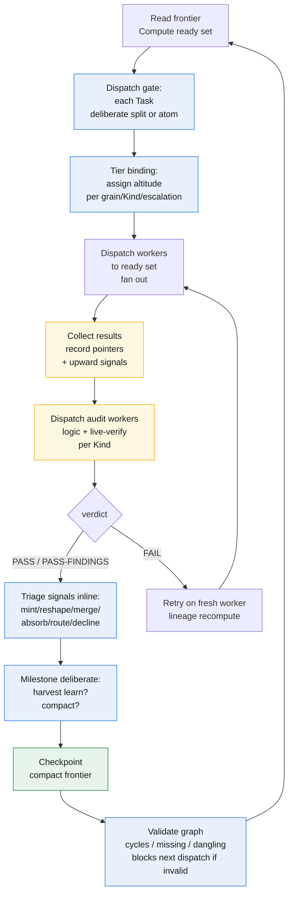
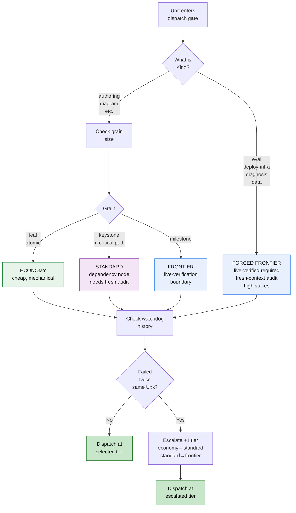

# The loop: the driver's scheduler

The driver runs a **deterministic scheduler loop** over the DAG: read frontier, compute ready set, deliberate splits at the dispatch gate, dispatch workers in parallel, collect and record (the driver is the single writer), dispatch audit workers, triage upward signals inline, validate the graph, retry failed units, deliberate at milestones (learn? compact?), checkpoint, repeat. The loop is small by design — no forecasting, no budget governor. Every step honors one law: nothing on the hot path is long-lived, and every task is a worker dispatch. And every step serves one principle: **the DAG determines what _CAN_ run, the driver determines what _SHOULD_ run, and the driver _reshapes_ the DAG whenever reality changes.**

## The loop, step by step

The driver repeats one cycle until the DAG is empty:

1. **Read the frontier; compute the ready set.** The driver reads the frontier — the hot tier of the ledger, never the history — and computes the **ready set**: every unit whose dependencies are all satisfied *and* whose audit gate is open (a downstream unit may not start until the upstream it depends on has cleared its audit). This is a topological scan, and it is the entire reason "foundation before drafts" needs no enforcement: a unit with an unmet dependency is simply not in the ready set, so it cannot be dispatched. This ready set is what the DAG says **CAN** run — purely graph-derived, recomputed every turn, never stored. What the driver then judges **SHOULD** run — which ready units to dispatch, in what priority — is never persisted, because it goes stale the instant the graph mutates. The plan is no fixed schedule but a **living, mutable DAG** the driver reshapes as reality changes.

2. **The dispatch gate: deliberate decomposition.** For each ready Task, the driver takes a **deliberation pass** (cheap — metadata only). The moment a Task enters the ready set, the driver re-considers it with upstream closed and more information than it had at plan time. The driver decides: is this a coherent atom (one worker can own it end-to-end), or should it split into subtasks? The **stopping rule** is *split down to the one-deliverable grain, never below*. One deliverable = one artifact (a doc, a query result, a report) that one downstream consumer owns. Below the atom, a seam appears that no one owns (task A produces part-1, task B produces part-2, someone else must integrate). The driver either (a) short-circuits the task as one atom (no children registered; dispatch single worker), or (b) mints decimal-ID subtasks (U3.1, U3.2, etc.), registers them pending, and re-registers the parent as a **pure container** with no Output of its own. This deliberation costs the driver cheap cycles and is exactly what a frontier context is for: reasoning about scope and structure, not executing work. The dispatch gate is one instance of a general move: the driver **reshapes** the plan whenever new information lands — adding, removing, or re-pointing `depends_on` edges and inserting discovered work. Splitting yields a **sub-DAG** (children with internal edges), never a flat list; downstream keeps depending on the container, so **splitting never re-points downstream edges.**

3. **Tier binding: altitude assignment.** The driver assigns a **tier** (altitude) to each ready unit before dispatch. The tier determines the model tier and effort budget. Altitude defaults by grain (leaf → economy; keystone → standard; milestone → frontier), but is **forced frontier by Kind** for runtime units (Kind ∈ {eval, deploy-infra, diagnosis, data}), and is **escalated by repeated watchdog deaths** (if a unit fails twice on the same Uxx, escalate one tier: economy → standard → frontier). The tier decision is recorded in the ledger as part of the dispatch stamp.

4. **Dispatch workers for the ready set.** For each ready (now split-or-atom) unit, the driver dispatches a fresh worker with that unit's dispatch payload — its bounded inputs and its spec, nothing more — to the worker pool at the selected tier. Independent ready units are dispatched together rather than one at a time: the driver **fans them out** in parallel, the way a Spark stage runs its independent tasks at once; parallel dispatches must own **disjoint outputs** — no two concurrent workers may write to the same file or store key, because the freeze that protects a done unit cannot prevent a live contention. Fan-out is the parallelism spine of GOTM 4.5 and the place it earns most of its speed; its mechanics — the concurrency cap, the fan-in barrier, the token economy of merging — are chapter 5. Here it is enough to say: ready units do not queue behind each other for no reason. **DISPATCHED means launched, and the driver proves it:** the status is stamped only after the Agent call returns a real agent id, and a turn-end rescan confirms no `in_progress`/DISPATCHED row lacks one. The ledger records verified fact, not intent — a status the driver *meant* to make happen but didn't is the source-of-truth lying, so the proof stamp closes the gap. **A worker owns its spec to completion:** mutation is free **between** dispatches and forbidden **during** one. If a running unit's `depends_on` change, the driver does not edit it in flight — it **kills and re-dispatches** the unit, cheap because units stay small.

   **Before an irreversible op, the driver gates first.** Every other gate in the loop is post-hoc — the audit runs *after* the artifact exists. That is exactly wrong for a destructive operation: a deploy that deletes a live app, a `DROP`, a `terraform`/`bundle` apply, a force-push, an overwrite-in-place. There is nothing to audit after; the resource is already gone. So irreversible ops get a **pre-execution gate**: before the driver dispatches the worker that will run one, it requires a **dry-run or plan produced and reviewed by an independent context first**, and only dispatches the real op once that review clears. This is the one place the loop reviews *before* it acts rather than after, and it exists because "remove-from-IaC + apply = delete" is a trap a plan-review catches generically that a post-hoc audit never can.

5. **Collect results; the driver records them.** Workers run, write their one output to the store, and return a terse structured result — a pointer plus a few index facts, never the work itself. The driver, as the **single writer**, records each unit's new status and output pointer to the ledger. Workers may also return **upward signals** — typed observations (split / discovery / blocker / dependency) that suggest the driver take an action, but do not execute the action themselves. This is the only point in the loop where the ledger is written, and exactly one hand writes it. Workers never touch the ledger; the duplicate-row race from v2 cannot occur by construction.

6. **Dispatch audit workers; advance the done states.** A worker that finishes can only ever reach **authored-done** — the artifact exists, but the context that made it is gone and never graded itself. So for each authored-done unit the driver dispatches a separate **audit worker**: a fresh context that reads the output and its spec from the store and renders a verdict. Independence here is not a rule to maintain; it is structural and therefore free, because the author is already discarded by the time the audit runs. For runtime units — anything deployed, infrastructural, or data-bearing (Kind ∈ {deploy-infra, data, eval, diagnosis}) — that **same audit worker additionally exercises the live artifact** as its real consumer to confer **live-verified**: one worker, one verdict, one report, not a second dispatch. For authoring units, logic verification is terminal. A passing audit advances the unit's state and opens the gate for its downstream; a failure becomes new work (step 8). The depth of audit independence, the verify-grain split, and the freeze that protects a passed unit are chapter 6.

7. **Triage upward signals inline.** For each upward signal the driver received (split / discovery / blocker / dependency), the driver, as the **sole full-context holder**, decides the action **inline in the loop turn** — no standing inbox, no delayed triage. The driver's options are: (a) **Mint** — "You're right; I'm registering [new unit]"; (b) **Reshape** — "I'll mint a unit but different scope"; (c) **Merge** — "This belongs with [existing pending unit]"; (d) **Absorb** — "I already have a unit for this"; (e) **Route to human** — "This is mission-level; I'm flagging it to QUESTIONS.md"; (f) **Decline with durable reason** — "I'm not minting a unit because [reason recorded in ledger recovery log]." The triage is not optional; if a signal is declined, its reason must be durable so it is not re-raised forever by a new worker. Workers can suggest, but **only the driver decides**. Two dispositions are shaped by the graph model: a **blocker** is disposed by inserting a **conditional unit** — a node-plus-edge whose spec is "await X," never a status flag (ch03) — and a **`dependency`** signal is disposed by **wiring the missing `depends_on` edge**. Human instruction is the one input that bypasses triage: a human can restructure pending work **immediately**, and human changes are **authoritative** — above the ratification ladder, applied at once and logged with the human as actor — and they respect the freeze, so a done unit is **superseded, never edited**.

8. **Validate the graph; block on any break.** Because the driver reshapes the DAG as it runs, any mutation can introduce a structural fault. So after any mutation the driver runs a deterministic **validation** pass — cycles, missing dependencies, dangling references, self-loops. An invalid graph is a **hard gate: it blocks the next dispatch** until the driver repairs the break or routes it to the human. There is **no auto-repair**, and validity — like the ready set — is **derived, never stored**.

9. **On worker failure, retry on a fresh worker.** A worker can crash, time out, or return a failing result. The response is a **retry**: dispatch the same unit again to a *new* worker. This is safe — in fact trivially safe — precisely because of the unit's shape. A unit is a function of its bounded inputs, and those inputs live on disk in the store. Re-running it is a **lineage** recompute, identical to how Spark recovers a lost task by recomputing it from its inputs rather than from any in-memory state. No partial worker state has to be salvaged, because there was never any worker state worth keeping; the inputs are the truth, and they are durable. A unit that keeps failing escalates to the human through the ratification ladder rather than retrying forever — and model tiering is in play, each retry can first **escalate the worker one model tier up** (economy → standard → frontier) before it reaches the human. But the default response to a single failure is simply: try again, fresh.

10. **Milestone deliberation: harvest learnings and compaction.** When a milestone settles a subtree (all children verified-done), the driver MUST answer two deliberate-or-defer prompts: (a) "**Harvest learnings here?**" — the driver decides whether to mint a `learn` unit that distills procedural lessons from the subtree into the project's L1 learning store, or defer with a recorded reason; (b) "**Compact now?**" — the driver decides whether to mint a `compact` unit that rolls closed units down to the cold archive (lossless GC), or defer with reason. These prompts are **non-skippable** (every milestone gets them); the *actions* are the driver's judgment. Both `learn` and `compact` are separate first-class meta-units, not auto-coupled. Chapter 7 and 9 detail the learning and compaction disciplines.

11. **Checkpoint.** Across cycles the frontier accumulates and the driver itself grows. Periodically the driver checkpoints: it compacts the frontier (rolling closed units down to their one-line archive pointers) and, on any fresh start, re-hydrates its own working set from the store. This is the mechanism that keeps the hot path cheap as the project runs long, and it is treated in full — compaction, the three-tier memory, and re-hydration — in chapter 7. In the loop it is one recurring housekeeping step, not a special mode.

12. **Repeat until the DAG drains.** The cycle runs again: recompute the ready set against the newly-recorded statuses **or any mutation**, deliberate splits, dispatch what is now ready, collect, audit, triage signals, validate, retry, milestone-deliberate, checkpoint. As audits pass, downstream units enter the ready set; as the ready set empties and no unit is left blocked, the DAG has drained and the project is done.

A compact view of one cycle:

The loop in 12 steps: deliberate splits at the gate, assign tier, dispatch workers in parallel, collect results with signals, audit independently, triage signals inline, validate the graph, retry on failure, deliberate at milestones, checkpoint, and repeat.

## Tier binding: altitude defaults, Kind-forced frontier, escalation

The driver assigns a tier (altitude) to each unit, determining its model tier and resource budget. The tier is driven by three factors:

**Tier binding rule:**

| Factor | Decision | Details |
|--------|----------|---------|
| **Grain default** | Leaf (no children) → economy; Keystone (dependency node, in critical path) → standard; Milestone → frontier | Leaf tasks are cheap; keystones need fresh audit; milestones are live-verification gates (expensive) |
| **Kind override** | Kind ∈ {eval, deploy-infra, diagnosis, data} → frontier | Runtime units must have fresh-context audit + live-verified check; frontier tier pays for it |
| **Repeated escalation** | ≥2 watchdog deaths (same Uxx) → escalate 1 tier | economy → standard → frontier; signals the unit is harder than estimated |

**Kind → tier binding decision tree:**

The decision tree shows: Kind forces frontier for runtime units; grain sets the default for authoring; repeated failures escalate. Once tier is bound, the driver dispatches to that tier's worker pool.

## Why the loop stays cheap

Every step reads metadata only: the frontier (small, index), pointer results, metadata-driven tier-binding. The driver never reads worker outputs into its context (records pointers only), never merges N results (that is a fan-in worker, Chapter 5), never re-reads history (reads frontier only). The dispatch gate is cheap because it reads closed information; tier-binding is cheap because it is per-unit metadata; signal triage is cheap because it closes inline. The result: the driver carries the index of an ever-larger project, never its work, and the loop stays bounded across thousands of units.

## Where the loop lives — a prompt discipline, then tooling

At its baseline, the loop is a **prompt discipline**. There is no runtime that *forces* the driver to run it; the driver follows it because the protocol tells it to, the same way a careful operator follows a checklist. This is deliberate: the scheduler is fundamentally a discipline the driver enacts, and stating it as a discipline first keeps it runtime-agnostic — it works in any plain interactive session with nothing installed.

On top of that baseline sit two further adoption tiers, for teams that want more than discipline:

- **A plugin command** packages the loop as an invokable step, so the driver can run a cycle through a single command rather than re-deriving the sequence from the protocol each turn.
- **A Workflow-style script** drives the loop programmatically where the runtime allows it — useful in SDK or headless contexts where the cycle can be executed without a human in the seat.

All three are the *same loop*. The command and the script do not change what the scheduler does; they only harden how reliably it is followed. A reader adopting GOTM 4.5 with nothing but a prompt is running the real thing; the tooling is convenience and rigor, not a different mechanism.

---

The loop is the sequence: read frontier, compute ready, deliberate splits, bind tier, dispatch, collect, audit, triage signals, validate, retry, milestone-deliberate, checkpoint, repeat. Chapter 5 shows how fan-out and fan-in scale without re-concentrating work into the driver.
