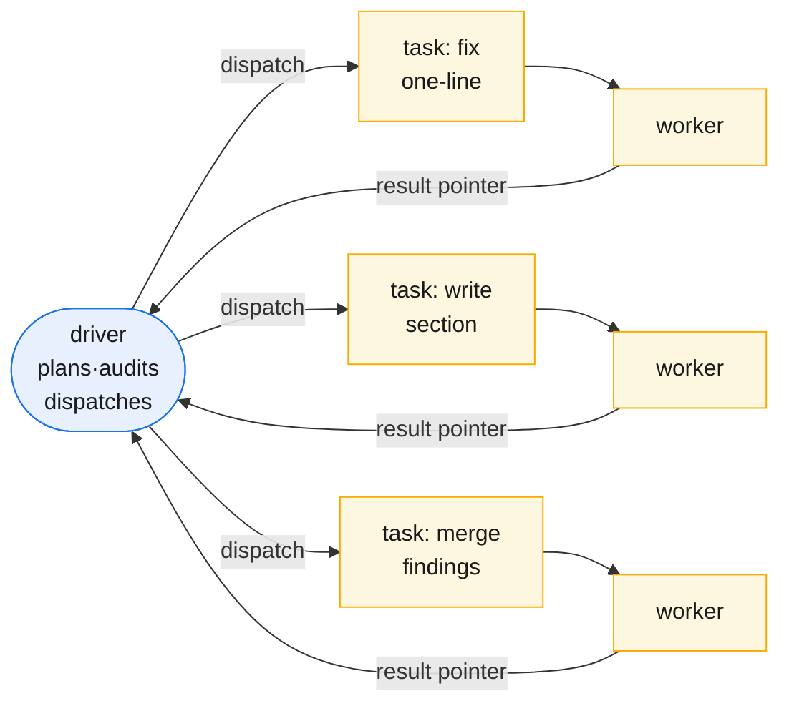
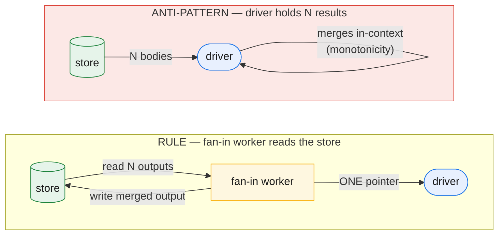
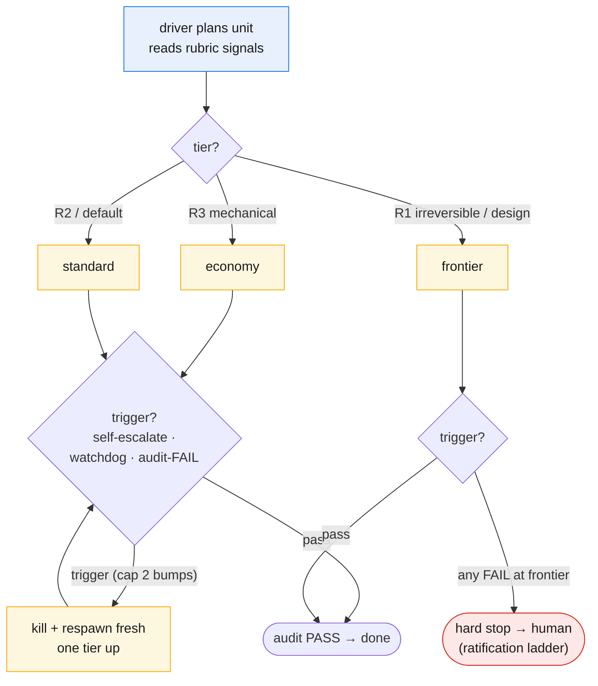

# Scaling & economy

Scaling rests on three pillars: **aggressive delegation** (every task is a worker dispatch), **fan-out/fan-in parallelism** (many workers; driver reads the store), and **tier-binding** (grain + Kind → model + effort).

## Aggressive delegation — the absolute law

The core discipline: **the driver executes nothing. Every task — however small — is a worker dispatch.** This forbids inline fixes that bloat the driver and is the root cause of monotonicity.

*Aggressive delegation: every subtask dispatches to its own short-lived worker. The driver receives a terse pointer, never the body.*

## Fan-out and fan-in — the parallelism spine

**Fan-out** is dispatching N workers; **fan-in** is joining at a **barrier** (where a downstream needs all upstreams). **Minimize barriers — default to pipeline.** Each unit flows author → audit → done independently; wall-clock is the slowest chain, not the sum of stages. A barrier is earned only when genuinely needed: synthesis (N → 1), cross-unit consistency checks, or foundation gates. Everywhere else, pipeline.

### The hard rule: fan-in is a fresh worker reading the store

**A fan-in is a fresh worker that reads the N outputs from the store and emits the merged output. The driver receives one pointer — never the N bodies.** This is the rule that stops the driver from swelling at barriers. The driver never merges; a merge is work, so it dispatches a fan-in worker.

*The hard rule: fan-in worker reads the store; driver gets one pointer. The anti-pattern pulls all N bodies into the driver, concentrating work at every join.*

Workers return **terse results**: a pointer + verdict + blocker (~8 lines max), never the body. This is the fan-in rule applied to *every* dispatch — detail on disk, index in context.

### The rest of the spine

**Fan-out is a tree.** A large unit spawns sub-workers; the driver sees only the root pointer. Context stays bounded regardless of breadth.

**Backpressure.** Fan-out is bounded by concurrency cap; unbounded width spikes resource use and re-concentration.

**Explicit barrier-failure policy.** On fanned-out failure: retry fresh or drop-and-continue (recording what dropped). Never silent partial merge.

**Order-independent merges.** Results are unordered; fan-in merges are commutative or sort by unit ID.

## Token economy

Scaling costs are managed via one asymmetry: **be frugal where there are many (workers); be generous where there is one (driver).**

**Workers stay lean:** dispatch payload = bounded inputs + spec. Never the ledger, sibling outputs, or conversation. A worker reads the store if needed or fans out; it is never padded. A hundred tokens of slop × a hundred dispatches = real money.

**The driver may be large:** it orchestrates. Don't starve it; trust re-hydration (chapter 2) on fresh starts to handle session boundaries.

Four levers:
- **Batching:** aggregate one-line fixes into one partition-worker; pay overhead once.
- **Audit weight:** full independent audit for keystones/deploys; light checks for mechanical units.
- **Hot-tier economy:** keep frontier terse; read audit files, not the whole ledger.
- **Model tiering:** strong driver + cheap workers. Next section.

### Tier binding — grain and Kind

**grain** (size/scope) + **Kind** (role: authoring, deploy-infra, data, eval) determine tier. Default by grain: leaves run **economy**; keystones run **standard**; milestones run **frontier**. Kind overrides: tasks with external side-effects (deploy-infra, eval, diagnosis) are forced to **frontier**. Each unit gets a static Tier label; the driver resolves it to `(model, effort)` at spawn.

| Grain | Default Tier | Kind Override | Escalation |
|---|---|---|---|
| **Leaf** | **economy** | deploy-infra, eval, diagnosis → frontier | watchdog/self-escalate/audit-FAIL: bump one tier (max 2) |
| **Keystone** | **standard** | same | same |
| **Milestone** | **frontier** | — | hard stop → human |

Escalation: on failure, kill and respawn one tier up (max 2 bumps). Frontier failure = hard stop.

### Model tiering

**The driver allocates; workers execute.** The driver stays at the user's strongest setting (≥ frontier) and chooses each worker's tier at dispatch. The allocator is the frontier model — the entity that just planned the unit — so routing is your best model's judgment.

**Two knobs:** `(model, effort)`. Effort is cheaper than a model-swap; trade effort first.

**Three tiers, runtime-mapped:**
- **economy** — small/fast, low effort — mechanical extraction, renames.
- **standard** — mid, medium effort — routine authoring, data work. (default)
- **frontier** — strong, high effort — diagnosis, design, keystones, irreversible.

**Rubric for dispatch-time tier choice:**

| Condition | Tier |
|---|---|
| Irreversible **OR** diagnosis/design **OR** deep reasoning + high novelty | **frontier** |
| Critical-path hub **OR** authoring/synthesis **OR** multi-hop **OR** hard-to-audit | **standard** |
| Mechanical, low reasoning, reversible, easily audited | **economy** |
| Unsure | **standard** (default) |

**Escalation:** on self-escalate, watchdog kill, or audit-FAIL, re-dispatch one tier up (max 2 bumps, capped at frontier). Frontier failure = hard stop → human. Each escalation is recorded (start/final tier, trigger, reason).

*The escalation ladder: the driver tiers each unit by rubric, and any of the three triggers kills the worker and respawns it fresh one tier up — capped at frontier, where a failure stops for a human rather than looping.*

**The safety keystone: blast-radius = kill-safety (one rule, two jobs).** Killing and respawning is clean only because of two facts that turn out to be the same fact. First, **the driver is the single writer**: a killed worker's partial output never lands in the ledger (the driver records only results it *receives*), so a kill mid-run leaves the store untouched and the fresh worker re-runs from clean inputs — chapter 7's worker-retry guarantee. Second, **irreversible workers are never cheap-tiered**: rubric **R1** sends anything with an external side-effect to **frontier from the start**, so the only workers ever killed-and-respawned are reversible / scratch ones. You never kill a worker mid-`deploy`, mid-write. So the blast-radius rubric rule and the kill-safety rule are **the same rule** — escalation is safe *by construction*, not by luck.

**Audit reverse-tiering:** cheap-but-hard-to-verify or irreversible units get frontier audits even when the worker ran economy. Cheap producer + costly-if-wrong = strong auditor. Independence (auditor ≠ author) does the safety work; tiering sizes it.

**Tier is a static label, not a governor:** assigned once at dispatch, never a meter or budget. It picks the right tool per unit upfront.

### Economy shape, not total spend

**GOTM has no project token budgets, DAG cost-forecasting, or budget-governed loop.** The loop stays simple; economy comes from lean workers + a fat driver + cheap store reads + per-unit tiering. Tier is a static label, not a meter.

**GOTM does not necessarily spend fewer tokens.** Fan-out parallelizes more work; risk-tiered audits add passes. What changes is *shape*: spend becomes **bounded** (no context grows forever), **attributable** (each unit's cost is its own), **parallelizable** (chains run in parallel), and **tier-able** (cheap models do cheap work).

## Summary

Three moves scale without monotonicity: (1) aggressive delegation, (2) dispatch-gate deliberation, (3) tier-binding. Result: driver stays thin, parallelism is visible, cost is attributable, failures escalate by tier.

---

Next: **keeping it honest** — audit independence, verify-grain, freeze.
