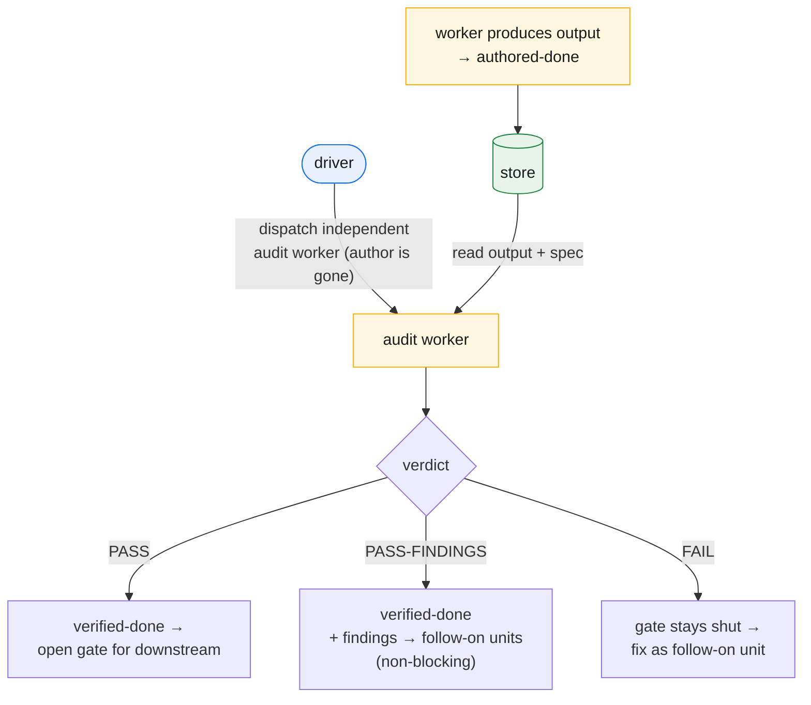

# Keeping it honest

The last three chapters built the machine: the three roles, the work as a DAG, the scheduler that walks it. But a machine that produces output is not yet one you can trust. This chapter is about the difference — how the framework knows a unit's output is *correct*, not merely *present*, and how it keeps a correct output correct once the project moves on. The mechanism has three parts: a producing context that can never grade itself, two distinct notions of "done," and a freeze that turns every later change into a new, owned unit rather than a silent edit.

## A worker cannot grade its own work

Chapter 3 left two terminal states on the table — **authored-done** and **verified-done** — and promised the full treatment here. Start with the producer.

A worker does one unit, writes one output, returns a terse structured result, and is discarded. The strongest thing it may claim is **authored-done**: *the artifact exists.* That is all — not that it is right, builds, deploys, or behaves as its consumer needs. A worker **never self-certifies**, and this is not a rule it is asked to honor. It is impossible by construction.

Here is the construction. The executor that produces a unit is an ephemeral worker; by the time anything checks that unit, the executor is **gone** — its context discarded the moment it returned. There is no long-lived "doer" left to bless its own output, because the architecture forbids one in the first place (chapter 2). The driver, seeing an authored-done unit, **always launches a separate audit worker** — a fresh context with no memory of having produced anything. Producer and checker are never the same context. We name this **auditor ≠ author**, and the point of saying it this way is that it is *structural*, not a guideline someone has to remember and can quietly let slip.

This is the exact failure the design eliminates. In v2 one long-lived doer planned, executed, deployed, and then validated *its own* deploy work — judged by the same context that did it. That is no audit at all, and independence eroded precisely because nothing prevented it. v3 does not ask the doer to be disciplined about not grading itself; it removes the doer before the grading happens. Self-grading is not discouraged — it is unavailable. So the loop has a built-in seam: a unit becomes authored-done when its worker returns, and only a *second* worker, launched by the driver, can move it further. Independence is not bought with vigilance; it falls out of the fact that workers are disposable.

## authored-done versus verified-done

The two states are not synonyms for "drafted" and "reviewed." They mark *who* established the claim and *how strong* the check was.

**authored-done** is the producer's claim: the output exists, the worker did the job it was dispatched to do. Necessary but not sufficient. A draft chapter no one but its author read is authored-done; a config written but never applied is authored-done. The artifact is on disk; nothing independent has touched it.

**verified-done** is conferred *only* by an independent worker — never by the producer, never by the driver asserting it, never by a green result the author saw. The audit worker reads the bounded inputs, the output, and the spec, and confirms the output meets the spec. For a prose or code unit that is a careful independent read against the contract. For **deploy, infra, and data units the bar is higher**: the verification worker performs a **runtime** check — not inspecting the artifact from the outside but **exercising the live artifact as its real consumer**. If the unit deployed an endpoint, the worker hits it as the real identity a consumer would use and confirms the real response; if it produced a table, the worker queries it the way a downstream unit will. The author's own green build or local run does *not* count: that is **self-validation**, the author watching its own machinery work, exactly what verified-done excludes. A thing is verified-done when someone who was *not* the author drove it the way reality will.

The distinction earns its keep where the gap between "looks done" and "is done" is widest — the units that touch live systems. authored-done says the deploy script ran without error in the author's hands; verified-done says a separate context, acting as the real consumer, got the real artifact to respond correctly. Only the second is a claim the rest of the project can build on.

## The freeze, and why findings become units

Once a unit is done, its output is **frozen** — nothing edits it in place, not the driver, not a later worker, not a passing fix. The freeze is v2's immutability rule, kept because it is what makes the ledger trustworthy: a done unit's output is a stable artifact other units depend on, and an artifact you can silently rewrite is not a foundation, it is a moving target.

But a real project *does* need to change things that are already done — an audit finds a gap, a downstream reveals an inconsistency, a decision is revisited. The freeze does not forbid change; it forbids *silent* change. To change a frozen output you register a **follow-on unit** — a new node in the DAG whose declared output is the change, attributed and audited like any other unit. This is **follow-on ownership**: a follow-on unit may legitimately own a change to a previously-done output, and that is the *only* sanctioned way a done output moves.

The enforcement is real, not honor-system. v2's immutability hook blocked writes to done outputs — correct in spirit but over-blocking, refusing legitimate follow-on edits along with illegitimate ones. The v3 hook **honors follow-on ownership**: a write to a frozen output is rejected *unless* an active follow-on unit owns that output. So the freeze holds against drift and the sanctioned path still gets through. The result is a load-bearing rule: **findings become new units, never silent edits.** An audit that turns up a problem does not reach back and patch the output it was auditing — it produces a finding registered as a follow-on unit some worker will own. The history stays legible: every change to a done output is a node with an author, an audit, and a place in the graph.

## Verdicts and the gate

An audit returns one of three verdicts, and the choice of three (not two) is deliberate.

- **PASS** — the output meets its spec; nothing to track. The unit is verified-done.
- **PASS-FINDINGS** — good enough to consume, but the audit surfaced real issues. The findings are *tracked* and become follow-on units, but they are **non-blocking**: downstream may proceed. This is the common middle case — a usable output with known, recorded follow-ups, so "good enough to build on" and "perfect" need not be the same thing.
- **FAIL** — the output does not meet its spec. This **blocks**: dependent units cannot be dispatched until the failure is owned by a follow-on unit and that unit passes.

These verdicts feed **the gate**: *downstream consumes an input only on a passing verdict.* A unit that lists another as a dependency is not dispatched the moment the dependency is authored-done — it waits for a verifying worker to return PASS or PASS-FINDINGS; a FAIL holds the gate shut. This is what makes the DAG's edges mean something at runtime: a dependency is not "the upstream produced something," it is "the upstream produced something an independent worker confirmed." The gate is where authored-done, verified-done, and the verdicts converge into a single scheduling rule — the reason a long project does not accumulate a sediment of unverified, silently-mutated outputs that only look done.

*The audit flow: a worker can only reach authored-done; the driver then dispatches a separate audit worker (the author is already gone, so independence is structural) that reads output and spec from the store and renders a verdict — PASS / PASS-FINDINGS confer verified-done and open the gate; FAIL holds it shut until a follow-on unit fixes it.*

---

Honesty here is structural, not aspirational: the producer is gone before the grade is given, the strong "done" requires an outsider exercising the live thing, and every later change is an owned unit the freeze can enforce. The next chapter turns to what happens when contexts *die* mid-flight and how the store stays affordable over a long project: **resilience and the three-tier memory economy**.
