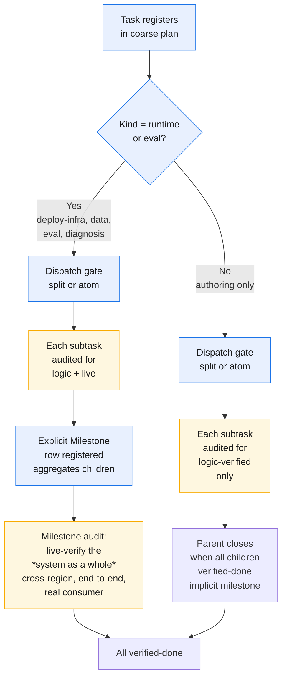
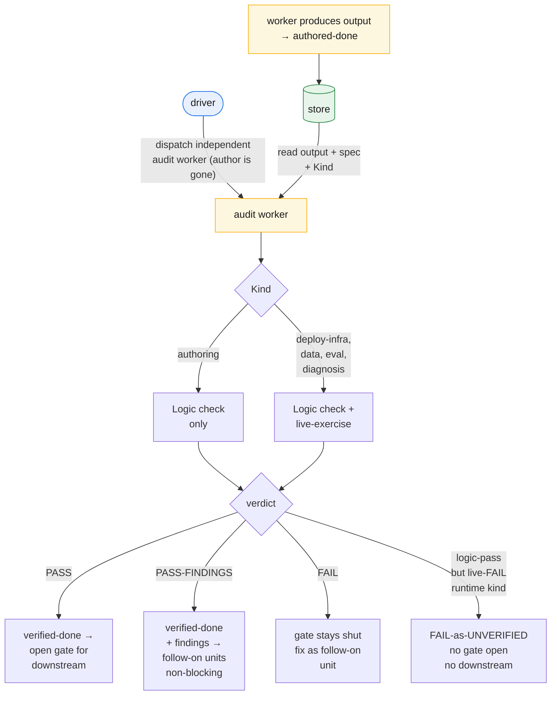

# Keeping it honest

The last three chapters built the machine: the three roles, the work as a DAG, the scheduler that walks it. But a machine that produces output is not yet one you can trust. This chapter is about the difference — how the framework knows a unit's output is *correct*, not merely *present*, and how it keeps a correct output correct once the project moves on. The mechanism has three parts: a producing context that can never grade itself, a **typed verification gate that splits on unit kind**, and a freeze that turns every later change into a new, owned unit rather than a silent edit.

## A worker cannot grade its own work

Chapter 2 left the fundamental principle in place: a worker does one unit, writes one output, returns a terse result, and is discarded. The strongest thing it may claim is **authored-done**: *the artifact exists.* That is all — not that it is right, builds, deploys, or behaves as its consumer needs. A worker **never self-certifies**, and this is not a rule it is asked to honor. It is impossible by construction.

Here is the construction. The executor that produces a unit is an ephemeral worker; by the time anything checks that unit, the executor is **gone** — its context discarded the moment it returned. There is no long-lived "doer" left to bless its own output, because the architecture forbids one in the first place (chapter 2). The driver, seeing an authored-done unit, **always launches a separate audit worker** — a fresh context with no memory of having produced anything. Producer and checker are never the same context. We name this **auditor ≠ author**, and the point of saying it this way is that it is *structural*, not a guideline someone has to remember and can quietly let slip.

This is the exact failure the design eliminates. In v2 one long-lived doer planned, executed, deployed, and then validated *its own* deploy work — judged by the same context that did it. That is no audit at all. GOTM does not ask the doer to be disciplined about not grading itself; it removes the doer before the grading happens. Self-grading is not discouraged — it is unavailable. So the loop has a built-in seam: a unit becomes authored-done when its worker returns, and only a *second* worker, launched by the driver, can move it further. Independence is structural.

## The typed verification gate: logic-verified vs live-verified

The two states are not synonyms for "drafted" and "reviewed." They mark *who* established the claim, *what they checked*, and *what kind of unit matters*.

**authored-done** is the producer's claim: the output exists, the worker did the job it was dispatched to do. Necessary but not sufficient. A draft chapter no one but its author read is authored-done; a config written but never applied is authored-done. The artifact is on disk; nothing independent has touched it.

**verified-done** is conferred *only* by an independent worker, but with a critical split: the depth of the check depends on the unit's **Kind**. For units that are purely about authoring (narrative, documentation, design proposals), **logic-verified** is terminal — an independent worker reads the bounded inputs, the output, and the spec, and confirms the output meets the spec. For **runtime kinds** — those whose whole job is to touch a live system (deploy-infra, data production, eval harnesses, diagnostic probes) — **logic-verified is insufficient**. A logic-only audit says "the script is well-written" but not "the script does what the real consumer needs when the real consumer runs it." These units must reach **live-verified**: an independent worker exercises the live artifact *as its real consumer would*.

The distinction earns its keep where the gap between "looks done" and "is done" is widest.

### What live-verified means for each kind

The principle is: "exercise the live artifact as its real consumer." But what a real consumer does depends on what the artifact is. Here is the per-kind specification:

| Kind | What live-verified looks like | Stops us from |
|---|---|---|
| **authoring** | Logic-verified (spec match, independent read, internal consistency). Terminal. | — (logic-only is terminal) |
| **UI / visual** | Rebuild from *current* source (a stale served bundle is the wrong build), then check with objective machine criteria: DOM structure, element counts, rendering bounds. Not a worker's prose about how it "looks." | Shipping a stale/cached build; accepting subjective "looks right" |
| **deploy-infra** | Exercise end-to-end **as the deployed identity**, not the author's identity. Recreating infra can mint a new principal whose access grants don't port over, so "it runs locally" but every real call fails. | Deploying as one identity, then the real consumer hitting it as a different identity and failing |
| **data** | Re-query the target **the way the downstream consumer will** — same credentials, same scope, same freshness expectations. Not just "rows landed." | A table that exists but isn't queryable / joinable the way the consumer expects it |
| **eval** | Harness fairness: equal-fidelity inputs on both arms, symmetric yardstick, position/order bias controlled (A/B swap). Every confound either eliminated or labeled. A biased harness emits a confident-wrong number. | A harness that looks rigorous but silently biases one arm (the field's highest-value catch) |
| **diagnosis** | Reproduce the reported failure under **controlled conditions** (isolate model, harness, config from the live system). Root-cause only once reproduction is clean. | Fixing a confound and missing the real bug; incomplete diagnosis that breaks in production |

Across all of them the constant is unchanged — someone who was *not* the author drove the thing the way reality will — and the typing just makes "the way reality will" concrete.

### The unverified failure

A logic-only audit of a runtime unit is a **FAIL-as-UNVERIFIED**, not a PASS. This is a hard rule, not a judgment call. A runtime unit that reaches authored-done but whose audit worker skips the live-exercise gate is blocked downstream — the gate does not open. The fix is a follow-on unit that adds the live check (or redoes it properly). This prevents the silent "we verified it at the desk and nobody noticed it fails live" failure.

## The milestone as the live-verification boundary

For runtime and eval tasks, **the Milestone** is an explicit ledger row that marks where live verification is forced. When a task splits into subtasks (e.g., deploy to three regions → three subtasks, one per region), each subtask is live-verified individually. Then the milestone aggregates them and re-verifies the system as a whole (e.g., "all three regions alive and talking to each other"). The milestone is what keeps each piece accountable *and* the whole system accountable.

For pure-authoring tasks, milestones are implicit — the parent closes when all children verify-done. There is no forced re-aggregation check because the outputs don't touch live systems.

## The freeze and follow-on ownership

Once a unit is done, its output is **frozen** — nothing edits it in place, not the driver, not a later worker, not a passing fix. The freeze is the foundation that makes the ledger trustworthy: a done unit's output is a stable artifact other units depend on, and an artifact you can silently rewrite is not a foundation.

But a real project *does* need to change things that are already done — an audit finds a gap, a downstream reveals an inconsistency, a decision is revisited. The freeze does not forbid change; it forbids *silent* change. To change a frozen output you register a **follow-on unit** — a new node in the DAG whose declared output is the change, attributed and audited like any other unit. This is **follow-on ownership**: a follow-on unit may legitimately own a change to a previously-done output, and that is the *only* sanctioned way a done output moves.

An audit that turns up a problem does not reach back and patch the output it was auditing — it produces a finding registered as a follow-on unit some worker will own. The history stays legible: every change to a done output is a node with an author, an audit, and a place in the graph.

## Verdicts and the gate

An audit returns one of three verdicts: **PASS** (spec met; verified-done; downstream may proceed), **PASS-FINDINGS** (good enough to consume; findings become non-blocking follow-on units), or **FAIL** (spec not met; blocks downstream until a follow-on unit fixes and passes). **The gate**: downstream consumes an input only on a passing verdict. A dependency is not "upstream produced something" but "upstream produced something an independent worker confirmed, or fixed if broken."

## How findings are tracked

Audit findings (severity: HIGH/MEDIUM/LOW) are triaged inline in the loop. HIGH becomes a blocking follow-on (FAIL blocks downstream); MEDIUM becomes non-blocking (PASS-FINDINGS opens downstream); LOW is deferred or batched. Every finding is recorded in the ledger with its disposition (owned unit or deferral reason) — never silent drops. This prevents "we knew about it but forgot" and keeps issues owned.

---

Honesty is structural: the producer is gone before grading, the check depth depends on unit Kind (logic for authoring, live-exercise for runtime), and every later change is an owned follow-on unit. The next chapter: **resilience and the three-tier memory economy**.
