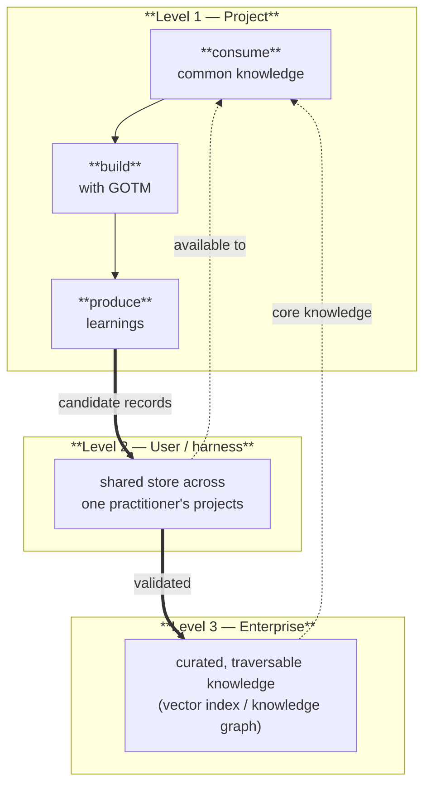

# Learning across projects

The first five chapters are about surviving *one* project: how a single mission's worth of work carries its context across hundreds of sessions without drifting. This chapter is about what happens *after* a project finishes — how a completed GOTM project stops being a closed record and starts making the *next* project cheaper.

The premise is simple. By the time a GOTM project is done, it has written down something most projects never do: not just *what* was built, but *why* — every decision with its rationale, every audit finding, every pivot forced by a constraint the team couldn't see coming. That record is the raw material of institutional knowledge. The discipline that made one project legible to its own future sessions also makes it legible to future *projects*.

GOTM's first principle was *the project remembers so the agent doesn't have to*. This chapter adds a second, built on the same mechanism: **the organization learns so the next project doesn't have to.**

## Bottom-up, in three levels

Knowledge in GOTM is **bottom-up**: it is born in a single project and rises only as far as evidence carries it.

**Level 1 — the project.** The build loop from chapters 1–5 gains two moves. *Consume:* at the start, the project reads whatever common knowledge already exists and skips mistakes earlier projects already paid for. *Produce:* when the project is done, it distills its own record into a set of transferable **learnings**. Level 1 is a loop — every project both draws from the pool and contributes back to it.

**Level 2 — the user / harness.** One practitioner's projects pool their learnings into a shared store available to all of that practitioner's future projects. After a few projects, *consume* starts paying back what *produce* deposited. The mechanism is deliberately left open — a folder, a repo, a small index — because it depends on the harness.

**Level 3 — the enterprise.** Across many practitioners, the learnings combine into a curated, **traversable** knowledge system — a vector index or a knowledge graph — that refines them and serves them to everyone. Same outcome as level 2, at organizational scale.

The outcome is identical at every level, and it is concrete: a project that consumes good learnings makes fewer mistakes, finishes faster, and — for agentic work — spends fewer tokens re-discovering what is already known.

## What a learning is

Not everything a project produces is a learning. A learning is a **transferable** claim — something a *different* project would benefit from knowing. The project's record sorts into a few recurring shapes:

- a **gotcha** — a trap, or a "use X, not Y," where the obvious path is wrong;
- a **prerequisite** — "do, grant, or verify X before step Y";
- a **pivot** — a place a technical or organizational constraint forced the plan off its intended path;
- a **pattern** — a repeatable approach that worked;
- an **anti-pattern** — a repeatable approach that didn't (often a finding the audits flagged more than once).

The crucial filter is *transferability*. A one-off detail specific to this project is not a learning — it stays in the record. A claim a stranger to the project could act on — generalized, with the project-specific nouns stripped but the load-bearing specifics kept — is.

## The format: one record, two consumers

A learning has to serve two very different readers with one artifact, and the way to do that is to separate the **record** (the source of truth) from its **projections** (how each reader sees it).

A **record** is structured and built to *merge*: a stable `claim` (the merge key), a `kind` and `tags` (for routing), the actionable `fix`, the `scope` it applies in, an **appendable** `evidence` list (which project, which decision or audit), and a `confidence`. The next project does not read records in bulk — it reads a generated **index** of one-line entries, filters to the tags it is touching, and expands the detail only for the few that apply. That is what makes a learning *save* tokens rather than spend them: scanning a line is cheap; the full fix loads only when relevant.

The same structured record is what an aggregation layer ingests. Because `claim` is a stable key and `evidence` is a list, a second project that hits the same wall does not create a duplicate — it **appends** its evidence to the existing record. The record grows; the pool does not bloat.

## Confidence is the bridge between the levels

A learning from a single project is a **candidate** — honestly marked as such, because one project is an anecdote. Confidence rises on a ladder:

- **candidate** — seen in one project;
- **validated** — confirmed independently by a second project;
- **core** — broadly applicable, curated at the enterprise level.

Two rules keep the ladder honest, and both are GOTM principles you have already met. A candidate cannot promote itself to *validated* on the strength of its own project — however many times the lesson recurred *within* that project — because promotion requires an **independent** confirmation: the same *auditor ≠ author* rule from chapter 4, applied across projects. And a learning a later project **contradicts** is not overwritten; it is flagged for review and demoted. That demotion path is what stops a knowledge pool from rotting into stale, confidently-wrong advice — the failure mode every "lessons learned" wiki eventually dies of.

## What is built, and what is the path

**Both halves of the level-1 loop are concrete, paste-able steps** — that is what keeps a learning pool from rotting into a write-only void. *Produce:* the end-of-project retrospective that reads a finished project's record and emits candidate learnings — [`prompts/outcome-analysis.md`](../prompts/outcome-analysis.md), scaffolded by [`templates/LEARNINGS.md.template`](../templates/LEARNINGS.md.template). *Consume:* the start-of-project step that scans the pool's indexes, tag-filters to the work at hand, and surfaces the few relevant records — [`prompts/consult.md`](../prompts/consult.md). A produce step with no consumer trains the agent to spend tokens distilling lessons nothing ever reads; the consume step closes that loop. In adopter tooling each is a single command (`/gotm:learn`, `/gotm:consult`) plus a bootstrap pull that consults the pool at project start.

What this framework deliberately does **not** ship is the **pool itself** — *where* the learnings live and *how* they are indexed (the user-level store, the enterprise vector index or knowledge graph). The two prompts specify the *steps*; the store is a platform binding, the same boundary chapter 4 drew around the enforcement hook. Point `consult.md` at a folder, a sibling-repo glob, or a `~/.gotm/learnings/` pool and the loop runs; scale that pool into an enterprise index and the same loop runs at organizational reach. Until a pool exists, consulting is honest about finding nothing — an empty pool is a valid result, not a silent skip.

The discipline stays small, as ever. A learning is a few lines. The retrospective is one pass at the end of a project; consulting is one pass at the start. What it buys is large: every finished project becomes a down payment on the next one.

→ Back to the [repository README](../README.md) · the producer prompt is [`prompts/outcome-analysis.md`](../prompts/outcome-analysis.md), the consumer prompt is [`prompts/consult.md`](../prompts/consult.md).
