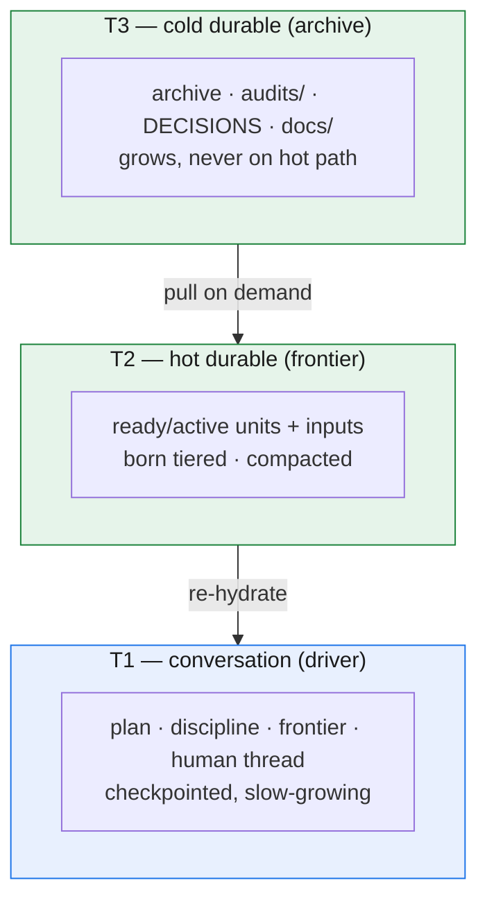

# Resilience & the three-tier memory economy

Every chapter so far has assumed a clean run: the driver walks the DAG, dispatches workers, collects, audits, drains. But real projects do not run clean. A worker times out mid-task. A session ends abruptly — a crash, a closed laptop, an auto-compaction the operator never asked for. The boundary the framework must defend is the one chapter 1 named: *nothing survives the session boundary unless it is on disk.* This chapter shows why that boundary is survivable — what happens when each kind of context dies, and how the same tiered store that keeps the hot path cheap also makes recovery free.

One invariant underneath all of it: **transcript independence** — on-disk state alone reconstructs working context. Not "mostly," not "with help from the conversation we still have." The conversation is a cache; the store is the truth. Every recovery move below is a consequence of taking that literally.

## The crash model has exactly two levels

Only two kinds of context in this architecture can die — the worker and the driver — so there are only two crash cases to handle.

**A worker crash is a task retry.** A worker is a function of its inputs (chapter 2): born with a bounded payload, it produces one output and holds nothing else. So when a worker crashes — times out, errors, returns garbage — recovery is simply to dispatch a fresh worker on the same unit. This is the loop's step 5 (chapter 4): the inputs still live on disk, untouched, so re-running the unit is a safe **lineage** recompute. The crashed worker held nothing irreplaceable, because by construction it held nothing the store does not already have. **retry** is not a special error path bolted on; it is the same dispatch the scheduler always does, aimed again at a unit whose inputs never moved. The discipline that makes this safe is idempotence — re-running produces an equivalent output, never a corrupt half-write or double-applied side effect. And because the driver is the single writer (chapter 2), a worker's partial output never lands in the ledger: the driver never records a result it did not receive, and the next attempt overwrites whatever the dead worker left behind.

**A driver crash is a re-hydrate.** This is the harder case, because the driver is the one long-lived context — and here the framework states its honest limit plainly. In an interactive session the driver *is* the session: on most interactive harnesses it cannot be made stateless and **it cannot self-trigger compaction** (compaction is typically human-only; no hook or model directive fires it; the auto-compact threshold is not tunable). (Concretely, this is the situation in an interactive Claude Code session — one common runtime — but the limit is a property of interactive harnesses generally, not of one tool.) So we do not promise a driver that never dies — we promise one that always comes back.

What makes that real is that the driver is **checkpointed**, not stateless. Its durable state — the plan, the frontier, the open questions — lives in the store, never only in chat. So on *any* fresh start — a cold restart, a context clear, or the far side of an auto- or manual compaction — the driver rebuilds its working set from the store through the **session-start reconcile** (chapter 4's opening step): it reads the **frontier**, checks it against disk, and reconstructs the manifest — the active-unit row plus its inputs as pointers, the rolling recovery-log window, and the open `QUESTIONS`. The driver is back where it was, holding the index again, ready to dispatch.

The load-bearing property is that **re-hydration is runtime-agnostic and depends on no compaction hook.** It works on every runtime because it leans on nothing but the store and the reconcile — the same transcript-independence guarantee GOTM has always made. An optional session-start hook *could* auto-inject the manifest the instant a compaction fires, making recovery feel instantaneous; but it is at most an accelerator, and the framework deliberately does not build on it. (In an SDK or headless setting the driver gains one more capability — it can additionally compact *itself* programmatically — but that too is a bonus where the runtime allows it, never a dependency.) Because the recovery path needs no hook, "no context loss across any session end" holds for the *accidental and hard* endings — the crash, the killed terminal, the surprise compaction — not just the clean ones. A guarantee covering only graceful shutdown would be no resilience guarantee.

## Three tiers, each reconstructing the one above it

Resilience and economy turn out to be the same mechanism from two sides. The store is not one undifferentiated memory; it is **three tiers**, each cheaper-but-larger than the last, each reconstructing the hotter one.

| Tier | What it is | Behavior |
|---|---|---|
| **T1 — conversation** | the driver itself: plan, discipline, frontier, the live human thread | **checkpointed**, slow-growing; the only volatile tier |
| **T2 — hot durable** | the ledger **frontier** — ready/active units and their immediate inputs | **born tiered**, **compacted** on a threshold; small and roughly constant |
| **T3 — cold durable** | the **archive** plus `audits/`, `DECISIONS.md`, `docs/` | grows without bound; pulled on demand, **never on the hot path** |

*The three tiers, cheaper-but-larger downward, each reconstructing the one above it: T2 re-hydrates the volatile driver (T1); T3 is pulled on demand to rebuild a compacted T2. No recovery move ever reads the big cold tier on the hot path.*

The relationships run downward. T1 is reconstructed from T2 — that *is* re-hydration: a dead driver rebuilt from the frontier. T2 is reconstructed from T3 when needed — a compacted ledger cell still points at the full audit and decision detail in the cold tier, so nothing is gone, only moved off the path read every turn. Each tier is the recovery medium for the one above it: the volatile tier is small and cheap to rebuild, the durable tiers large and rarely touched, and no recovery move ever requires reading the big cold tier on the **hot path**.

## A second axis: provenance

The three tiers sort memory by **heat** — how long a piece of context lives before it is reconstructed. That is one axis. Cutting across it is a second, orthogonal one: **provenance** — not *how hot* the knowledge is but *what kind* it is, and therefore how much to trust it. Three provenances: **session** memory — the ephemeral work of a single run (the worker's bounded context, the driver's T1) — which is what this whole chapter is about; **experience** — earned, weighted lessons distilled from past projects (the learning pool); and **facts** — given, authoritative truths about the world the work lives in (the context pool).

The distinction is load-bearing because the two axes answer different questions. The heat axis (T1/T2/T3) says *how long context lives*; the provenance axis says *what kind it is and how much to trust it* — **facts are obeyed; experience is weighted**. The two cross-project provenances — experience and facts — and their pools are the subject of [`docs/09`](09-learning-across-projects.md).

## Compaction is the anti-monotonicity mechanism

The reason a thousand-unit project reads no more per turn than a ten-unit one is **compaction** — precisely what the v2 ledger lacked (chapter 1). Here is the mechanism, and why it loses nothing.

When a unit reaches its terminal state — done *and* audited — its verbose detail is already written down somewhere durable: the verdict in its `audits/` file, the rationale in `DECISIONS.md`, the output in `docs/` (or wherever its artifact sits). The unit's full frontier cell — bounded inputs, spec, status churn — is now a *duplicate* of detail that exists in the cold tier. So compaction rewrites that cell down to a one-line **archive** entry that keeps the **audit pointer**: which file holds the verdict, where the output lives. Nothing is discarded. The compaction is **lossless** because every fact it removes from the hot tier still exists, in full, one pointer away in T3. And it is **gate-preserving**: the audit pointer travels with the archived cell, so the verified-done gate (chapter 6) stays provable forever — you can always follow the pointer back to the verdict that opened it.

Two things keep this honest. First, compaction is **an index operation, not an edit to a frozen output.** It rewrites a *ledger cell* — a row in the scheduler's bookkeeping — and never touches the unit's artifact, which stays byte-for-byte frozen; it only changes how the ledger *refers* to that output, from a verbose record to a terse pointer. So it does not violate the freeze: the freeze protects artifacts, and the frontier is not an artifact — it is the live index of the work. Second, compaction has a **trigger and a window**, not a continuous churn. The driver runs it at the **session-start reconcile**, on a size-or-count threshold (the frontier grows past a band, or too many done units pile up), so it is periodic housekeeping, not a per-turn cost. And it keeps a **rolling recovery-log window** — the most recent slice of activity stays in full detail on the hot path even after the units it describes are archived, so a driver re-hydrating right after a crash sees what just happened, not only terse pointers.

This is why the ledger is **born tiered** rather than compacted as an afterthought (chapter 3): compaction is not a cleanup someone remembers to run, it is the steady-state behavior that keeps T2 small while T3 absorbs the growth — off the hot path, where unbounded growth costs nothing per turn.

## The invariant, restated

Strip away the tiers and triggers and one thing remains: **transcript independence** — the property that on-disk state alone reconstructs working context. Worker retry depends on it (inputs on disk, so lineage recompute is safe); driver re-hydration *is* it (the store rebuilds the session); compaction preserves it (moving detail between tiers, never out of the store). Every resilience move in this chapter is the same bet: keep the truth on disk, treat every context as a cache of it, and no session boundary — clean or violent — can take the work with it.

The next chapter, *In practice*, turns these guarantees into adoption: how the interactive and SDK drivers differ, how to bootstrap a v3 project, and how this very rewrite is its own worked example.
