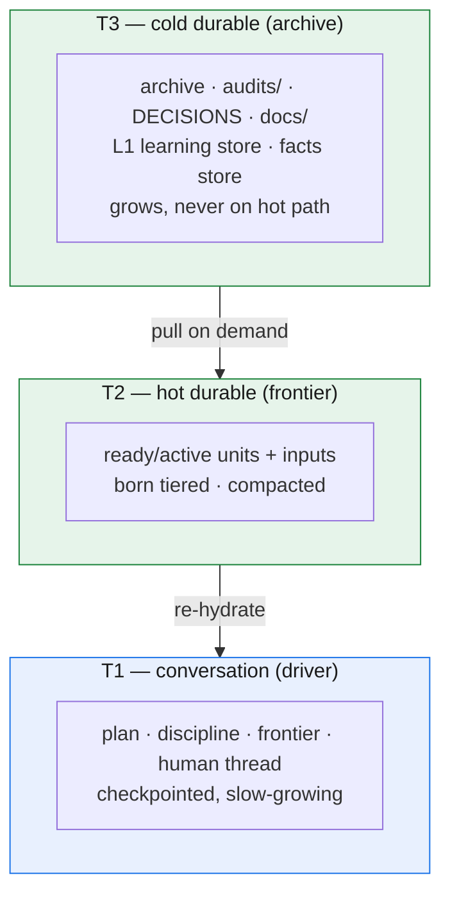
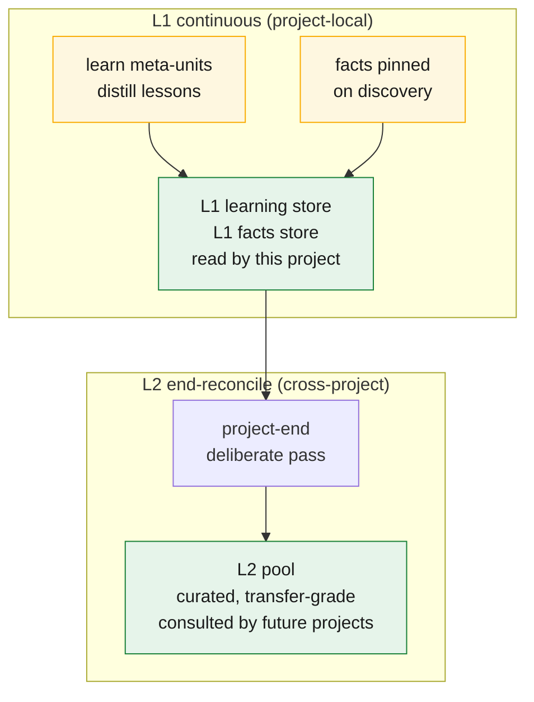
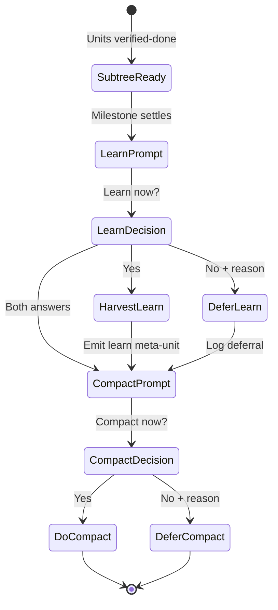

# Resilience & the three-tier memory economy

Every chapter so far has assumed a clean run: the driver walks the DAG, dispatches workers, collects, audits, drains. But real projects do not run clean. A worker times out mid-task. A session ends abruptly — a crash, a closed laptop, an auto-compaction the operator never asked for. The boundary the framework must defend is the one chapter 1 named: *nothing survives the session boundary unless it is on disk.* This chapter shows why that boundary is survivable — what happens when each kind of context dies, and how the same tiered store that keeps the hot path cheap also makes recovery free.

One invariant underneath all of it: **transcript independence** — on-disk state alone reconstructs working context. Not "mostly," not "with help from the conversation we still have." The conversation is a cache; the store is the truth. Every recovery move below is a consequence of taking that literally.

## The crash model has exactly two levels

**A worker crash is a task retry.** A worker is a function of its inputs: born with a bounded payload, it produces one output and holds nothing else. When a worker crashes, recovery is a lineage recompute — dispatch a fresh worker on the same unit, using the same on-disk inputs. No partial state is lost because the driver (single writer) never recorded a result it did not receive. Retries are safe for the same reason tier-escalation (Chapter 5) is safe: the killed worker's partial output never landed in the ledger, so re-running produces the same result.

**A driver crash is a re-hydrate.** The driver is **checkpointed**, not stateless: its durable state (plan, frontier, open questions) lives in the store. On any fresh start — cold restart, context clear, auto-compaction — the driver rebuilds via **session-start reconcile**: read frontier, reconcile against disk, reconstruct manifest (active units + their input pointers + recovery-log window + QUESTIONS), and resume.

Re-hydration is **runtime-agnostic and hook-independent** — it works on every runtime using only the store and reconcile, the same transcript-independence guarantee GOTM always made. An optional hook could accelerate it, but is not required. Because recovery depends on no hook, the guarantee holds for the hard ends — crashes, killed terminals, surprise compactions — not just clean shutdowns.

## Three tiers, each reconstructing the one above it

Resilience and economy turn out to be the same mechanism from two sides. The store is not one undifferentiated memory; it is **three tiers**, each cheaper-but-larger than the last, each reconstructing the hotter one.

| Tier | What it is | Behavior |
|---|---|---|
| **T1 — conversation** | the driver itself: plan, discipline, frontier, the live human thread | **checkpointed**, slow-growing; the only volatile tier |
| **T2 — hot durable** | the ledger **frontier** — ready/active units and their immediate inputs | **born tiered**, **compacted** on a threshold; small and roughly constant |
| **T3 — cold durable** | the **archive** plus `audits/`, `DECISIONS.md`, `docs/`, learning & facts stores | grows without bound; pulled on demand, **never on the hot path** |

*The three tiers, cheaper-but-larger downward, each reconstructing the one above it: T2 re-hydrates the volatile driver (T1); T3 is pulled on demand to rebuild a compacted T2. No recovery move ever reads the big cold tier on the hot path.*

The relationships run downward. T1 is reconstructed from T2 — that *is* re-hydration: a dead driver rebuilt from the frontier. T2 is reconstructed from T3 when needed — a compacted ledger cell still points at the full audit and decision detail in the cold tier, so nothing is gone, only moved off the path read every turn. Each tier is the recovery medium for the one above it: the volatile tier is small and cheap to rebuild, the durable tiers large and rarely touched, and no recovery move ever requires reading the big cold tier on the **hot path**.

## A second axis: provenance

The three tiers sort memory by **heat** — how long a piece of context lives before it is reconstructed. That is one axis. Cutting across it is a second, orthogonal one: **provenance** — not *how hot* the knowledge is but *what kind* it is, and therefore how much to trust it. Three provenances: **session** memory — the ephemeral work of a single run (the worker's bounded context, the driver's T1) — which is what this whole chapter is about; **experience** — earned, weighted lessons distilled from past projects (the learning pool); and **facts** — given, authoritative truths about the world the work lives in (the context pool).

The distinction is load-bearing because the two axes answer different questions. The heat axis (T1/T2/T3) says *how long context lives*; the provenance axis says *what kind it is and how much to trust it* — **facts are obeyed; experience is weighted**. The two cross-project provenances — experience and facts — and their pools are the subject of [`docs/09`](09-learning-across-projects.md).

## Compaction is the anti-monotonicity mechanism

The reason a thousand-unit project reads no more per turn than a ten-unit one is **compaction** — precisely what the v2 ledger lacked (chapter 1). Here is the mechanism, and why it loses nothing.

When a unit reaches its terminal state — done *and* audited — its verbose detail is already written down somewhere durable: the verdict in its `audits/` file, the rationale in `DECISIONS.md`, the output in `docs/` (or wherever its artifact sits). The unit's full frontier cell — bounded inputs, spec, status churn — is now a *duplicate* of detail that exists in the cold tier. So compaction rewrites that cell down to a one-line **archive** entry that keeps the **audit pointer**: which file holds the verdict, where the output lives. Nothing is discarded. The compaction is **lossless** because every fact it removes from the hot tier still exists, in full, one pointer away in T3. And it is **gate-preserving**: the audit pointer travels with the archived cell, so the verified-done gate (chapter 6) stays provable forever — you can always follow the pointer back to the verdict that opened it.

Two things keep this honest. First, compaction is **an index operation, not an edit to a frozen output.** It rewrites a *ledger cell* — a row in the scheduler's bookkeeping — and never touches the unit's artifact, which stays byte-for-byte frozen; it only changes how the ledger *refers* to that output, from a verbose record to a terse pointer. So it does not violate the freeze: the freeze protects artifacts, and the frontier is not an artifact — it is the live index of the work. Second, compaction has a **trigger and a window**, not a continuous churn. The driver runs it at the **session-start reconcile**, on a size-or-count threshold (the frontier grows past a band, or too many done units pile up), so it is periodic housekeeping, not a per-turn cost. And it keeps a **rolling recovery-log window** — the most recent slice of activity stays in full detail on the hot path even after the units it describes are archived, so a driver re-hydrating right after a crash sees what just happened, not only terse pointers.

This is why the ledger is **born tiered** rather than compacted as an afterthought (chapter 3): compaction is not a cleanup someone remembers to run, it is the steady-state behavior that keeps T2 small while T3 absorbs the growth — off the hot path, where unbounded growth costs nothing per turn.

## L1/L2 learning tiers

Learning and fact-gathering happen during project execution. The same tiered principle that keeps the durable store lean also applies to the cross-project knowledge stores: **learning is continuous to L1; promoted once to L2 at project end.**

**L1 — Project-local learning (continuous write).** When a project completes a `learn` meta-unit (chapter 4, chapter 9), the distilled lessons are written to the project's own L1 store, read by this project's *later* dispatch gates for intra-project recall. L1 is high-volume and local — a project may generate contradictory learnings mid-run as understanding evolves; that is expected. A dispatch gate reading L1 asks: "What did this project already figure out that might apply to this new subtask?" — anchored in this project's own experience, not broader pools. Likewise, facts discovered mid-project and pinned (chapter 9) are written continuously to a project-local L1 facts store. Both are private, temporal, and allowed to be messy.

**L2 — Cross-project pool (end-reconcile only).** At project end, a deliberate reconciliation pass reads the entire L1 record (learnings and facts) and promotes a curated, contradiction-free subset into L2, the shared cross-project pool. The L2 pass is a single deliberate action, not continuous churn. It filters: removes mid-project reversals, merges contradictions with supporting evidence, surfaces only transfer-grade knowledge. Because compaction keeps raw detail in the cold tier (lossless), the L2 pass never needs to be "sufficient" — it only filters for "faithful" (every promoted lesson traces to a real settled unit; no invented patterns). L2 is what future projects consult at bootstrap (chapter 4, chapter 9) — concise, curated, trustworthy.

*L1/L2 learning flows: L1 accumulates continuously, read by the current project's own gates; L2 is promoted once at end, curated for transfer to future projects.*

## The deliberate-or-defer prompt at milestones

A milestone is where a subtree of work settles and is verified complete (chapter 6). At that moment, the driver faces two non-optional prompts — neither skippable, each a driver judgment call.

### Learn now?

When a milestone settles verified-done, the driver **must** decide: **do I harvest a `learn` meta-unit here, or defer with recorded reason?** This is not "is learning possible" but "is learning opportune now?" The driver might defer because: the learning is still incubating (contradictions are live), the settled units are tactical (not generalizable), the project is fast-wrapping and L1 will be small anyway. But the *question itself* is not optional — the framework enforces it as a prompt, never a silent skip. This is the anti-pattern guard (feedback from six projects: learnings simply never got generated). The driver's answer is recorded as-is in a durable log line, so a later reconciliation pass can honor those deferred windows if the project timeline shifts.

### Compact now?

Similarly, when a milestone settles, the driver **must** decide: **do I trigger compaction on the frontier now, or defer?** Compaction is lossless; it costs nothing to defer. But the deliberate gate prevents the "frontier just keeps growing" monotonicity that sank v2 projects. The driver might compact early if a subtree is very large and unlikely to be re-opened; might defer if the next phase is adjacent and will read those details. Again, the decision is logged, so intent is clear downstream.

Both prompts are **driver's judgment, not automatic.** The framework asks; the driver decides; the decision is durable. Chapter 9 describes how these prompts interact with the end-of-project pool reconciliation.

*Milestone → deliberate-or-defer: the driver must answer "learn now?" and "compact now?" — never skipped, always logged for durable record.*

## The invariant, restated

Strip away the tiers, prompts, and triggers and one thing remains: **transcript independence** — the property that on-disk state alone reconstructs working context. Worker retry depends on it (inputs on disk, so lineage recompute is safe); driver re-hydration *is* it (the store rebuilds the session); compaction preserves it (moving detail between tiers, never out of the store); L1/L2 tiering preserves it (learning flows from T3 without polluting T1). Every resilience move in this chapter is the same bet: keep the truth on disk, treat every context as a cache of it, and no session boundary — clean or violent — can take the work with it. Learning happens asynchronously through the meta-unit channel (chapter 9), never by the driver copying from chat into the store.

The next chapter, *In practice*, turns these guarantees into adoption: how the interactive and SDK drivers differ, how to bootstrap a GOTM project, and how this very rewrite is its own worked example.
