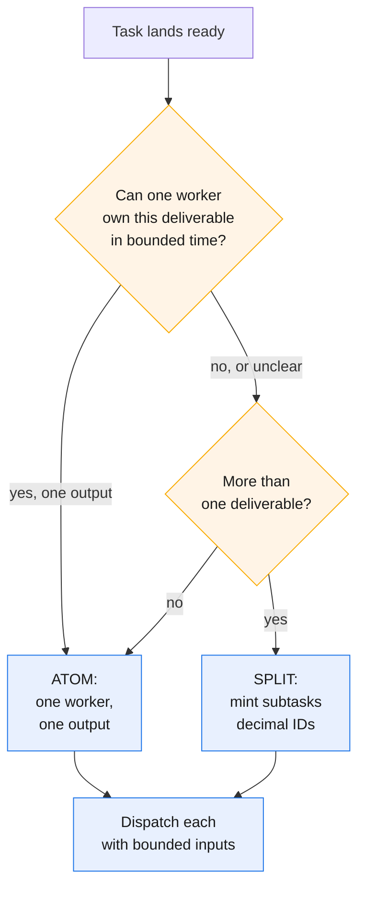
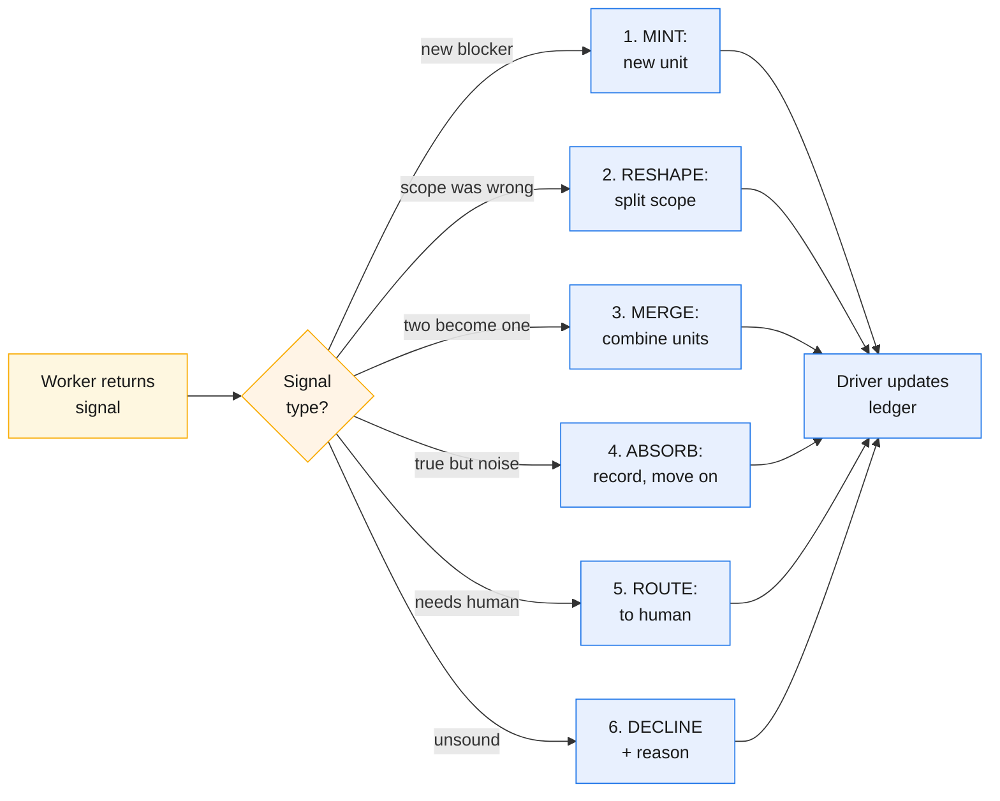

# In practice

The previous seven chapters built the framework. This chapter is about *doing it* — how practitioners adopt GOTM, deliberate at the dispatch gate, bind tiers, and triage upward signals.

## Adoption tiers

The driver loop is a **prompt discipline**, not a software install. Three adoption tiers exist:

1. **Prompt discipline (baseline).** The driver follows the loop by hand: read frontier, compute ready set, dispatch worker per unit, collect result, dispatch auditor, record status. No plugin needed. If your agent reads files, dispatches subagents, and writes files, it runs GOTM.
2. **Runtime command.** A plugin or harness packages the loop as one invocable step — loads protocol, reads ledger, drives a turn. Same architecture, scripted.
3. **Workflow-style script.** Programmatic loop outside interactive turns — headless or batch.

Start at prompt discipline; move up only to amortize the chore.

### Bootstrapping a fresh project

Three things in place before the first unit runs:

- **The store:** a `.gotm/` subfolder alongside the repo. Holds protocol, ledger, decisions/questions, `audits/` and `docs/` (chapters 2–3).
- **Born-tiered ledger:** hot frontier (ready + active units) + cold archive (closed units as one-line pointers). Seed with foundation units.
- **Driver/worker split:** driver plans and writes store; workers read inputs, produce one output, return terse result. Establish this on turn one to prevent work leaking back.

Trap: harnesses auto-load from project root, so a `.gotm/` subfolder silently breaks auto-load. Keep a thin root pointer.

## Dispatch-gate deliberation in practice

The **dispatch gate** is where the driver decides: split into subtasks, or atom (one worker, one deliverable, one output)? This decision happens *before* dispatch so the worker is born bounded.

**Stopping rule:** one deliverable (one file, one decision, one region) = one worker. Two workers on the same file is always wrong.

Examples: "Write chapter 3" → atom. "Rewrite nine chapters" → split to U2.1–U2.9. "Deploy to three regions + aggregate" → split: three deploys (atoms) + one aggregate worker (atom, the reduce step). "Fix PR comments" → check first: if "typo" + "add validation" then atom; if "rewrite" + "rethink API" + "add tests" then split.

### Tier binding: grain meets Kind

After split-or-atom, the driver chooses tier. Defaults: leaves (hours) → economy, keystones (days, hubs) → standard, milestones → frontier. **Kind overrides:** deploy-infra, eval, diagnosis → frontier always, because live-verification is forced (chapters 4–5).

**Tier-binding walkthrough:** Kind overrides grain. Leaves (hours) + authoring = economy. Keystones (days, hub) + design = standard. Any deploy-infra, eval, diagnosis = frontier. Unsure = standard (default).

## Upward-signal triage: the driver's options

Workers report observations; signals are typed suggestions. The driver (sole full-context holder) decides:

**1. Mint:** signal suggests new unit. Driver validates, creates unit, original stays authored-done, new is pending.
**2. Reshape:** scope was wrong. Driver amends Output (follow-on, not edit), mints split units, marks parent as container.
**3. Merge:** two units are one. Driver supersedes one, folds into follow-on.
**4. Absorb:** true but not a unit. Driver records in decision log for audit to find, moves on.
**5. Route:** for human. Driver adds to QUESTIONS.md or human-review unit; loop pauses/branches.
**6. Decline + reason:** unsound or out-of-scope. Driver records reason (one-line in ledger). Must be durable so not re-raised.

## Interactive vs SDK driver

**Interactive drivers** (like Claude Code) cannot self-compact. The driver grows across a long project, but re-hydration from store on fresh start (cold restart, context clear, manual compaction) rescues it. This is the same transcript-independence guarantee GOTM always had — it depends on no hook. Keep the driver thin; trust re-hydration.

**SDK/headless drivers** can compact programmatically, but that is additive, not foundational. The architecture leans on re-hydration (both modes) not self-compaction (programmatic only). Know which world you are in; apply the matching constraint.

## The worked example: this rewrite itself

**This framework's own documentation was produced driver/worker.** The rewrite was run as a GOTM project.

Foundation: **U23** (design blueprint, change-map, per-chapter scope). At dispatch gate, the driver deliberated: split nine-chapter rewrite or atom? Answer: nine deliverables, nine owners. Driver minted **U24.1–U24.9** (one per chapter). Each dispatch: change-map + prior chapters referenced, nothing else. No worker saw the conversation or a sibling's draft. Each produced one file, returned terse pointer. Driver never held chapter bodies.

Each chapter: **independently audited by fresh worker** (auditor ≠ author, chapter 6). Auditor checked: (a) logic-verified (match spec?), (b) diagrams mmdc-parse (machine validation, not claim). Chapters: authored-done from writer, verified-done from auditor only.

Parallel drift fixed via **fan-in coherence U24.12**: one worker read all eleven verified outputs *from store* and harmonized them (canonical terms, cross-references, voice). Driver got one pointer, never eleven bodies — fan-in rule (chapter 5) held at final join. Coherence audited, verified-done.

### Dispatch-gate visibility in the retrospective

Ledger snapshot showing dispatch-gate discipline:

| Unit | Title | Status | Output |
|---|---|---|---|
| U23 | Change-map + brief | verified-done | GOTM-4.5-DOCS-BRIEF.md |
| U24 | Rewrite 11 docs (9 chapters + README) | *split* | — |
| U24.1–U24.9 | Chapter 1–9 | verified-done | 01-*.md through 09-*.md |
| U24.10 | README | verified-done | README.md |
| U24.12 | Coherence + terminology | verified-done | COHERENCE-FINDINGS.md |

Parent **U24**: no Output (all in U24.1–U24.12), verified-done when children pass. Hierarchy (decimals), parallel siblings (no inter-child `depends_on`), convergence (U24.12 reads eleven, harmonizes).

## Optional: the composition layer

This layer is **optional** and domain-specific. The core framework (chapters 1–7 and 9) is **domain-agnostic** and adopts none of it — a research report or a migration uses nothing here and loses nothing. Reach for it only when your domain rewards **define-once reuse**, software especially.

**Rule 7 — atomic, reusable, define-once solution design — is *not* a ground rule.** The ground rules are the five of v4.5 plus **Rule 6** (first principles, chapter 6); Rule 7 is a tool a domain may adopt, not an obligation every context carries. Where it applies, it asks that each capability be defined once and composed, never duplicated. **Service-oriented architecture is merely this layer's software instance, not its definition** — the same define-once discipline reads differently in a data model, a proof corpus, or a document set.

Under this layer the composition skeleton is designed early — but as a **living foundation, not an up-front waterfall.** The early architecture is a first draft the driver revises through **follow-ons**: append-only audited units that leave the original frozen while downstream pins a version. Architecture-first means the shape is stated before the parts, not fixed before reality speaks.

Adoption also opens an **optional added audit dimension**: where the layer is in force, an audit *may* additionally check reuse-versus-duplication and boundary integrity — whether a unit re-implemented what already exists, whether it respects the seams. This is never a default audit step; it is switched on only for a project that has chosen the layer.

---

**In practice:** adopt at the tier that fits, deliberate at dispatch gate with stopping rule, bind each unit to tier, and know your runtime's limit. The discipline is real because it built what you're reading. Next: **learning across projects**.

