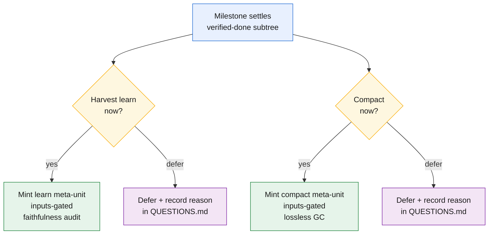
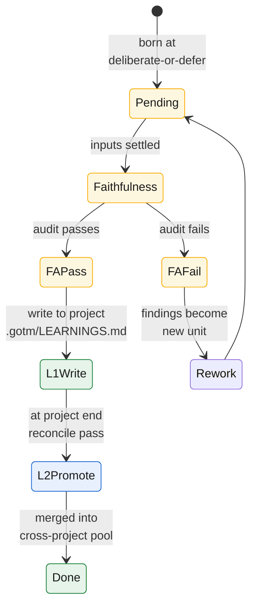
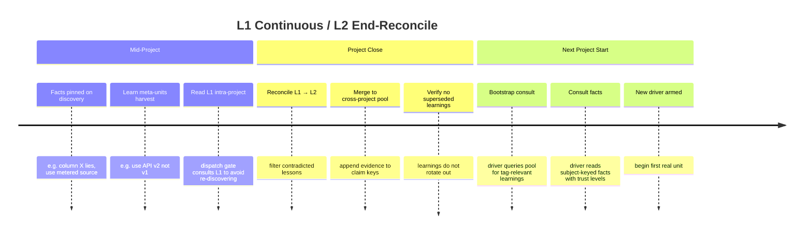

# Learning across projects

Every previous chapter survived *one* project. This chapter spans projects: what happens after a project drains, how to export its lessons, and how future projects consult them.

By project end, the store holds not just *what* was built but *why* — every decision, audit finding, pivot. That is raw institutional knowledge. The same store that made one project legible across sessions can make it legible to future projects — if we distill on the way out and consult on the way in.

The record holds two knowledge types that decay and promote differently. **Experience** (*what I've learned to do*) and **Facts** (*what I know is true*). A method is contradicted by a better one; a fact is superseded by newer observation but the older fact was true when observed. So the cross-project layer has **two siblings: the learning pool** (procedural) **and the context pool** (declarative). Each closes a consume/produce loop with rules fitted to what it holds.

## The cross-project analog of the store

There is a clean way to see this layer, and it reuses the framework's central idea rather than inventing a new one. Within a project, the store reconstructs a worker's context: a worker is born stateless, reads its bounded inputs from the store, does its one unit, and is discarded — the store is what lets a fresh context skip the work of re-deriving everything that came before it. **Across projects, the learning pool plays exactly the same role for drivers.** A new project's driver is also born without history. The pool seeds it the way the store seeds a worker: it lets the new driver skip the mistakes earlier drivers already paid for, instead of re-discovering them at full cost. (Everything in this section holds for the **context pool** too — same shape, one level up — with the differences called out under *The context pool* below.)

So the learning pool is the **cold tier**, one level up. Inside a project the cold tier is the ledger's archive — closed-out detail, never on the hot path, pulled only on demand. The learning pool is that same shape across the project boundary: closed-out *lessons*, never carried in any driver's working set, pulled only when a new project's tags match. It is durable, it accumulates without bound, and nothing reads it on a recurring basis. The cold tier that fed future *turns* now feeds future *drivers*.

This keeps the **context economy** honest at the largest scale. Re-discovering a known gotcha is the cross-project version of monotonicity: every project paying, from zero, for a lesson some prior project already bought. The pool quarantines that cost the same way the archive does — the knowledge sits cold until a tag pulls the few relevant lines onto a new project's hot path, and no further.

## Meta-units: learn and compact as first-class operations

GOTM 4.5 draws a sharp line that prior versions blurred: **`learn` and `compact` are separate first-class meta-units**, not auto-coupled. A `learn` unit distills procedural lessons (experience, patterns, gotchas) into the project's local learning tier. A `compact` unit moves closed-and-verified work to the cold archive (lossless garbage collection). Different jobs, different triggers, each a driver-scheduled unit marked `Kind: meta`.

Each meta-unit is **Inputs-gated**: it cannot run until the settled subtree it depends on is audited and verified. A `learn` unit depends on the subtree of audited units whose record it is distilling; a `compact` unit depends on verified-done units ready to move. This discipline ensures that learning is never written from partial or uncertain work — the store's central principle (durable facts only) extends across the project boundary.

A `learn` unit is additionally **audited for faithfulness** (never sufficiency). The auditor checks every learning against the settled record: does this claim trace back to a real unit? Is there contradicting evidence the learning should surface? Faithfulness means *grounded in the real ledger*, not *complete* — because compaction is lossless (the full detail stays cold), a learning can be a partial and evolving distill, confident it is faithful without needing to be comprehensive. That separation — audit for faithfulness in the learning, not sufficiency — is what lets learnings flow and update over the project's life.

## Deliberate-or-defer prompts at milestone settle

The second structural change from v4: **at every milestone settle, the driver MUST answer two questions explicitly**, never silent skip. When a settled subtree reaches verified-done, the driver faces a deliberate-or-defer prompt:

1. **"Harvest a `learn` now?"** — Do it immediately (mint a learn meta-unit) or defer-with-recorded-reason (record in `QUESTIONS.md` why this learning is not ripe yet).
2. **"Compact now?"** — Do it immediately (mint a compact meta-unit) or defer-with-recorded-reason.

The *prompt* is non-skippable (the anti-silent-skip guard). The *action* stays the driver's judgment. Recording the reason is the forcing function: even "defer because the shape of this learning is not stable yet" surfaces the learning candidate so it is not forgotten, and a later driver can revisit it. This closes the feedback's dominant theme: *compaction never ran* and *learnings never got pooled*. Now both have a driver decision point every time a milestone closes.

## L1 continuous / L2 end-reconcile: the two-tier learning structure

Within a project, the learning pool mirrors the fact store (chapter 9, section *The context pool*) with its own **L1/L2 tiering** — reflecting D5's structure that "both stores mirror the L1-continuous / L2-end-curated shape."

- **L1: Project-local procedural store.** Written continuously by `learn` meta-units throughout the project. L1 is read by this project's own later dispatch gates to avoid re-discovering a pattern already settled. High-volume, allowed to be messy or contradictory (a lesson later contradicted is a signal, not an error). Scaffolded from `templates/LEARNINGS.md.template` and stored at `.gotm/LEARNINGS.md` — project-private, intra-project recall only.

- **L2: Cross-project curated pool.** Promoted **once, at project end**, as a deliberate reconciliation pass. A human reviewer (or a dedicated audit worker) reads the full L1 record, filters out lessons that a later milestone reversed, and merges the survivors into the user's cross-project learning pool. Concise, curated, transfer-grade; the end-gate prevents mid-project lessons from being exported as gospel when later work contradicts them.

This closes the v4 asymmetry: facts were continuous (pinned on discovery) but learnings were end-only (batch). Now **both stores are continuous into L1 and curated into L2 at end** — the same story told twice, one for declarative knowledge and one for procedural.

v4.6 additionally **captures graph-evolution telemetry** — an append-only record of how the execution structure evolved (inserts, splits, edge changes, supersessions, status/audit transitions; each with its actor and reason). This is the **bridge from graph engineering to learning engineering** — the record that could one day turn *how the graph evolved* into learning data. For now it is **instrumentation, not a learning channel**: v4.6 records it but does **not** promote it into the cross-project pool. Learning *from* the shape of successful graphs is a later version's subject — **capture now, learn later.**

## The consume / produce loop

The cross-project layer is two moves, one at each end of a project's life.

**Produce — at project end.** When the DAG drains, one pass reads the finished record and distills it into transferable **learnings**, then merges them into the pool. Distillation first: not everything in the record is a learning — a learning is a claim a *different* project would benefit from knowing (a gotcha, a prerequisite, a pivot, a pattern that worked, or an anti-pattern audits flagged more than once). The filter is *transferability*: a one-off detail stays in the record; a claim a stranger to the project could act on becomes a learning. Then the merge: each learning is merged into the pool **by its `claim` key** — if the claim is already there, this project's evidence is *appended*; if new, the claim is added. That append-not-overwrite path keeps the pool honest as it grows.

**Consume — at project start.** Before the first real unit, one pass *queries* the pool for tag-relevant prior learnings and pulls them into the new project — a bootstrap **consult**. The new driver does not load the whole pool; it scans a generated index, filters to the tags the project is touching, and expands detail only for the few that apply. That selectivity is what makes a learning *save* tokens rather than spend them. This is the *read-in* from the cold tier that closes the loop and pays the produce step back.

## The context pool — the declarative sibling

Everything above is the **learning pool**: procedural knowledge, *what I've learned to do*. Now the second store. Where the learning pool is the cross-project analog of the store *for experience*, the **context pool** is the cross-project analog of the store *for facts* — *what I know is true*. A new project's driver is born not only without the *lessons* earlier drivers paid for, but without the *facts* they established: which column lies, which convention the repo follows, which table is the real source. The context pool seeds it with those, so it obeys what earlier drivers verified instead of re-verifying it from scratch.

The two stores share a shape but differ on every rule that matters, because **a fact and a lesson are trusted, decay, and promote differently**:

| | **Learning pool** (experience) | **Context pool** (facts) |
|---|---|---|
| answers | *what I've learned to **do*** | *what I **know** is true* |
| merge key | `claim` | `subject` (entity + attribute) |
| decays by | **contradiction** → contested + demote | **change** → supersede + retain old |
| promotes by | **independent confirmation** (≥2 projects) | **commonality + curation** (≥2 users, then endorsement) |
| trust ladder | candidate → validated → core | personal → shared → canonical |
| privacy | (rarely private) | **`shareable` gate is load-bearing** |
| in use | *informs* (an anecdote to weigh) | *obeyed* (constrains, per its trust) |

The last row is decisive: **a fact is obeyed; a learning informs.** A learning is one project's anecdote you weigh; a `canonical` fact is a constraint you honor.

A fact carries a `kind` recording what sort of thing it asserts — `schema`, `resource`, `convention`, `constraint`, `entity`, and one worth naming separately: **`best-practice`** — an endorsed, curated *normative standard*, a fact about the **recommended way** to do something. It is distinct from a candidate `pattern` learning: a `pattern` is procedural experience earning its way up by evidence, while a `best-practice` is declarative, already-endorsed guidance you obey. It tends `shared`/`canonical` (a standard is worth little until common or curated) and **links to the method-learning that grounds it** — the `best-practice` fact says *"do X"*, the learning it points at says *why X worked* — so the endorsed standard and its procedural origin travel cross-linked.

## Diagrams: milestone → deliberate-or-defer → meta-units

**Diagram 1: Deliberate-or-defer prompt at milestone settle**

**Diagram 2: Learn meta-unit lifecycle (pending → faithful → L1 → L2)**

**Diagram 3: Timeline — L1 continuous, L2 end-reconcile**

