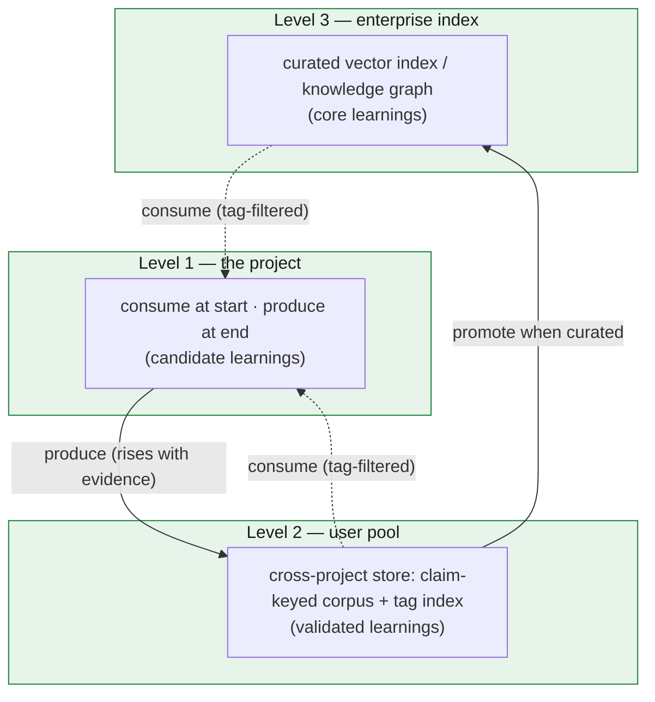
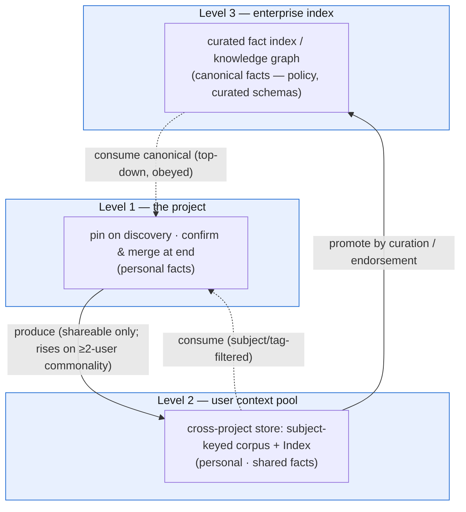

# Learning across projects

Every chapter so far has been about surviving *one* project: one mission's worth of work moved across hundreds of sessions without drifting, held in a store that lets any context be thrown away and rebuilt. This closing chapter steps outside that boundary. It asks what happens *after* a project drains — how a finished GOTM project stops being a closed record and starts making the *next* project cheaper. The mechanics inside a project are settled (chapters 1–7); here we add one layer on top of them, and it is the only layer that spans projects.

The premise follows directly from the discipline. By the time a project drains, the store holds something most projects never write down: not just *what* was built, but *why* — every decision with its rationale, every audit finding, every pivot a constraint forced. That record is the raw material of institutional knowledge. The same store that made one project legible to its own future sessions can make it legible to future *projects* — if we distill it on the way out and consult it on the way in.

But that record holds knowledge of **two different kinds**, and conflating them is a mistake. Some of it is *experience* — *what I've learned to **do*** (use X, not Y, where the obvious path is wrong; grant that permission before this step). And some of it is *facts* — *what I **know** is true* (this column lies; that API needs this header; the prod warehouse is X). The first is **procedural** knowledge, the second **declarative**, and they decay, promote, and are trusted on entirely different clocks — a method can be *contradicted* by a better one; a fact is never wrong when it *changes*, it was true when observed and a newer observation *supersedes* it. So the cross-project layer is not one store but **two siblings**: the **learning pool** for experience and the **context pool** for facts. This chapter builds the same "cross-project analog of the store" idea *twice* — first for experience (the settled model), then for facts (its declarative sibling) — and shows how each closes the same consume/produce loop with rules fitted to what it holds.

## The cross-project analog of the store

There is a clean way to see this layer, and it reuses the framework's central idea rather than inventing a new one. Within a project, the store reconstructs a worker's context: a worker is born stateless, reads its bounded inputs from the store, does its one unit, and is discarded — the store is what lets a fresh context skip the work of re-deriving everything that came before it. **Across projects, the learning pool plays exactly the same role for drivers.** A new project's driver is also born without history. The pool seeds it the way the store seeds a worker: it lets the new driver skip the mistakes earlier drivers already paid for, instead of re-discovering them at full cost. (Everything in this section holds for the **context pool** too — same shape, one level up — with the differences called out under *The context pool* below.)

So the learning pool is the **cold tier**, one level up. Inside a project the cold tier is the ledger's archive — closed-out detail, never on the hot path, pulled only on demand. The learning pool is that same shape across the project boundary: closed-out *lessons*, never carried in any driver's working set, pulled only when a new project's tags match. It is durable, it accumulates without bound, and nothing reads it on a recurring basis. The cold tier that fed future *turns* now feeds future *drivers*.

This keeps the **context economy** honest at the largest scale. Re-discovering a known gotcha is the cross-project version of monotonicity: every project paying, from zero, for a lesson some prior project already bought. The pool quarantines that cost the same way the archive does — the knowledge sits cold until a tag pulls the few relevant lines onto a new project's hot path, and no further.

## The consume / produce loop

The cross-project layer is two moves, one at each end of a project's life.

**Produce — at project end.** When the DAG drains, one pass reads the finished record and distills it into transferable **learnings**, then *merges them into the pool*. Distillation first: not everything in the record is a learning: a learning is a claim a *different* project would benefit from knowing — a gotcha ("use X, not Y, where the obvious path is wrong"), a prerequisite ("grant or verify X before step Y"), a pivot, a pattern that worked, or an anti-pattern the audits flagged more than once. The filter is *transferability*: a one-off detail stays in the record; a claim a stranger to the project could act on — project-specific nouns stripped, load-bearing specifics kept — becomes a learning. Then the merge, which is a real step, not a someday-a-consumer-reads-this write to disk: each learning is merged into the pool **by its `claim` key** — if the claim is already there, this project's evidence is *appended* to the existing record; if it is new, the claim is added. That is the *write-out* to the cold tier.

**Consume — at project start.** Before the first real unit, one pass *queries* the pool for tag-relevant prior learnings and pulls them into the new project — a bootstrap **consult**. This is the *read-in* from the cold tier. The new driver does not load the whole pool; it scans a generated index of one-line entries, filters to the tags the project is actually touching, and expands the detail only for the few that apply. That selectivity is what makes a learning *save* tokens rather than spend them: scanning a line is cheap, and the full fix loads only when relevant — exactly the discipline the archive uses inside a project.

Each move is one pass, and they are mirror images: produce merges the distilled record into the pool; consume queries it to seed the next driver. A produce step with no consumer is a write-only void — tokens spent distilling lessons nothing reads. The consume step is what closes the loop and pays the produce step back.

## The context pool — the declarative sibling

Everything above is the **learning pool**: procedural knowledge, *what I've learned to do*. Now the second store, built by the same recursion. Where the learning pool is the cross-project analog of the store *for experience*, the **context pool** is the cross-project analog of the store *for facts* — *what I know is true*. A new project's driver is born not only without the *lessons* earlier drivers paid for, but without the *facts* they established: which column lies, which convention the repo follows, which table is the real source. The context pool seeds it with those, so it obeys what earlier drivers verified instead of re-verifying it from scratch. It lives at the user tier as its own store, the reference layout a user-home `context/` store (`~/.gotm/context/`), sibling to the learning pool's `learnings/`.

The two stores share a shape but differ on every rule that matters, because **a fact and a lesson are trusted, decay, and promote differently**:

| | **Learning pool** (experience) | **Context pool** (facts) |
|---|---|---|
| answers | *what I've learned to **do*** | *what I **know** is true* |
| merge key | `claim` | `subject` (entity + attribute) |
| decays by | **contradiction** → contested + demote | **change** → supersede + retain old |
| promotes by | **independent confirmation** (≥2 projects) | **commonality + curation** (≥2 users, then endorsement) |
| trust ladder | candidate → validated → core | personal → shared → canonical |
| privacy | (rarely private) | **`shareable` gate is load-bearing** |
| in use | *informs* (an anecdote to weigh) | *obeyed* (constrains, per its trust) |

The last row is the one to hold onto: **a fact is obeyed; a learning informs.** A learning is one project's anecdote you weigh; a `canonical` fact is a constraint you honor. That single difference is why the two get separate prompts, separate consume steps, and separate merge rules — conflating them, treating a fact as a mere suggestion or a lesson as gospel, is the exact error the split fixes.

A fact carries a `kind` recording what sort of thing it asserts — `schema`, `resource`, `convention`, `constraint`, `entity`, and one more worth naming on its own: **`best-practice`** — an endorsed, curated *normative standard*, a fact about the **recommended way** to do something. It is distinct from a candidate `pattern` learning ("worked for me once"): a `pattern` is procedural experience earning its way up by evidence, while a `best-practice` is declarative, already-endorsed guidance you obey. It trends `shared`/`canonical` (a standard is worth little until common or curated) and **links to the method-learning that grounds it** — the `best-practice` fact says *"do X"*, the learning it points at says *why X worked* — so the endorsed standard and its procedural origin travel cross-linked, each on its own decay clock.

### The context pool's consume / produce loop

Same two moves as the learning pool — but produce has *two moments*, because a fact is useful sooner than a lesson is. A lesson only helps the *next* project, so it is distilled once, at project end. A fact helps **this** project's own downstream units the moment it is found — so it is pinned on discovery *and* confirmed at end.

**Produce — pin on discovery, confirm at end.** [`prompts/context-analysis.md`](../prompts/context-analysis.md) governs both moments. Mid-project, when a worker discovers a fact, it surfaces it in its ≤8-line terse return on one added line — `FACT: <subject> — <assertion>` — and, the architecture unchanged, the **driver as single writer pins it** to the project-local `.gotm/CONTEXT.md`. That makes the fact a first-class, slice-able input the driver can hand to downstream workers, instead of leaving it buried in `DECISIONS.md` prose or lost in chat. At project end a confirm-and-merge pass reviews the pinned facts, sets each one's `volatility` (its decay clock) and its `shareable` flag (the privacy gate), and merges the shareable facts up into the pool with the `context.py` tool — keyed by `subject`, so a changed value **supersedes** the old (the old value is *retained* with its `asof` and pointed at the new; never overwritten — the freeze, applied to facts). A compound observation carrying both a fact and a method is **decomposed on produce** — the fact to `CONTEXT.md`, the method to `LEARNINGS.md`, cross-linked — so each gets its own decay clock.

**Consume — read in at start.** [`prompts/consult-facts.md`](../prompts/consult-facts.md) is the mirror of the learning pool's consult, kept as a *separate* step (facts are obeyed, learnings weighted — the two working sets stay distinct). At bootstrap it queries the pool by `subject`/`tags` over its generated Index, expands the full record only for the handful that match, and writes the survivors to `CONSULTED-FACTS.md` — a reference note that does *not* merge back up. Because the pull asks the tool to relink (`--with-methods`), a fact arrives **with** its cross-linked method: the "`paid_usage` column lies" fact lands on the driver's desk *together with* the "compute from `paid_usage_metering`" query. Store separate, present together. And it prefers **current** records over stale-but-trusted ones — a `--min-trust` floor that surfaced a superseded value while hiding the live one would be a trap, so trust is carried as a caveat, not used to filter the current record out.

Both stores scaffold their project-local artifact from a template — [`templates/CONTEXT.md.template`](../templates/CONTEXT.md.template) mirrors the learning pool's, same Index + Records + merge shape, different rules on the three axes above.

### One store, two directions — how facts flow both ways

Here the two stores part company most sharply. Learnings are **purely bottom-up**: born in a project, rising only as far as independent evidence carries them, never pushed down as edict. Facts flow **both ways through one store**, and the record's `trust` field encodes which end a fact came from:

```
   canonical  ▲  curation / endorsement (authority)      ← top-down: an org policy or curated
   shared     │  commonality (≥2 users pin one subject)     schema DESCENDS, consumed into a
   personal   │  pinned from my own projects                 project as a canonical constraint
              ▼  consume: subject/tag-filtered into a project
```

- **Bottom-up** (mirroring the learning pool): my own conventions and observations are pinned `personal`; they rise to `shared` when ≥2 distinct *users* independently pin the same `subject`, and only to `canonical` when an authority *endorses* — never automatically.
- **Top-down** (what the learning pool has no analog for): an enterprise policy or a curated canonical schema is a fact *consumed into* a project's context with `trust: canonical` — received, not earned; obeyed, not weighed.

Same store, same schema, same merge tool — the ladder just runs in both directions, with `trust` recording the origin. This is also why the flow to enterprise is partly a **filter, not just a promotion**: only `shareable: yes` facts are ever eligible to rise, and only commonality across users (not one loud project) lifts them — two gates the purely-bottom-up learning pool does not need.

### The trust hierarchy — two axes, not one line

Because both stores now feed a driver, a consuming driver needs a way to arbitrate everything it pulls. The temptation is a single ranked line — canonical fact beats decision beats shared fact beats validated learning — but that line conflates two things that are *orthogonal*: **how authoritative** a piece of knowledge is and **how well-grounded in evidence** it is. Trust is therefore **two axes**, resolved in order.

**Axis A — authority (does it constrain?).** `canonical` context and `DECISIONS.md` **constrain**: they are received, not weighed. Everything else — learnings, `personal`/`shared` facts — merely **informs**. The dividing line is not a rung on one ladder; it is the question of whether the knowledge *governs* the project or *advises* it. Crucially, informing knowledge never silently overrides a constraint: a learning or fact that **contradicts** a `canonical` fact or a `DECISIONS.md` choice **raises a `QUESTION`** — it never quietly wins by recency or by looking well-grounded.

**Axis B — evidence (how do we weight what informs?).** Among the *informing* knowledge, order by **`grounding`** first, then by cross-project confirmation count. A learning carries `grounding` recording *how it was known*:

- **`grounding: observed`** — reality corrected the agent; a LEDGER revert or pivot forced the lesson. Strongest.
- **`grounding: audited`** — an independent `FAIL → fix` confirmed it. Also strong.
- **`grounding: decided`** — a `DECISIONS.md` choice that may still be untested. Weakest, until reality checks it.

`observed`/`audited` outweigh `decided`; ties break on how many distinct projects have confirmed the claim. `personal`/`shared` facts are weighted alongside learnings here (a `personal` fact a learning contradicts is *signal* — surface it), while `canonical` facts and decisions sit on Axis A above them.

**The re-ratification exception.** The two axes meet at one sharp case: a well-grounded (`observed`/`audited`), `validated` learning that directly **contradicts a `DECISIONS.md` choice**. It does **not** silently win — human authority is not overridden by a background merge — but it is **not** ignored either, because evidence that reality corrected an agent cannot be waved off. It **forces re-ratification**: it raises a `QUESTION` for a human to reconcile the decision against the new evidence. This is the one place Axis B reaches up and touches Axis A, and it does so by *asking*, never by *acting*.

**Symmetry.** The split makes the two pools structurally parallel: facts already carry authority via their `trust` field (`personal → shared → canonical`); learnings now carry evidence-origin via `grounding` (`observed`/`audited`/`decided`). Authority on one pool, evidence-origin on the other — same shape, mirrored axis. `DECISIONS.md` still governs the project; a consulted fact or learning that shapes a decision is cited in that decision's rationale. Two axes, resolved authority-first, are what let a driver hold both pools at once without one drowning the other.

## Three levels, bottom-up

Knowledge in GOTM is **bottom-up**: born in one project, rising only as far as evidence carries it. **The three levels hold for both stores** — the learning pool and the context pool each have a project rung, a user-pool rung, and an enterprise rung — so read each level below as describing *both* siblings, with the fact-specific difference noted.

- **Level 1 — the project.** The build loop gains the two moves above. Consume at the start, produce at the end. Level 1 is itself a loop: every project both draws from the pools and contributes back to them. (Facts differ only in *when*: produce is pinned on discovery mid-project as well as confirmed at end.)
- **Level 2 — the user pool.** A concrete cross-project store, living at the *user tier* — outside any one project, so it is cross-project by construction. There are two such stores side by side: the reference layout is a user-home `learnings/` store keyed by `claim` (appendable evidence + a tag index) and a user-home `context/` store keyed by `subject` (appendable provenance + a generated Index), each distinct from every project's own store. Every practitioner's projects merge into them and query them. After a few projects, consume starts paying back what produce deposited. This is the layer this chapter makes concrete.
- **Level 3 — the enterprise index.** Across many practitioners, each pool combines into a curated, traversable knowledge system — a semantic (vector) index or a knowledge graph — that refines it and serves it to everyone. Same loop, organizational reach. L3 plugs in *above* L2 without changing it: it reads the same merged corpus and layers a richer retrieval surface on top, so nothing at L2 has to be rebuilt to reach organizational scale. The two pools reach L3 by *different* flows, though — learnings by independent confirmation, facts by commonality-plus-curation through the `shareable` gate — as the diagram below shows.



*Bottom-up learning: a project produces candidate learnings that rise to the user pool as validated, then to a curated enterprise index as core — and at each level the pool feeds back down, tag-filtered, to seed the next project's driver.*

The **context pool** has the same three rungs, but its flow runs *both* ways — personal facts rise on commonality, and canonical policy descends — with `trust` recording each fact's origin:



*Bidirectional facts: shareable personal facts rise to shared on cross-user commonality and to canonical only by curation, while canonical policy descends top-down into a project as an obeyed constraint — one store, `trust` encoding which end each fact came from.*

The outcome is identical for both pools and concrete: a project that consumes good learnings and established facts makes fewer mistakes, finishes faster, and spends fewer tokens re-discovering what is already known or re-verifying what is already true.

## The promotion gate — the pool's own discipline

A lesson from a single project is an anecdote, and the pool says so. Each learning carries a confidence that rises on a ladder:

- **candidate** — seen in one project;
- **validated** — confirmed independently by a *second* project;
- **core** — broadly applicable, curated at the enterprise level.

The promotion gate is the key addition — it is the pool's own discipline, and it is what stops the pool rotting into confidently-wrong advice, the failure mode every "lessons learned" wiki eventually dies of. The clean way to see it is that the pool *is a store*, and GOTM recursed one level up: it runs the same disciplines a project store already runs — **merge, don't duplicate** (claim-keyed append, not a growing pile of near-copies); **audit by independent confirmation** (a claim is only trusted once someone other than its author confirms it); **append, don't overwrite** (nothing already written is destroyed). Two rules make that concrete at the cross-project scale.

First, **a candidate cannot promote itself.** However many times a lesson recurred *within* its own project, that is not validation; promotion `candidate → validated` requires an **independent** project to hit the same wall and confirm the same claim. This is the *auditor ≠ author* rule of chapter 6, lifted across the project boundary: the authoring project produces the candidate; only a different, later project — auditor ≠ author, now *across projects* — confers validation. Because a learning's record carries a stable claim as its merge key and an appendable evidence list, the second project does not create a duplicate: it appends its evidence to the existing record and the confidence ticks up. The record grows; the pool does not bloat.

Second, **a contradiction demotes and flags — it never overwrites.** When a later project contradicts an existing learning, the pool does not silently replace the old advice with the new: it keeps both, marks the claim contested, appends the conflicting evidence, and demotes a `validated` claim back to `candidate` for a human to resolve. Overwriting would let the newest project win by recency; demote-and-flag lets *evidence* win, and preserves the trail. That append-not-overwrite path is what keeps the pool honest as it grows.

**The context pool has its own gate — supersede, don't overwrite.** The same "the pool *is a store*, GOTM recursed one level up" idea governs facts, but the rules fit a fact rather than a lesson. **Merge, don't duplicate** becomes `subject`-keyed: a fact for a subject already in the pool with the *same* value appends provenance, never a near-copy. **Append, don't overwrite** becomes **supersede-on-change**: a fact for the same subject with a *different* value does not contest the old one — a changed fact is not *wrong*, it *was* true `asof` its date — so the pool retains the old value with its `asof`, points its `superseded_by` at the new record, and the new value becomes current. Nothing is erased; the freeze applies to facts too. And promotion runs on a *different* signal: not independent confirmation but **commonality** — `personal → shared` requires ≥2 distinct *users* to have pinned the same subject, and `shared → canonical` is curation only, an authority's endorsement, never minted by the merge. Guarding all of it is a gate the learning pool has no need for — the **`shareable` privacy gate**: a fact carrying private detail (accounts, comp, an individual's schedule) is stored and used locally but flagged `NEVER-EXPORT` and never rises, so the upward flow for facts is partly a *filter*, not just a promotion. A superseding record is always born `personal` (unconfirmed), even when it replaces a `shared` one — recency does not inherit trust.

## What ships, and what is a binding

One honest note, the same boundary the framework draws around its runtime hooks — and it applies to **both** pools. For the learning pool, the **store, the steps, and the discipline** are specified concretely: a single merged corpus at the user tier, keyed by `claim` with appendable evidence and a generated tag index; produce distills then *merges* by claim; consume *queries* by tag; the promotion gate governs `candidate → validated` and demote-on-contradiction. The reference layout is a user-home `learnings/` store, sibling to each project's own store. What the framework deliberately does **not** hardcode is the **runtime binding** — the actual tool that reads and writes the corpus, and the exact path it resolves. That is the platform's job: an adopter wires produce and consume to whatever performs the claim-keyed merge and the tag query over the store, and each becomes a single command. Scale the same corpus into an enterprise semantic index (L3) and the same loop runs at organizational reach. Until a pool exists, consulting is honest about finding nothing — an empty pool is a valid result, not a silent skip.

The **context pool** draws the same line. Its store, steps, and discipline are equally concrete: a merged corpus at the user tier keyed by `subject` with appendable provenance and a generated Index; produce ([`context-analysis.md`](../prompts/context-analysis.md)) pins on discovery then *merges* by subject at end; consume ([`consult-facts.md`](../prompts/consult-facts.md)) *queries* by subject/tags and relinks methods; the gate governs supersede-on-change, `personal → shared` on ≥2-user commonality, and the `shareable` privacy filter. The reference layout is a user-home `context/` store, sibling to `learnings/` and to each project's own `.gotm/CONTEXT.md` (scaffolded from [`CONTEXT.md.template`](../templates/CONTEXT.md.template)). What is **not** hardcoded is again the runtime binding — the tool that performs the subject-keyed supersede-merge and the index query, plus the `FACT:` worker-return convention that feeds pin-on-discovery. The framework ships as reference the `context.py` tool (`init` · `merge` · `query` · `status`); an adopter wires it, or an equivalent, so produce and consume each become one command. And the same honesty holds twice over: on a first project every fact is `personal`, `shareable: no` facts never rise, and an empty context pool is a valid result — never a silent skip, and never manufactured commonality to make the pool look richer than one user's evidence warrants.

## Closing

This is where the thesis closes its largest arc. GOTM began as a context-economy discipline for a single project: a durable store that is the system of record, with nothing long-lived on the hot path. The cross-project layer extends that same discipline past the project boundary — and it extends it *twice*, once for experience and once for facts. The cold tier that fed future turns now feeds future drivers; the store that reconstructed a worker's context now seeds the next project's driver with both what earlier drivers *learned to do* and what they *established is true*. Re-discovering a known lesson and re-verifying a known fact were both the cross-project face of monotonicity, and the two consume / produce loops are what forbid them — the same recursion applied to procedural and declarative knowledge alike, so that every finished project becomes a down payment on the next one.

→ Back to the [repository README](../README.md), or return to the start at [chapter 1](01-the-problem-and-thesis.md).
