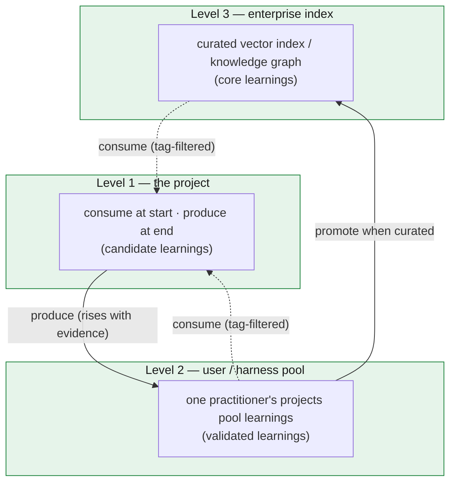

# Learning across projects

Every chapter so far has been about surviving *one* project: one mission's worth of work moved across hundreds of sessions without drifting, held in a store that lets any context be thrown away and rebuilt. This closing chapter steps outside that boundary. It asks what happens *after* a project drains — how a finished GOTM project stops being a closed record and starts making the *next* project cheaper. The mechanics inside a project are settled (chapters 1–7); here we add one layer on top of them, and it is the only layer that spans projects.

The premise follows directly from the discipline. By the time a project drains, the store holds something most projects never write down: not just *what* was built, but *why* — every decision with its rationale, every audit finding, every pivot a constraint forced. That record is the raw material of institutional knowledge. The same store that made one project legible to its own future sessions can make it legible to future *projects* — if we distill it on the way out and consult it on the way in.

## The cross-project analog of the store

There is a clean way to see this layer, and it reuses the framework's central idea rather than inventing a new one. Within a project, the store reconstructs a worker's context: a worker is born stateless, reads its bounded inputs from the store, does its one unit, and is discarded — the store is what lets a fresh context skip the work of re-deriving everything that came before it. **Across projects, the learning pool plays exactly the same role for drivers.** A new project's driver is also born without history. The pool seeds it the way the store seeds a worker: it lets the new driver skip the mistakes earlier drivers already paid for, instead of re-discovering them at full cost.

So the learning pool is the **cold tier**, one level up. Inside a project the cold tier is the ledger's archive — closed-out detail, never on the hot path, pulled only on demand. The learning pool is that same shape across the project boundary: closed-out *lessons*, never carried in any driver's working set, pulled only when a new project's tags match. It is durable, it accumulates without bound, and nothing reads it on a recurring basis. The cold tier that fed future *turns* now feeds future *drivers*.

This keeps the **context economy** honest at the largest scale. Re-discovering a known gotcha is the cross-project version of monotonicity: every project paying, from zero, for a lesson some prior project already bought. The pool quarantines that cost the same way the archive does — the knowledge sits cold until a tag pulls the few relevant lines onto a new project's hot path, and no further.

## The consume / produce loop

The cross-project layer is two moves, one at each end of a project's life.

**Produce — at project end.** When the DAG drains, one pass reads the finished record and distills it into transferable **learnings**, written to `LEARNINGS.md`. This is the *write-out* to the cold tier. Not everything in the record is a learning: a learning is a claim a *different* project would benefit from knowing — a gotcha ("use X, not Y, where the obvious path is wrong"), a prerequisite ("grant or verify X before step Y"), a pivot, a pattern that worked, or an anti-pattern the audits flagged more than once. The filter is *transferability*: a one-off detail stays in the record; a claim a stranger to the project could act on — project-specific nouns stripped, load-bearing specifics kept — becomes a learning.

**Consume — at project start.** Before the first real unit, one pass pulls tag-relevant prior learnings into the new project — a bootstrap **consult**. This is the *read-in* from the cold tier. The new driver does not load the whole pool; it scans a generated index of one-line entries, filters to the tags the project is actually touching, and expands the detail only for the few that apply. That selectivity is what makes a learning *save* tokens rather than spend them: scanning a line is cheap, and the full fix loads only when relevant — exactly the discipline the archive uses inside a project.

Each move is one pass, and they are mirror images: produce distills the record into the cold tier; consume seeds the next driver from it. A produce step with no consumer is a write-only void — tokens spent distilling lessons nothing reads. The consume step is what closes the loop and pays the produce step back.

## Three levels, bottom-up

Knowledge in GOTM is **bottom-up**: born in one project, rising only as far as evidence carries it.

- **Level 1 — the project.** The build loop gains the two moves above. Consume at the start, produce at the end. Level 1 is itself a loop: every project both draws from the pool and contributes back to it.
- **Level 2 — the user / harness pool.** One practitioner's projects pool their learnings into a shared store across all of that practitioner's future projects. After a few projects, consume starts paying back what produce deposited.
- **Level 3 — the enterprise index.** Across many practitioners, the learnings combine into a curated, traversable knowledge system — a vector index or a knowledge graph — that refines them and serves them to everyone. Same loop, organizational reach.

*Bottom-up learning: a project produces candidate learnings that rise to the user/harness pool as validated, then to a curated enterprise index as core — and at each level the pool feeds back down, tag-filtered, to seed the next project's driver.*

The outcome is identical at every level and concrete: a project that consumes good learnings makes fewer mistakes, finishes faster, and spends fewer tokens re-discovering what is already known.

## The confidence ladder

A lesson from a single project is an anecdote, and the pool says so. Each learning carries a confidence that rises on a ladder:

- **candidate** — seen in one project;
- **validated** — confirmed independently by a *second* project;
- **core** — broadly applicable, curated at the enterprise level.

Two rules keep the ladder honest, and both are GOTM principles you have already met — recast for the cross-project scale. First, **a candidate cannot promote itself.** However many times a lesson recurred *within* its own project, that is not validation; promotion to *validated* requires an **independent** project to hit the same wall and confirm it. This is the *auditor ≠ author* rule of chapter 6, lifted across the project boundary: the authoring project produces the candidate; only a different, later project confers validation. Because a learning's record carries a stable claim as its merge key and an appendable evidence list, the second project does not create a duplicate — it appends its evidence to the existing record and the confidence ticks up. The record grows; the pool does not bloat. Second, **a contradiction demotes.** A learning a later project contradicts is not silently overwritten — it is flagged for review and demoted. That demotion path is what stops a pool from rotting into confidently-wrong advice, the failure mode every "lessons learned" wiki eventually dies of.

## What ships, and what is a binding

One honest note, the same boundary the framework draws around its runtime hooks. The **steps** ship: produce is a paste-able retrospective prompt scaffolded by a `LEARNINGS.md` template; consume is a paste-able bootstrap prompt that scans the pool, tag-filters, and surfaces the matches. In adopter tooling each is a single command. What the framework deliberately does **not** ship is the **pool location** — *where* the learnings live and *how* they are indexed (a folder, a sibling-repo glob, a `~/.gotm/learnings/` store, an enterprise vector index). That is a platform binding. Point the consume step at any of them and the loop runs; scale the pool into an enterprise index and the same loop runs at organizational reach. Until a pool exists, consulting is honest about finding nothing — an empty pool is a valid result, not a silent skip.

## Closing

This is where the thesis closes its largest arc. GOTM began as a context-economy discipline for a single project: a durable store that is the system of record, with nothing long-lived on the hot path. The learning loop extends that same discipline past the project boundary. The cold tier that fed future turns now feeds future drivers; the store that reconstructed a worker's context now seeds the next project's driver. Re-discovering a known lesson was always the cross-project face of monotonicity, and the consume / produce loop is what forbids it — the context economy, now spanning projects, so that every finished project becomes a down payment on the next one.

→ Back to the [repository README](../README.md), or return to the start at [chapter 1](01-the-problem-and-thesis.md).
