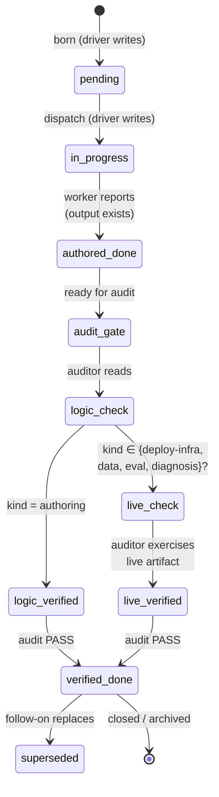
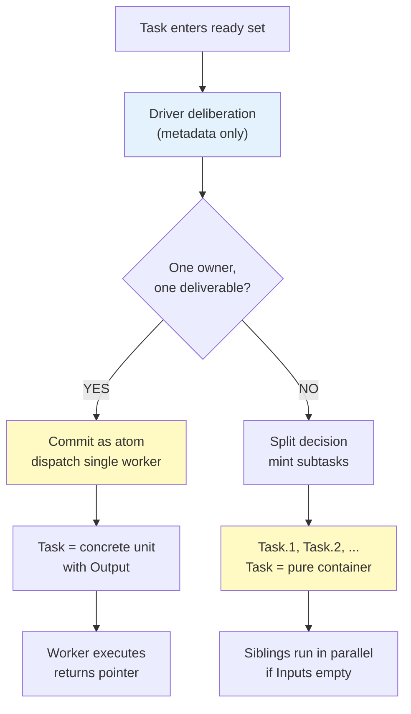
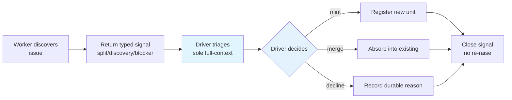

# GOTM 4.5 — Deliberate DAG decomposition & aggressive delegation

> **Status:** v1.0 — thesis-level design (D4, D5 ratified). This is the conceptual blueprint for GOTM's next orchestration model: from monolithic subagent dispatch to deliberately decomposed DAGs with lazy dispatch gates. The driver schedules; workers execute; nothing in the middle.
>
> **Method:** Design-first (design in `.gotm/design/` of parent workspace); thesis frozen here (this repo); implementation to follow in the plugin repo per the docs↔plugin sync discipline.

---

## 1. The thesis in one line

**Model task dispatch on Spark's execution model:** the driver designs a DAG and holds metadata but *executes nothing*; every task is deliberately decomposed into subtasks (not wrapped monolithically); each subtask goes to a short-lived worker. This dissolves two corroborated failure modes: driver context bloat (taking on small tasks inline) and long-running monolithic subagents (unbounded worker context, un-auditable blobs, stalled watchdogs).

---

## 2. What does NOT change (preserved invariants)

The v4.5 model is **compatible with v4** in all verification gates and ownership. These are load-bearing and inviolate:

- **The driver still designs the DAG** — it reads the mission, upstream outputs, and project state, and registers a coarse ledger of Tasks.
- **The driver is the single writer** of the ledger (and DECISIONS.md, QUESTIONS.md). A worker produces one output and reports; the driver records the pointer.
- **Auditor ≠ author.** Every authored-done unit is checked by a fresh context.
- **Freeze + follow-on ownership.** A done unit's output is frozen. Change comes through a follow-on unit.
- **Born-tiered ledger, reconcile-from-disk crash-safety.** Hot frontier (active units + recovery window) + cold archive (closed detail). Re-hydrate on any fresh start.
- **`authored-done → verified-done` state machine.** A producing worker reports authored-done; an independent auditor confers verified-done.

**What v4.5 changes:** only *how a task becomes work* — the dispatch gate gains a lazy-decomposition move, subtasks are full units, the driver never executes, and workers can return typed signals. The *mechanics of verification* are identical.

---

## 3. The object model: Ask → Task → Subtask → Milestone

v4.5 introduces a four-level nesting:

| GOTM | Definition | Scope |
|---|---|---|
| **Ask** | Human mission / question | driver reads once per project start |
| **Task** | Coarse ledger entry; a logical plan element | a work area / phase (days to weeks) |
| **Subtask** | Physical plan element; born when a Task is decomposed | one deliverable / boundary (hours to days) |
| **Milestone** | Shuffle boundary / verification boundary (live-verified) | runtime/eval task completion that needs live test |

A **Task** is registered upfront with a coarse spec. When the driver reaches it in the ready set, it takes a **deliberation pass** (cheap — metadata only) and either:
- **Commits it as an atom** (no children) and dispatches a single worker, OR
- **Splits it into `Task.1, Task.2, …`** (decimal children), registers them all, and the original becomes a **pure container** with no Output of its own.

A **pure-container Task** closes `verified-done` only when all its children are verified-done. Any integration/convergence step is itself the final delegated subtask (the "reduce"), never done by the driver.

---

## 4. The two new mechanisms

### 4.1 Lazy dispatch gate with deliberate decomposition

The moment a Task enters the ready set, the driver runs a **deliberation pass**:

1. **Input:** the Task's statement + spec, closed upstream outputs (pointers only), the frontier view of the project state.
2. **Deliberation:** is this a coherent atom (one worker can own it end-to-end), or should it split?
3. **Stopping rule:** *split down to the one-deliverable grain, never below*. One deliverable = one artifact (a doc, a query result, a test report) that a downstream can consume on its own.
4. **Commit:** the driver either (a) short-circuits an atom, dispatching it directly as one unit, or (b) registers `Task.1, Task.2, …` as pending subtasks and re-registers the parent as a pure container.

**Stopping rule in practice:**
- "audit module error handling + write findings + propose 3 fixes" = **one atom** (one report, one owner)
- "audit 50 modules" = **split** (each module is one audit, then a final task integrates)
- "refactor auth layer in one PR" = **one atom** (one artifact)
- "refactor three systems" = **split** (one PR per system, then integration)

**Registration is lazy, not eager.** The parent Task is registered upfront (so downstream can see it as a dependency). But children are registered *only when the parent is picked up for execution*. This eliminates provisional row churn.

---

### 4.2 Advisory upward-signal protocol (worker → driver)

A worker may observe something that suggests the driver should take an action — discover a new task, recognize a blocker, propose a split. It **returns a typed signal** as part of its result:

**Signal types:**

- **`split`** — "I finished my piece, but I discovered that the next logical part should be its own subtask."
- **`discovery`** — "During my work I found a downstream issue / missing precondition / gap."
- **`blocker`** — "I hit a hard dependency or permission wall."

**Worker responsibility:** describe the observation, suggest a disposition. *That's it.* The worker **does not act**. It has no ownership of the outcome.

**Driver responsibility (sole full-context holder):** triage inline in the loop. Options:
- **Mint** — "You're right; I'm registering [new unit]."
- **Reshape** — "I'll mint a unit but different scope."
- **Merge** — "This belongs with [existing pending unit]."
- **Absorb** — "I already have a unit for it."
- **Route to human** — "This is a mission-level question."
- **Decline with durable reason** — "Not minting a unit, because [one-liner reason]."

**Triage is inline, no standing inbox.** A declined signal leaves a one-line durable record so it is not re-raised forever.

---

## 5. Decimal IDs: provenance tree vs. Inputs DAG

### 5.1 The distinction

Decimal IDs (`U3.1, U3.2, U3.3`) represent **provenance** — "these subtasks were born from the split of U3." They are an **append-only tree**: sibling decimals are never renumbered.

The **`Inputs` column** represents the **dependency graph** — "this unit needs the output of that one." Inputs are **data dependencies**, not tree edges.

**Critical:** sibling decimals do **not** imply sequence. Reading U3.1, U3.2, U3.3 and concluding they run sequentially is a silent misread that destroys parallelism.

### 5.2 The rule: sibling parallelism via empty inter-sibling Inputs

When U3 splits into U3.1, U3.2, U3.3:

- **If none list the others in `Inputs`**, they are **data-independent** and **run in parallel**.
- **If U3.2 lists `Inputs: U3.1`**, then U3.2 waits for U3.1; U3.3 may run in parallel with U3.1 if it has no dependency.

This is the **only** mechanism for expressing parallelism. The decimal *position* is inert; only `Inputs` matters.

---

## 6. The verify-grain split: logic-verified vs live-verified

### 6.1 Two verification modes

**`logic-verified`** — an independent auditor checks the unit against its spec: does the output exist, match the spec, and cite correctly? **Terminal for authoring units** (Kind = `authoring`).

**`live-verified`** — an independent auditor additionally exercises the output as the real consumer would:

| Kind | Live verification | 
|---|---|
| **authoring** | Not required. Logic audit terminal. |
| **ui** | Rebuild from current source; run the artifact fresh; auditor views it firsthand. |
| **eval** | Harness fairness: equal inputs, symmetric yardstick, A/B swap to control bias. |
| **deploy-infra** | End-to-end as the deployed identity: run a real query through the artifact. |
| **data** | Re-query as the downstream consumer: consume the data through the real path. |
| **diagnosis** | Reproduce under controlled conditions; strip confounds *before* root-causing. |

### 6.2 The rule: runtime kinds mandate live-verified

A logic-only audit of a **runtime unit** (Kind ∈ {deploy-infra, data, eval, diagnosis}) is a **FAIL-as-UNVERIFIED**, not a pass. The unit may have perfect logic, but if it was *not* exercised live, the claim "it works" is unsubstantiated.

---

## 7. Tier binding: altitude defaults, Kind-forced frontier, repeated-death escalation

| Decision | Tier | Details |
|---|---|---|
| **Default (by grain)** | Leaf (atomic) → **economy**; Keystone (dependency node) → **standard**; Milestone → **frontier** | Economical tiers for leaf units unless overridden. |
| **Kind override** | Kind ∈ {eval, deploy-infra, diagnosis} → **frontier** | Runtime units cost more (live verification is expensive, stakes are high). |
| **Repeated escalation** | ≥2 watchdog deaths in same unit → escalate 1 tier | Complexity signals higher cost; escalate resources. |

---

## 8. Ratified forks (settled trade-offs)

| Fork | Decision | Rationale |
|---|---|---|
| **Milestone rows: explicit for runtime, implicit for authoring** | (a) Pure-authoring task splits into children → no explicit milestone row. (b) Runtime task splits → driver registers explicit milestone row (the re-aggregation gate). | Authoring tasks don't need a re-aggregation gate. Runtime tasks do (live verification is the hard gate). |
| **Subtask depth is terminated by atomicity, not capped** | A task may split N levels deep if each split is justified by atomicity. No hard depth cap. | Capping tempts circumventing by putting unrelated work into one "super-task." In practice, depth is shallow (the cost of deep nesting discourages it). |
| **Discovery is orthogonal to raiser's audit** | A worker's signal is audited independently from the raiser's own unit. **The raiser's unit is audited on its own merits.** | If discovery held the raiser open, the unit became non-atomic ("the work plus fixing downstream"). Decoupling lets units own their scope. |

---

## 9. The learning & compaction model (D5)

### 9.1 Separate operations, explicit prompts

`learn` and `compact` are **independent driver-scheduled meta-units**, not coupled to a settle-event. When a milestone settles a subtree, the driver MUST answer two explicit deliberate-or-defer prompts:
- **"Harvest learnings now, or defer?"**
- **"Compact frontier now, or defer?"**

Never silently skip.

### 9.2 Learning: L1 continuous, L2 end-curated

**L1 (project-local store):** written continuously by `learn` units, read by this project's later dispatch gates (intra-project recall). High-volume, private, allowed to be messy/contradictory.

**L2 (cross-project shared pool):** promoted once at project end as a deliberate reconciliation pass. Concise, curated, transfer-grade. Filters out mid-project lessons a later milestone reversed.

### 9.3 Compaction: lossless GC, born-tiered

**Sole ledger GC** (no rotation — rotation loses lineage). **Lossless by construction:** full detail archived with audit pointer; one pointer away in cold tier. **Born-tiered:** ledger is born tiered (frontier + archive), not compacted as afterthought.

---

## 10. Example: runtime task split into parallel subtasks + milestone

```
| U5 | Deploy: replication pipeline across 3 regions | Inputs: U4 | Kind: deploy-infra |
| U5.1 | Deploy to us-west (Oregon) | Inputs: U4 | Kind: deploy-infra |
| U5.2 | Deploy to us-east (Virginia) | Inputs: U4 | Kind: deploy-infra |
| U5.3 | Deploy to eu-west (Ireland) | Inputs: U4 | Kind: deploy-infra |
| U5-milestone | Replication pipeline: live verification (all 3 regions) | Inputs: U5.1, U5.2, U5.3 | Kind: deploy-infra |
```

- **Tree structure:** U5 → {U5.1, U5.2, U5.3, U5-milestone} (U5 is a pure container).
- **Parallelism:** U5.1, U5.2, U5.3 list no inter-sibling inputs → **run in parallel**.
- **Milestone:** explicit row that **forces live-verification** (all 3 regions must be live-queried).
- **Ownership:** driver registers all five in the deliberation pass.

---

## 11. State machine (lifecycle overview)



---

## 12. Dispatch gate flow (deliberation & split decision)



---

## 13. Upward-signal protocol (worker observation → driver action)



---

## 14. References & grounding

- **D4, D5 (locked decisions)** — the ratified model, ratified forks, and learning/compaction design.
- **D1 (docs = living thesis)** — this design is a thesis-level document; the plugin implements it afterward.
- **D2 (two repos, separate publish)** — this design is frozen here; the plugin carries runtime prompts/templates.
- **PROTOCOL.md (operational contract)** — all three roles, loop, audit gates, anti-drift, resilience are preserved; this design amends the dispatch gate and verify-grain sections.

---

## Epilogue

GOTM v4.5 reframes execution from monolithic subagent dispatch to **deliberately decomposed DAGs with lazy dispatch gates**, keeping the driver a scheduler and never an executor. The model is fully backward-compatible: all verification gates, ownership, and freeze/follow-on discipline stay unchanged. The learning and compaction model (D5) adds explicit deliberate-or-defer prompts to prevent silent skips and split learn/compact as independent operations. Both tracks (facts and learnings) follow the L1-continuous / L2-end-curated lifecycle, closing the v4 asymmetry.
