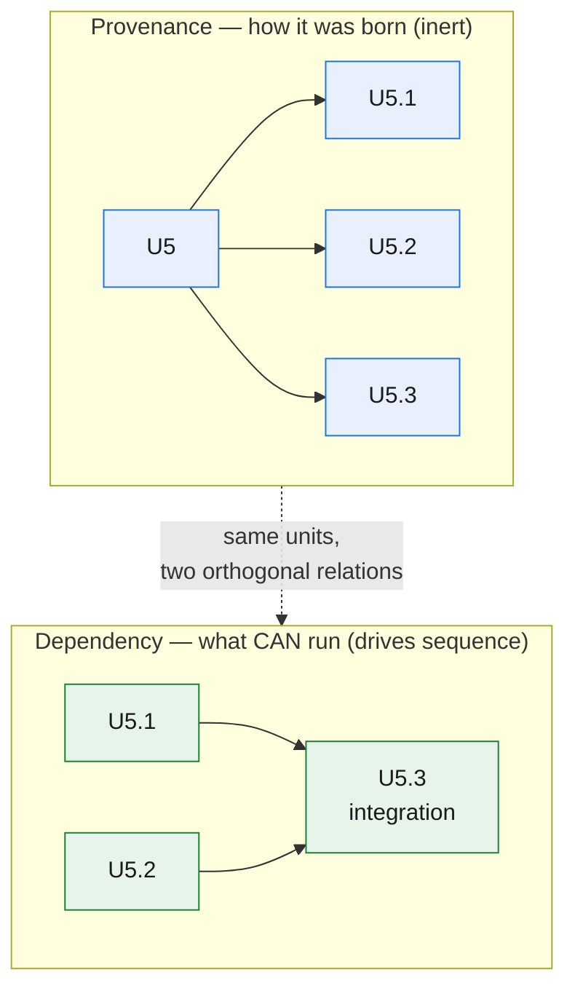
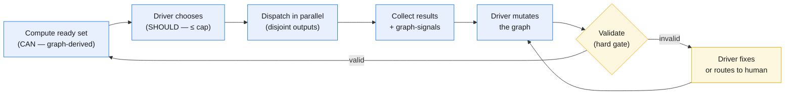
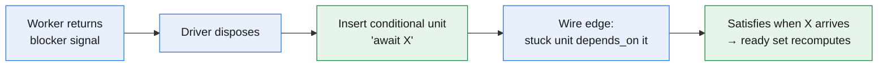

# GOTM 4.6 — The living DAG: dependencies as first-class execution semantics

> **Status:** v1.0 — thesis-level design entry. This is the conceptual blueprint for GOTM's next step: the dependency graph becomes explicit data the scheduler reads, and the plan becomes a *living* structure the driver reshapes as reality changes. It does not rewrite v4.5 — it **formalizes the V3 → v4.5 lineage** (the Inputs-DAG, the born-tiered store, advisory signals, the verify-grain split) into an executable graph model. Read [`GOTM-4.5-DESIGN.md`](GOTM-4.5-DESIGN.md) first; this entry references it rather than restating it.
>
> **Method:** Design-first (conceptual thesis frozen here); runtime mechanics — the concrete file format, mutation operations, and validation checks — live in the plugin repo per the docs↔plugin sync discipline and are deliberately absent here.

---

## 1. The thesis in one line

> **The DAG determines what CAN run. The Driver determines what SHOULD run. The Driver can reshape the DAG whenever reality changes.**

Three consequences fall out of this principle, and they shaped every decision below:

- **CAN run is purely graph-derived** — a unit is ready exactly when its dependencies are satisfied. This is computed from the graph every turn and *never stored* (a stored ready-flag goes stale the moment the graph mutates).
- **SHOULD run is driver judgment** over the ready set — a priority call the driver makes fresh each turn and *never persists*. There is no stored `priority` or `order`; the critical path is derived when needed, not written down.
- **Reshape when reality changes** is first-class — the plan is never fixed. This is the anti-waterfall, evolve-as-we-go soul of GOTM made structural rather than aspirational.

---

## 2. What v4.6 formalizes (and what does not change)

v4.6 is a **formalization, not an expansion.** Everything load-bearing was already present in the lineage; v4.6 makes it explicit data the scheduler can read and mutate.

| v4.5 (implicit) | v4.6 (formalized) |
|---|---|
| `Inputs` column, read as prose by the driver | Explicit dependency edges the scheduler computes over |
| Dispatch-gate deliberation splits a Task into children | The same move generalized: mutate the graph whenever new information lands |
| Foundation-before-drafts as a topological property | Ready-set recomputed automatically on every completion or mutation |
| Advisory upward-signals (split / discovery / blocker) | The same signals plus a new `dependency` signal, now typed graph-signals the driver disposes into edits |

The **preserved invariants are inviolate**: the driver is the single writer and executes nothing; auditor ≠ author; freeze + follow-on ownership; the born-tiered store re-hydrated from disk on any fresh start; the `authored-done → verified-done` state machine with its logic-verified / live-verified grain; a milestone forces the live check. v4.6 changes only *how the plan is represented and evolved* — the verification mechanics are identical.

> **Alignment:** measured against the full framework, v4.6 is ~85–90% a restatement of existing discipline. `depends_on` is the Inputs-DAG made explicit; dynamic mutation is the mint / reshape / merge triage the driver already ran; the born-tiered store, advisory signals, verify-grain and model-tiering are all already load-bearing. The one genuinely new instrument is graph-evolution telemetry — recording *how* successful execution structures actually evolved (see §10); this capability is new in v4.6 with no prior-art in the design lineage.

---

## 3. Dependencies as first-class execution semantics

v4.5 established that **decimal position is inert; the dependency is everything.** v4.6 makes the two concerns separate first-class objects:

- **Provenance** (decimal IDs — `U5 → U5.1, U5.2`) records *how* a unit was born: which split produced it. It is an append-only tree; siblings are never renumbered. Provenance carries **no execution meaning** — reading `U5.1, U5.2, U5.3` as a sequence is the same silent parallelism-killing misread it always was.
- **Dependency** (`depends_on`) records *what must be satisfied* before a unit can run. This is the graph edge, and it is the **sole** carrier of ordering. All gating lives here — data dependencies, ordering barriers, blockers, human-waits.

The ready-gate therefore moves off the provenance tree entirely and onto the dependency edges: **sequence is determined entirely by `depends_on`.**

One further distinction sharpens the dispatch payload. A unit's **dependency-set** (what gates it) and its **read-set** (the data the worker actually consumes) are different, related by one invariant:

> **A worker's read-set is a subset of its dependency-set.**

A unit may *depend on* an upstream unit for ordering — an integration barrier waits on three deploys — without *reading* all three outputs into its dispatch. The dependency-set drives *when* it runs; the read-set drives *what goes in the dispatch payload*. When unstated, the read-set defaults to the full dependency-set.

---

## 4. The living, mutable DAG

### 4.1 CAN vs SHOULD

Every turn the scheduler computes the **ready set** — the units whose dependencies are all satisfied ("satisfied" = verified-done, so downstream never builds on an un-audited output). This is **CAN run**, and it is pure graph derivation.

Over that ready set the driver makes a **SHOULD run** judgment: which of the eligible units to dispatch now, given the critical path and the mission. This judgment is never stored — it is recomputed each turn against the current graph, because any stored priority is stale the instant the graph changes.

### 4.2 Mutation is the dispatch gate, generalized

v4.5's dispatch gate was already a graph mutation: reaching a coarse Task, the driver deliberated with more information than it had at plan time and either committed an atom or split it into children. v4.6 recognizes this as **one instance of a general move** — *reshape the plan whenever new information lands* — and lets the driver:

- **add, remove, or re-point dependencies** as reality clarifies;
- **insert newly discovered work** anywhere in the structure;
- **split a unit into a sub-DAG** — dependency-aware decomposition yields children *with internal edges*, not a flat sibling list. Downstream keeps depending on the parent container (which is satisfied only when all its children are), so **splitting never re-points downstream edges.**

After every completion or mutation the ready set is **recomputed automatically**, and all independent ready units become candidates for **concurrent dispatch**, bounded by a project-wide concurrency cap. Parallel dispatches must own **disjoint outputs** — the same freeze-safety rule that lets the single-writer store stay race-free.

### 4.3 The invariant: a running worker's scope is never mutated under it

Mutation is free *between* dispatches. It is forbidden *during* one. A worker receives a fixed dispatch spec and owns it to completion; the driver never edits the scope of an in-flight worker. If a unit's dependencies change while it is running, the resolution is blunt and safe: **kill and re-dispatch.** This leans on the standing design assumption that **units stay small**, so re-dispatch is cheap — the same assumption that makes aggressive delegation affordable. A worker's world is stable for its whole life; only the graph around it moves.

---

## 5. The loop, generalized

The scheduler loop is where the twelve requirements meet. It is v4.5's loop with mutation and recomputation made explicit:

Every arrow is a driver action or a pure computation; no work happens on this path except scheduling, disposing signals, and validating. The workers do the work, off to the side, and return.

---

## 6. Validation is a hard gate

Because the graph is now mutated continuously, its integrity must be guaranteed before it drives the next dispatch. After any mutation the driver runs a deterministic **validation** pass — checking for **cycles, missing dependencies, dangling references, and self-loops** (a dependency on a superseded unit is invalid and must be re-pointed to its successor).

An invalid graph **blocks the next dispatch.** The driver repairs it or routes the defect to the human. There is **no auto-repair** — silently "fixing" a malformed graph would let the scheduler act on a plan no one authored. Validity, like the ready set, is derived and never stored.

---

## 7. Worker graph-signals — advisory, driver disposes

Workers still cannot touch the plan; only the driver mutates the graph (single-writer, now graph-edition). A worker may return a typed **graph-signal**:

- **`dependency`** — "I need an upstream input that isn't wired in."
- **`blocker`** — "I am stuck against a hard wall."
- **`split`** — "This is too big; it should become a sub-DAG."
- **`discovery`** — "I found new sibling or downstream work."

Each is **advisory**: the worker describes and suggests, takes no action, owns no outcome. The driver — the sole full-context holder — **disposes** each into a concrete graph edit or a durable decline (mint / reshape / merge / absorb / route-to-human / decline-with-reason), and every disposition is logged.

### Blockers, waits, and barriers are conditional units — never inert flags

A thing that gates "can run" is expressed as a **node and an edge**, not a `blocked_on` field on some other unit. A blocker is a **conditional unit**: a real unit whose spec is "await condition X" and which satisfies when X arrives. This preserves the model's center of gravity — *a unit is always a dispatch spec that produces an output* — and keeps CAN-run purely graph-derived. A worker's `blocker` signal composes two mutations: the driver **inserts a blocker node and wires the edge**.

---

## 8. Human-driven graph changes

A human instruction can restructure pending work **immediately**. Human changes are **authoritative** — they sit above the ratification ladder — and are applied at once, logged with the human as actor. They respect the freeze like any other mutation: a done unit is not edited; it is superseded by a follow-on. The human reshapes the future of the plan, never the frozen past of it.

---

## 9. The graph as a flat file, and its two derived surfaces

The plan is data, but it is **not** a database. v4.6 keeps the ledger a **flat file** — no SQLite, no graph database, no workflow engine — and resolves the representation into three surfaces with a single source of truth:

| Surface | Role | Form |
|---|---|---|
| **The graph file** | **Sole canonical source.** All mutation goes through it; re-hydration reads it. | Machine-native, **one line per unit**, each line carrying that unit's dependencies, state, spec, read-set, and output key. |
| **The human ledger** | A **derived, read-only view** for legible diffs and no-tool reads. | Rendered from the canonical file; never edited by hand. |
| **The recovery log** | The narrative — mission, "where are we / why." | A **separate, append-only prose file** (this half *should* stay prose). |

There is **no two-way sync**: the human view is regenerated from the canonical file, and editing it directly is a category error. A line-per-unit flat file is what makes continuous mutation, validation, and ready-set recomputation tractable — operations that are painful in a prose table and clean over machine-native lines.

This also preserves the born-tiered store and its crash-safety honestly. Compaction remains a driver-scheduled meta-unit — a threshold **surfaces the deliberate-or-defer prompt**, never a silent background sweep — and **re-hydration never depends on compaction having run.** The store alone reconstructs context.

---

## 10. Graph-evolution telemetry — instrumentation, not yet a learning channel

v4.6 adds an **append-only record of meaningful graph mutations** — one entry per structural edit (insert, split, add / remove / re-point edge, supersede, status and audit transitions), each noting the actor (driver / human / disposed-signal) and the reason. It is kept separate from the unit records so the graph stays clean.

Its purpose is **instrumentation for future structural learning**: a durable trace of *how* a successful execution structure actually evolved, not merely what was concluded at the end. This is a genuinely new v4.6 capability with no prior-art in the design lineage.

The scope boundary is deliberate and must be honored: v4.6 **captures** this telemetry; it does **not** promote it into the cross-project learning pool. Learning *from* the shape of successful graphs is a later version's subject. Capturing now, learning later, is the honest sequencing.

---

## 11. Rule 6 — reason and verify from first principles

v4.5 carried five ground rules. v4.6 adds one, and it is genuinely a **ground rule** — but it names an epistemology already implicit in the store-is-truth thesis and the independent-audit gate; it introduces **no new scope.**

> **Rule 6 — First principles.** Reason and verify from ground truth, never from a worker's prose, an assumption, or a copied pattern. Re-check negative claims against the source. Never say one thing and do another.

Why it earns ground-rule status: the whole model already rests on it. "The store is the system of record" is worthless if the driver trusts a worker's *summary* of the store instead of the store. "Auditor ≠ author" exists precisely because a producer's claim that its output is correct is not evidence. Rule 6 crystallizes the discipline the audit gate already enforces and makes it a standing obligation on every context, not a property of one step. An audit that trusts the artifact's own account of itself, or a negative claim ("nothing references this") accepted without checking the source, is a failed audit.

---

## 12. The optional composition layer (NOT a ground rule)

Some projects — software especially — benefit from designing reusable, well-bounded components once and composing them, rather than rebuilding capability ad hoc. v4.6 makes this available **as an explicitly optional layer.** It is emphatically **not** a ground rule, and the core thesis stays **domain-agnostic**: a research report or a migration adopts none of this and loses nothing.

A project *may* adopt the layer. It comprises:

- **Rule 7 — atomic, reusable solution design (define-once).** Design each capability once, with clean boundaries, and reuse it. Service-oriented architecture is simply this layer's *software instance*, not its definition.
- **Architecture-first as a living foundation.** The composition skeleton is designed early — but as a **living foundation unit**, revised through **follow-ons**, never as a frozen up-front waterfall. "Living" means the original stays frozen and downstream pins a version; change arrives as a new audited follow-on unit, not an in-place edit. Architecture-first here is a shape, not a phase gate.
- **An optional compositional-conformance audit dimension** — when adopted, audits may additionally check reuse-vs-duplication and boundary integrity.

The distinction is the whole point: **the ground rules are the five of v4.5 plus Rule 6.** The composition layer is a tool a project reaches for when its domain rewards it, and GOTM does not mandate it.

---

## 13. References & grounding

- **[`GOTM-4.5-DESIGN.md`](GOTM-4.5-DESIGN.md)** — the model v4.6 formalizes: the four-level object model, decimal-provenance vs Inputs-DAG, the verify-grain split, advisory signals, learning / compaction as meta-units. v4.6 amends the *representation and evolution* of the plan; the object model and every verification gate carry over.
- **[`V4-VNEXT-DESIGN.md`](V4-VNEXT-DESIGN.md)** — the declarative context pool and the trust model. (Graph-evolution telemetry is not present there; it is a genuinely new v4.6 capability.)
- **[`MODEL-TIERING-DESIGN.md`](MODEL-TIERING-DESIGN.md)** — per-worker model tiering, preserved unchanged: each unit still resolves to a concrete (model, effort) at dispatch.

---

## Epilogue

GOTM v4.6 turns the plan from a document the driver reads into a **graph the scheduler computes over and the driver reshapes.** The DAG says what can run; the driver says what should; and because reality moves, the driver keeps the graph alive — mutating between dispatches, never under a running worker, always re-validating before the next step. Nothing about the founding contract changes: the store is the system of record, the driver executes nothing, and no output is trusted until an independent context has checked it against ground truth. v4.6 simply gives that contract a structure that can bend without breaking.
